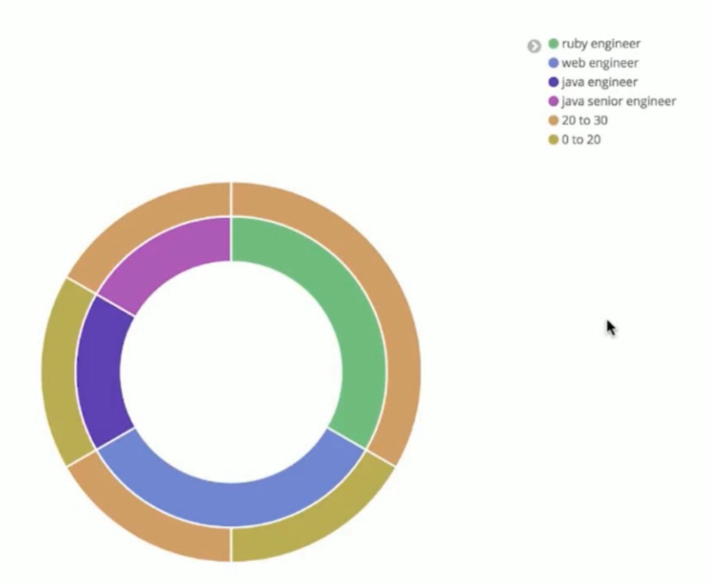

# 聚合分析进阶

## 01.Bucket+Metric聚合分析
 
bucket聚合分析允许通过添加子分析来进一步进行分析，该子分析可以是Bucket也可以是Metric。这也使得聚合分析能力变得异常强大。

### 1.1.分桶再分桶

request:
```json
GET test_search_index/_search
{
  "size": 0,
  "aggs": {
    "jobs": {
      "terms": {
        "field": "job.keyword",
        "size": 10
      },
      "aggs": {
        "age_range": {
          "range": {
            "field": "age",
            "ranges": [
              {
                "to": 20
              },
              {
                "from": 20,
                "to": 30
              },
              {
                "from": 30
              }
            ]
          }
        }
      }
    }
  }
}
```

response:
```json
{
  "took" : 1,
  ..........
  },
  "aggregations" : {
    "jobs" : {
      "doc_count_error_upper_bound" : 0,
      "sum_other_doc_count" : 0,
      "buckets" : [
        {
          "key" : "ruby engineer",
          "doc_count" : 2,
          "age_range" : {
            "buckets" : [
              {
                "key" : "*-20.0",
                "to" : 20.0,
                "doc_count" : 0
              },
              {
                "key" : "20.0-30.0",
                "from" : 20.0,
                "to" : 30.0,
                "doc_count" : 2
              },
              {
                "key" : "30.0-*",
                "from" : 30.0,
                "doc_count" : 0
              }
            ]
          }
        },
        {
          "key" : "web engineer",
          "doc_count" : 2,
          "age_range" : {
            "buckets" : [
              {
                "key" : "*-20.0",
                "to" : 20.0,
                "doc_count" : 1
              },
              {
                "key" : "20.0-30.0",
                "from" : 20.0,
                "to" : 30.0,
                "doc_count" : 1
              },
              {
                "key" : "30.0-*",
                "from" : 30.0,
                "doc_count" : 0
              }
            ]
          }
        },
        {
          "key" : "java engineer",
          "doc_count" : 1,
          "age_range" : {
            "buckets" : [
              {
                "key" : "*-20.0",
                "to" : 20.0,
                "doc_count" : 1
              },
              {
                "key" : "20.0-30.0",
                "from" : 20.0,
                "to" : 30.0,
                "doc_count" : 0
              },
              {
                "key" : "30.0-*",
                "from" : 30.0,
                "doc_count" : 0
              }
            ]
          }
        },
        {
          "key" : "java senior engineer",
          "doc_count" : 1,
          "age_range" : {
            "buckets" : [
              {
                "key" : "*-20.0",
                "to" : 20.0,
                "doc_count" : 0
              },
              {
                "key" : "20.0-30.0",
                "from" : 20.0,
                "to" : 30.0,
                "doc_count" : 1
              },
              {
                "key" : "30.0-*",
                "from" : 30.0,
                "doc_count" : 0
              }
            ]
          }
        }
      ]
    }
  }
}
```

### 1.2.分桶后进行数据分析

request:
```json
GET test_search_index/_search
{
  "size": 0,
  "aggs": {
    "jobs": {
      "terms": {
        "field": "job.keyword",
        "size": 10
      },
      "aggs": {
        "salary": {
          "stats": {
            "field": "salary"
          }
        }
      }
    }
  }
}
```

response:
```json
{
  "took" : 1,
  "timed_out" : false,
  "_shards" : {
    "total" : 1,
    "successful" : 1,
    "skipped" : 0,
    "failed" : 0
  },
  "hits" : {
    "total" : 6,
    "max_score" : 0.0,
    "hits" : [ ]
  },
  "aggregations" : {
    "jobs" : {
      "doc_count_error_upper_bound" : 0,
      "sum_other_doc_count" : 0,
      "buckets" : [
        {
          "key" : "ruby engineer",
          "doc_count" : 2,
          "salary" : {
            "count" : 2,
            "min" : 12000.0,
            "max" : 15000.0,
            "avg" : 13500.0,
            "sum" : 27000.0
          }
        },
        {
          "key" : "web engineer",
          "doc_count" : 2,
          "salary" : {
            "count" : 2,
            "min" : 5000.0,
            "max" : 8000.0,
            "avg" : 6500.0,
            "sum" : 13000.0
          }
        },
        {
          "key" : "java engineer",
          "doc_count" : 1,
          "salary" : {
            "count" : 1,
            "min" : 10000.0,
            "max" : 10000.0,
            "avg" : 10000.0,
            "sum" : 10000.0
          }
        },
        {
          "key" : "java senior engineer",
          "doc_count" : 1,
          "salary" : {
            "count" : 1,
            "min" : 30000.0,
            "max" : 30000.0,
            "avg" : 30000.0,
            "sum" : 30000.0
          }
        }
      ]
    }
  }
}
```

## 02.pipeline聚合分析
针对聚合分析的结果再次进行聚合分析，而且支持链式调用，可以回答如下问题：
- 订单月平均销售额是多少？

Pipeline的分析结果会输出到原结果中，根据输出位置的不同，分为以下两类：
- Parent结果内嵌到现有的聚合分析结果中
    - Derivative
    - Moving Average
    - Cumulative Sum
- Sibling结果与现有聚合分析结果同级
    - Max/Min/Avg/Sum Bucket
    - Stats/Extended Stats Bucket
    - Percentiles Bucket

### 2.1.Sibling- Min Bucket
找出所有Bucket中值最小的Bucket名称和值

request:
```json
GET test_search_index/_search
{
  "size":0,
  "aggs":{
    "jobs":{
      "terms": {
        "field": "job.keyword",
        "size": 10
      },
      "aggs":{
        "avg_salary":{
          "avg": {
            "field": "salary"
          }
        }
      }
    },
    "max_salary_by_job":{
      "max_bucket": {
        "buckets_path": "jobs>avg_salary"
      }
    }
  }
}
```

response:
```json
{
........
  },
  "aggregations" : {
    "jobs" : {
      "doc_count_error_upper_bound" : 0,
      "sum_other_doc_count" : 0,
      "buckets" : [
        {
          "key" : "ruby engineer",
          "doc_count" : 2,
          "avg_salary" : {
            "value" : 13500.0
          }
        },
        {
          "key" : "web engineer",
          "doc_count" : 2,
          "avg_salary" : {
            "value" : 6500.0
          }
        },
        {
          "key" : "java engineer",
          "doc_count" : 1,
          "avg_salary" : {
            "value" : 10000.0
          }
        },
        {
          "key" : "java senior engineer",
          "doc_count" : 1,
          "avg_salary" : {
            "value" : 30000.0
          }
        }
      ]
    },
    "max_salary_by_job" : {
      "value" : 30000.0,
      "keys" : [
        "java senior engineer"
      ]
    }
  }
}
```

### 2.2.Parent - Derivative
计算Bucket值的导数

request:
```json
GET test_search_index/_search
{
  "size": 0,
  "aggs": {
    "birth": {
      "date_histogram": {
        "field": "birth",
        "interval": "year",
        "min_doc_count": 0
      },
      "aggs": {
        "avg_salary": {
          "avg": {
            "field": "salary"
          }
        },
        "derivative_avg_salary": {
          "derivative": {
            "buckets_path": "avg_salary"
          }
        }
      }
    }
  }
}
```

response:
```json
{
  "took" : 2,
  "timed_out" : false,
  "_shards" : {
    "total" : 1,
    "successful" : 1,
    "skipped" : 0,
    "failed" : 0
  },
  "hits" : {
    "total" : 6,
    "max_score" : 0.0,
    "hits" : [ ]
  },
  "aggregations" : {
    "birth" : {
      "buckets" : [
        {
          "key_as_string" : "1980-01-01T00:00:00.000Z",
          "key" : 315532800000,
          "doc_count" : 1,
          "avg_salary" : {
            "value" : 30000.0
          }
        },
        {
          "key_as_string" : "1981-01-01T00:00:00.000Z",
          "key" : 347155200000,
          "doc_count" : 0,
          "avg_salary" : {
            "value" : null
          },
          "derivative_avg_salary" : {
            "value" : null
          }
        },
        {
          "key_as_string" : "1982-01-01T00:00:00.000Z",
          "key" : 378691200000,
          "doc_count" : 0,
          "avg_salary" : {
            "value" : null
          },
          "derivative_avg_salary" : {
            "value" : null
          }
        },
        {
          "key_as_string" : "1983-01-01T00:00:00.000Z",
          "key" : 410227200000,
          "doc_count" : 0,
          "avg_salary" : {
            "value" : null
          },
          "derivative_avg_salary" : {
            "value" : null
          }
        },
        {
          "key_as_string" : "1984-01-01T00:00:00.000Z",
          "key" : 441763200000,
          "doc_count" : 0,
          "avg_salary" : {
            "value" : null
          },
          "derivative_avg_salary" : {
            "value" : null
          }
        },
        {
          "key_as_string" : "1985-01-01T00:00:00.000Z",
          "key" : 473385600000,
          "doc_count" : 1,
          "avg_salary" : {
            "value" : 15000.0
          },
          "derivative_avg_salary" : {
            "value" : null
          }
        },
        {
          "key_as_string" : "1986-01-01T00:00:00.000Z",
          "key" : 504921600000,
          "doc_count" : 0,
          "avg_salary" : {
            "value" : null
          },
          "derivative_avg_salary" : {
            "value" : null
          }
        },
        {
          "key_as_string" : "1987-01-01T00:00:00.000Z",
          "key" : 536457600000,
          "doc_count" : 1,
          "avg_salary" : {
            "value" : 12000.0
          },
          "derivative_avg_salary" : {
            "value" : null
          }
        },
        {
          "key_as_string" : "1988-01-01T00:00:00.000Z",
          "key" : 567993600000,
          "doc_count" : 0,
          "avg_salary" : {
            "value" : null
          },
          "derivative_avg_salary" : {
            "value" : null
          }
        },
        {
          "key_as_string" : "1989-01-01T00:00:00.000Z",
          "key" : 599616000000,
          "doc_count" : 1,
          "avg_salary" : {
            "value" : 8000.0
          },
          "derivative_avg_salary" : {
            "value" : null
          }
        },
        {
          "key_as_string" : "1990-01-01T00:00:00.000Z",
          "key" : 631152000000,
          "doc_count" : 1,
          "avg_salary" : {
            "value" : 10000.0
          },
          "derivative_avg_salary" : {
            "value" : 2000.0
          }
        },
        {
          "key_as_string" : "1991-01-01T00:00:00.000Z",
          "key" : 662688000000,
          "doc_count" : 0,
          "avg_salary" : {
            "value" : null
          },
          "derivative_avg_salary" : {
            "value" : null
          }
        },
        {
          "key_as_string" : "1992-01-01T00:00:00.000Z",
          "key" : 694224000000,
          "doc_count" : 0,
          "avg_salary" : {
            "value" : null
          },
          "derivative_avg_salary" : {
            "value" : null
          }
        },
        {
          "key_as_string" : "1993-01-01T00:00:00.000Z",
          "key" : 725846400000,
          "doc_count" : 0,
          "avg_salary" : {
            "value" : null
          },
          "derivative_avg_salary" : {
            "value" : null
          }
        },
        {
          "key_as_string" : "1994-01-01T00:00:00.000Z",
          "key" : 757382400000,
          "doc_count" : 1,
          "avg_salary" : {
            "value" : 5000.0
          },
          "derivative_avg_salary" : {
            "value" : null
          }
        }
      ]
    }
  }
}
```

### 2.3.Parent - Moving Average
计算Bucket值的移动平均值

```json
GET test_search_index/_search
{
  "size": 0,
  "aggs": {
    "birth": {
      "date_histogram": {
        "field": "birth",
        "interval": "year",
        "min_doc_count": 0
      },
      "aggs": {
        "avg_salary": {
          "avg": {
            "field": "salary"
          }
        },
        "mavg_salary": {
          "moving_avg": {
            "buckets_path": "avg_salary"
          }
        }
      }
    }
  }
}
```

### 2.4.Parent - Cumulative Sum
计算Bucket值的累积加和
```json
GET test_search_index/_search
{
  "size": 0,
  "aggs": {
    "birth": {
      "date_histogram": {
        "field": "birth",
        "interval": "year",
        "min_doc_count": 0
      },
      "aggs": {
        "avg_salary": {
          "avg": {
            "field": "salary"
          }
        },
        "cumulative_salary": {
          "cumulative_sum": {
            "buckets_path": "avg_salary"
          }
        }
      }
    }
  }
}
```