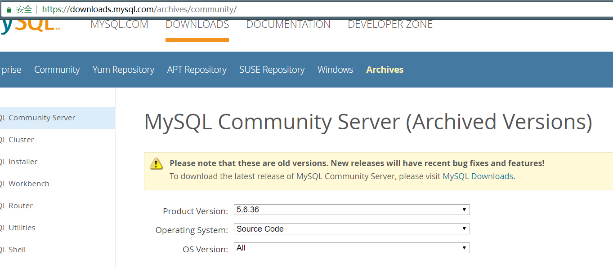
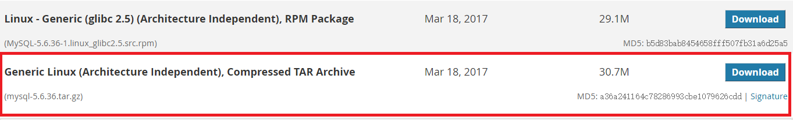
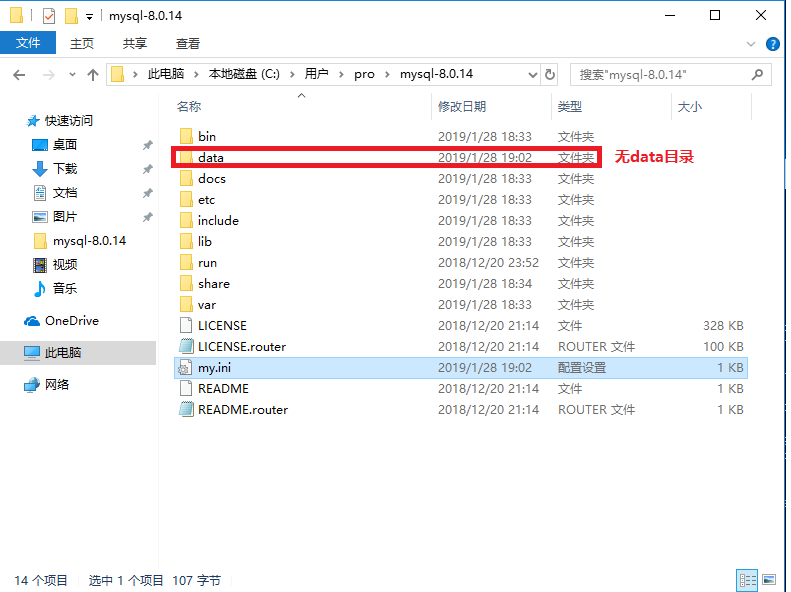
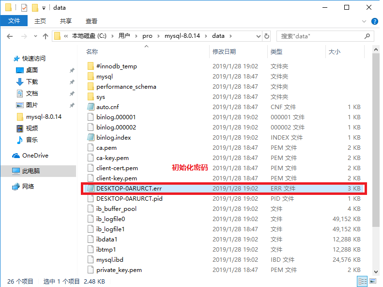

# MySQL数据库
## 1.简介
现在企业中主流使用的是MySQL5.6 5.7版本。<br>

## 2.安装
- 1.[RPM、Yum：安装方便、安装速度快，无法定制](https://www.jianshu.com/p/7cccdaa2d177)
- 2.二进制：不需要安装，解压即可使用，不能定制功能
- 3.编译安装：可定制，安装慢。
  - 5.5之前：./configure make makeinstall
  - 5.5之后：cmakegmake
- 4.先编译，然后制作rpm，制作yum库，然后yum安装。
  - 简单、速度快、可定制，比较复杂制作时间长

- 企业选择安装方式
  - 中小企业：以上方式都可以，运维偏向编译，dba偏向选择二进制。
  - 大型企业：可以选择4

### 里程碑一 下载安装包
地址：[https://downloads.mysql.com/archives/community/](https://downloads.mysql.com/archives/community/)<br>
我们选择5.6.36版本，使用源码(Source Code)<br>
<br>
<br>
选择最下面的源码包。<br>
<br>

### 里程碑二 安装依赖创建用户
```shell
yum install -y ncurses-devel libaio-devel
yum install cmake
```

在Ubuntu下:<br>
```shell
apt install libncurses5-dev libaio1 libaio-dev libssl-dev libboost-dev
```

```sql
useradd mysql -s /sbin/nologin -M
```

### 里程碑三 编译安装

#### 1.检验我们下载的安装包
```shell
[root@noble tools]# md5sum mysql-5.6.36.tar.gz
a36a241164c78286993cbe1079626cdd  mysql-5.6.36.tar.gz
```

#### 2.第二步解压已经下载好的MySQL安装包
```shell
[root@noble tools]# tar xf mysql-5.6.36.tar.gz
[root@noble tools]# ls
mysql-5.6.36  mysql-5.6.36.tar.gz
```

#### 3.第三步编译安装
```shell
cd mysql-5.6.36
```
```shell
cmake . -DCMAKE_INSTALL_PREFIX=/application/mysql-5.6.36 \
-DMYSQL_DATADIR=/application/mysql-5.6.36/data \
-DMYSQL_UNIX_ADDR=/application/mysql-5.6.36/tmp/mysql.sock \
-DDEFAULT_CHARSET=utf8 \
-DDEFAULT_COLLATION=utf8_general_ci \
-DWITH_EXTRA_CHARSETS=all \
-DWITH_INNOBASE_STORAGE_ENGINE=1 \
-DWITH_FEDERATED_STORAGE_ENGINE=1 \
-DWITH_BLACKHOLE_STORAGE_ENGINE=1 \
-DWITHOUT_EXAMPLE_STORAGE_ENGINE=1 \
-DWITH_ZLIB=bundled \
-DWITH_SSL=bundled \
-DENABLED_LOCAL_INFILE=1 \
-DWITH_EMBEDDED_SERVER=1 \
-DENABLE_DOWNLOADS=1 \
-DWITH_DEBUG=0
```
```shell
make && make install
```
```shell
ln -s /application/mysql-5.6.36/ /application/mysql
```

MySQL8.0编译信息<br>
注意MySQL8.0的源码安装需要gcc5.3的版本<br>
```shell
cmake . -DCMAKE_INSTALL_PREFIX=/application/mysql-8.0.14 \
-DMYSQL_DATADIR=/application/mysql-8.0.14/data \
-DMYSQL_UNIX_ADDR=/application/mysql-8.0.14/tmp/mysql.sock \
-DDEFAULT_CHARSET=utf8 \
-DDEFAULT_COLLATION=utf8_general_ci \
-DWITH_BOOST=/application/mysql-8.0.14/boost
```

### 里程碑四 安装后的相关配置

#### 1.拷贝默认配置文件
```shell
cp /application/mysql/support-files/my*.cnf /etc/my.cnf
```


#### 2.初始化数据库
```shell
/application/mysql/scripts/mysql_install_db --basedir=/application/mysql --datadir=/application/mysql/data/ --user=mysql
```
如果初始化成功会看到两个OK<br>

#### 3.创建目录并设置权限
```shell
mkdir -p /application/mysql/tmp
chown -R mysql.mysql /application/mysql/
```

#### 4.启动MySQL的一些配置
```shell
cp /application/mysql/support-files/mysql.server /etc/init.d/mysqld
```

```shell
chkconfig mysqld on #开机自启动
chkconfig --list mysqld
```

```shell
/etc/init.d/mysqld start #运行MySQL
```

#### 5.配置环境变量
```shell
echo 'PATH=/application/mysql/bin/:$PATH' >> ~/.bashrc
tail -1 ~/.bashrc
source ~/.bashrc
```

#### 6.删除用户
用户名的格式是``user@host``组成的，所以用户名包括``user``和``host``两部分。我们删除时也要包括这两部分<br>
```sql
drop user root@127.0.0.1;
```

#### 7.更改root用户密码
命令行下：<br>
```sql
mysqladmin -uroot -p password 123456
```

## 3.Windows安装mysql
在官网上下载zip包:[https://dev.mysql.com/downloads/mysql/](https://dev.mysql.com/downloads/mysql/)<br>

### 3.1解压下载好的zip压缩包
在解压好的压缩包中创建``my.ini``文件(解压好的目录做为安装目录)<br>
在``my.ini``文件中写入以下内容:<br>
```
[mysqld]

basedir=C:\Users\pro\mysql-8.0.14
datadir=C:\Users\pro\mysql-8.0.14\data
```

目录结构如下:<br>
<br>

### 3.2初始化mysql并安装
```
mysqld  --initialize
mysqld  --install
```
初始化完成后会设置一个初始化密码,我们需要在错误日志中寻找,在data目录下后缀名是``.err``,文件名是主机名.<br>
<br>

### 3.3启动MySQL服务
```
net start MySQL  
```
停止命令是<br>
```
net stop MySQL  
```

### 3.4修改密码
```
mysqladmin -uroot -p password 123456
```
如果不能更改弱密码,可以设置myslq的全局变量来解决:<br>
```
show global variables;
set global variable***=low;
set global variable***length=4;
```

## 4.安装datagrip
在官网下载:[https://www.jetbrains.com/datagrip/](https://www.jetbrains.com/datagrip/)<br>
激活:[http://idea.lanyus.com/](http://idea.lanyus.com/)<br>