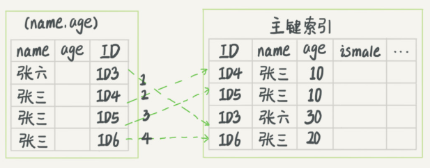
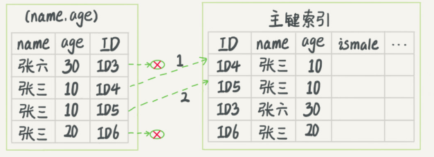

# 索引

每碰到一个新数据库，我们需要先关注它的数据模型，这样才能从理论上分析出这个数据库的适用场景。

## 1.索引基本算法

在MySQL的Innodb引擎中，索引实现的算法是B+树

在MySQL的innodb引擎中，每一个索引都对应一个B+树。<br>
- 1.主键索引用于检索整行数据
- 2.一般索引用于检索主键索引

### 1.2.主键索引设置为自增ID的好处
- 1.节省内存：一般索引会存储主键，所以主键越小越省空间
- 2.节约时间：自增ID保证数据都是追加(如B+树，追加数据不会发生页分裂)

在典型的KV模型下以业务数据块做主键比自增ID有优势。为什么？


## 2.索引的使用

### 2.1.覆盖索引
通过避免回表(**回到主键索引树搜索的过程，我们称为回表**)查询实现时间优化。<br>

覆盖索引的创建方式是创建联合索引。我们举例说明：

假设这个市民表的定义是这样的：

```sql
CREATE TABLE `tuser` ( 
    `id` int(11) NOT NULL, 
    `id_card` varchar(32) DEFAULT NULL, 
    `name` varchar(32) DEFAULT NULL, 
    `age` int(11) DEFAULT NULL, 
    `ismale` tinyint(1) DEFAULT NULL, 
    PRIMARY KEY (`id`), 
    KEY `id_card` (`id_card`), 
    KEY `name_age` (`name`,`age`)
) ENGINE=InnoDB
```

我们知道，身份证号是市民的唯一标识。也就是说，如果有根据身份证号查询市民信息的需求，我们只要在身份证号字段上建立索引就够了。而再建立一个（身份证号、姓名）的联合索引，是不是浪费空间？

如果现在有一个高频请求，要根据市民的身份证号查询他的姓名，这个联合索引就有意义了。它可以在这个高频请求上用到覆盖索引，不再需要回表查整行记录，减少语句的执行时间。

[联合索引的存储结构](https://juejin.im/post/5e57ac99e51d45270e212534)

- 1.``KEY `name_age` (`name`,`age`)``会创建一个B+树
  - 1.1.<K1, K2, V>是<name, age, id>的B+树(``select age from tuser where name = 'amos'``语句就会利用这个B+树实现覆盖索引，不会发生回表)

理解了联合索引创建B+树的逻辑，也就明白了为什么联合索引对，关键字``name``和``age``有顺序要求。

**由于覆盖索引可以减少树的搜索次数，显著提升查询性能，所以使用覆盖索引是一个常用的性能优化手段。**

### 2.2.最左前缀原则
联合索引中，索引字段位置不同。可以减少维护索引的个数。<br>

[联合索引的存储结构](https://juejin.im/post/5e57ac99e51d45270e212534)

理解联合索引的存储结构，同样是理解最左前缀原则最好的方式。

### 2.3.索引下堆

索引下堆的目的同样是减少回表次数。考虑下面sql语句：

``select * from tuser where name like '张%' and age=10 and ismale=1;``

如果我们有``name, age``联合索引有下面两种情况：

- 1.没有索引下堆(通过最左前缀原则有一部分优化)，但要回表4次



- 2.有索引下堆，先和索引中的数据对比，再回表

