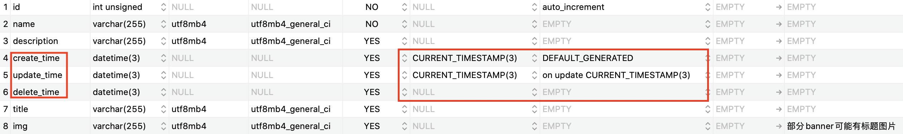

# 三个时间
业务开发中每个表都会添加三个时间：
- 1.create_time
- 2.update_time
- 3.delete_time

## 01.create_time
create_time用来表示这条记录的创建时间，通常在数据表创建过程中增加``CURRENT_TIMESTAMP``，让mysql自动填写这个字段的内容。
- ``CURRENT_TIMESTAMP``的意思是当前时间戳。当新增记录时，会自动赋值当前时间戳

## 02.update_time
update_time用来表示这条记录更新的时间，通常在数据表创建过程中增加``CURRENT_TIMESTAMP``，``on update CURRENT_TIMESTAMP``让mysql自动填写这个字段的内容。
- ``CURRENT_TIMESTAMP``的意思是当前时间戳。当新增记录时，会自动赋值当前时间戳
- ``on update CURRENT_TIMESTAMP``的意思是当记录更新时，用当前时间戳再赋值给该字段

## 03.delete_time
delete_time用来表示这条记录删除的时间。
- 1.当这个字段被赋值时，表示这条记录被删除了。如果是null，表示这条记录在业务上还存在
- 2.当需要删除一条记录时，直接赋值该字段不需要真正删除这条记录，因为数据是有价值的，我们需要保留。
- 3.不需要给这个字段设置特殊属性。比如``CURRENT_TIMESTAMP``