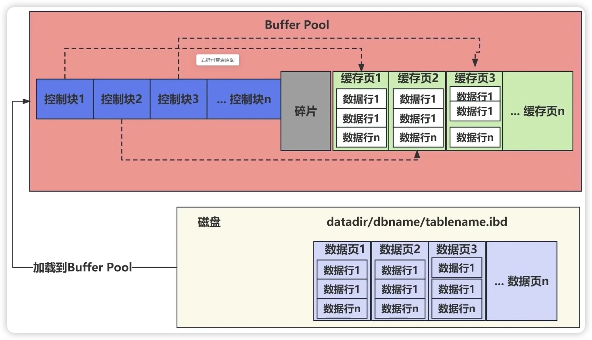
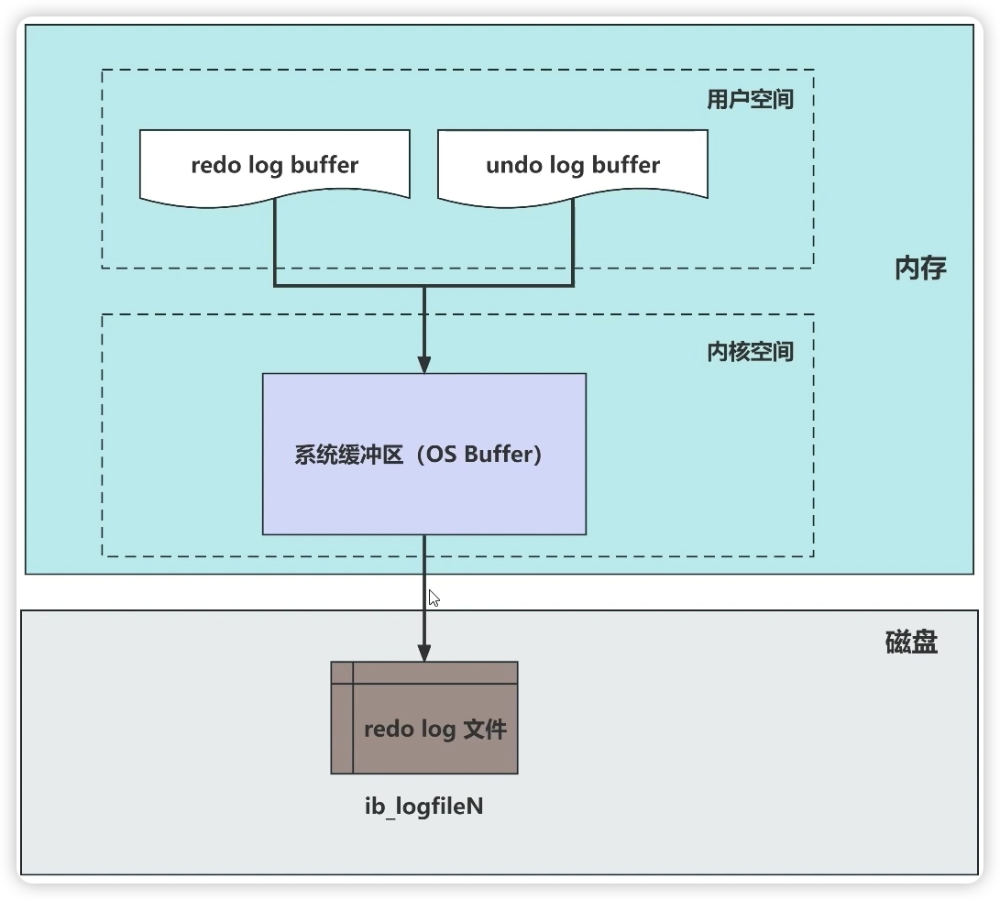
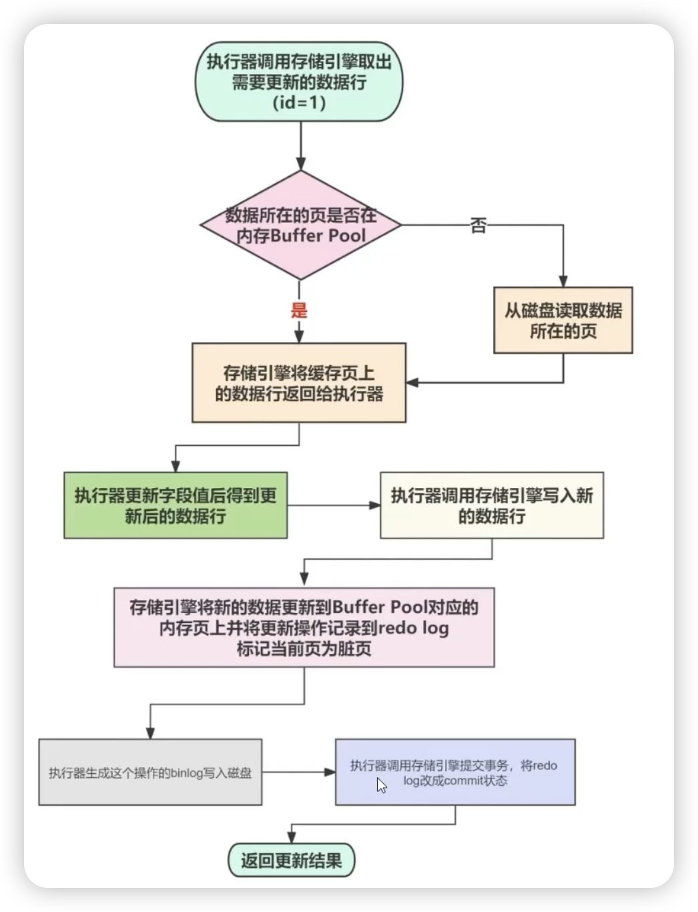

# Buffer Pool 和 Redo log

## 知识回顾

### 重做日志（Redo log）

1. InnoDB引擎记录的物理日志
2. 记录的是“在某个数据页上做了什么修改"
3. 用于数据库崩溃恢复（Crash Recovery）,保证事务的 ACID 特性中的C(Consistent)
4. 大小固定，循环写入。空间不够时会覆盖旧日志

## 通过问题引出BufferPool和RedoLog；每次数据更改都修改磁盘会怎样？

1. IO浪费。InnoDB是以页(16KB)来管理磁盘空间的，如果一个sql只修改很少字段就要更新整个页会带来大量IO浪费
2. 随机IO性能差。事物可能会修改多个IO数据页(16KB)，这时磁盘更改就涉及到随机IO(非连续的存储修改就是随机IO)修改

```sql
show variables like 'innodb_page_size';
Variable_name   |Value|
----------------+-----+
innodb_page_size|16384|
```

### InnoDB的解决方法

1. 先将数据的更新记录到 redo log，并更新内存中的数据页(Buffer Pool)
2. 后台线程会把操作记录更新异步到磁盘中的数据页


## Buffer Pool

1. 充当磁盘的页数据缓存
2. 将随机写磁盘的IO转化成先顺序写日志，再异步批量IO数据页到磁盘

### BufferPool大小

默认128M连续的内存空间

```sql
show variables like '%innodb_buffer_pool_size%';
Variable_name          |Value    |
-----------------------+---------+
innodb_buffer_pool_size|134217728|
```

**生产环境中：通常将大小设置成可用物理内存的60%~80%**

### Buffer Pool中缓存了哪些数据？
1. 数据页(innodb_page_size)
2. 索引页，undo 页，插入缓存、自适应哈希索引、锁信息等等。

### Buffer Pool中缓存的数据页

1. 还没写入数据的页称为空闲页（Free Page）
2. 已经写入数据的页称为干净页（Clean Page）
3. 写入数据后，发生数据更新的页称为脏页（Dirty Page）

### Buffer Pool中的结构



1. 控制块和缓存页是一一对应的
2. 当查询命中一行记录时，会将行所在的完整页缓存到BufferPool中，然后再查询具体行并返回结果
3. Buffer Pool中的数据越来越多怎么办？答案是尽可能让BufferPool缓存的是热点数据LRU算法。

**传统LRU的实现**

1. 新增的缓冲页将其控制块作为节点添加到LRU链表头部
2. 已存在的缓存页被再次访问时也被一到头部
3. 当需要释放空间时，从LRU链表尾部淘汰

**传统LRU的缺陷**

1. Buffer Pool 污染问题严重（
   1. 某个范围查询导致Buffer Pool加载了大量数据到表头，使得很多热点数据被淘汰，其他热点Sql查询性能突然降低
   2. 某个查询语句虽然只有少量结果，但做全表扫描，这些被扫描的数据也都加载到BufferPool中
2. 预读失效问题

### InnoDB的解决传统LRU的缺陷的方案-Buffer Pool 污染问题严重

**基于冷热区分的LRU**

```sql
show variables like '%innodb_old_block%';
Variable_name         |Value|
----------------------+-----+
innodb_old_blocks_pct |37   |
innodb_old_blocks_time|1000 |
```


1. 新数据插入在old区，这样就不会影响young区的高热数据
2. 如果old区数据经常被访问，就会向young区移动

**冷数据区的数据什么时候会到热数据区？**

1. 数据进入old区（也就是被加载到BufferPool）时记录访问时间
2. 数据页在LRU链表中存在时间超过1s就移动到链表头部(整个链表的头部也是young头部)
3. young 区域前1/4被访问不会移动到链表头部（因为最头部就最热的数据，减少这部分数据移动，可以减少大量无效移动

### InnoDB的解决传统LRU的缺陷的方案-解决预读失效问题

**也是基于冷热区分的LRU**

1. 加载数据页时，会提前把它相邻的数据页一并加载进来
2. 让预读的页上真正被访问的页才移动到LRU 链表的头部

### BufferPool如何管理空闲页(Free Page)呢？答：Free 链表

如果每次插入新的缓存时要从链表头部找空闲页，太低效，可以把空闲页单独维护一个链表

1. 将空闲页的控制块作一个链表结构的节点维护起来
2. 头节点存储了头尾节点的地址，当前链表中节点的数量等信息
3. 元素是一个个的控制块，而每个控制块包含着对应缓存页的地址

### BufferPool如何管理脏页(Dirty Page)呢？答：Flush 链表

Sql更新操作修改了某个BufferPool中某个页中某行数据，就会把这个页标记为脏页

1. 将脏页的控制块作为一个链表结构的节点维护起来

## Redo log的写入过程

1. 内存中的日志缓冲（redo log buffer）
2. 磁盘上的日志文件（redo logfile）



事物提交后，会写入到redo log中，然后刷到磁盘redo log中。

机制有3种，通过 ``innodb_flush_log_at_trx_commit`` 来配置

```
Variable_name                 |Value|
------------------------------+-----+
innodb_flush_log_at_trx_commit|1    |

0-事物提交后立即写入到redo log buffer中。异步有个线程写入到OS Buffer中，再写入到redo log中
1-立即写入redo log buffer，并立即写入到磁盘redo log文件中
2-立即写入OS Buffer中，但异步线程写入到redo log文件中
```


## InnoDB 写入数据的过程

假设执行如下语句

```sql
update balance_user set balance=balance+1 where id = 1;
```



1. 上图中的流程更新数据到BufferPool对应的页上->更新记录redoLog->标记为脏页->写binlog->redoLog改为commit状态

   a. 后面的binlog和redoLog变更是常说的“两阶段提交”


### RedoLog什么时候回刷到磁盘中？

1. 事务提交
2. LogBuffer空间不足时
3. 事务日志缓冲区满（？
4. 检查点checkPoint
5. 后台刷新线程定时写数据到RedoLog
6. MySql服务关闭的时候


### InnoDB存储引擎的redo log写满时
1. 触发检查点（Checkpoint）
2. 暂停写入操作
3. 循环使用redo log空间


### 防止redo log写满导致的性能问题
1. 增加redo log的大小（会适当增加奔溃恢复的时间成本
2. 监控并调整检查点策略
3. 循环使用redo log空间
