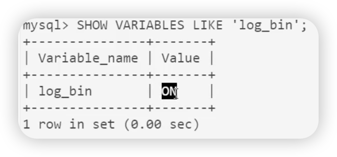
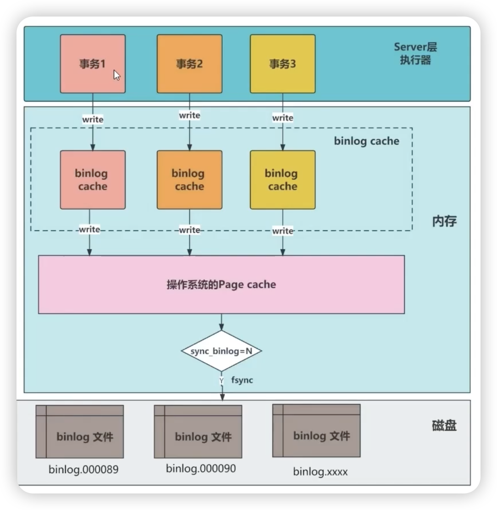
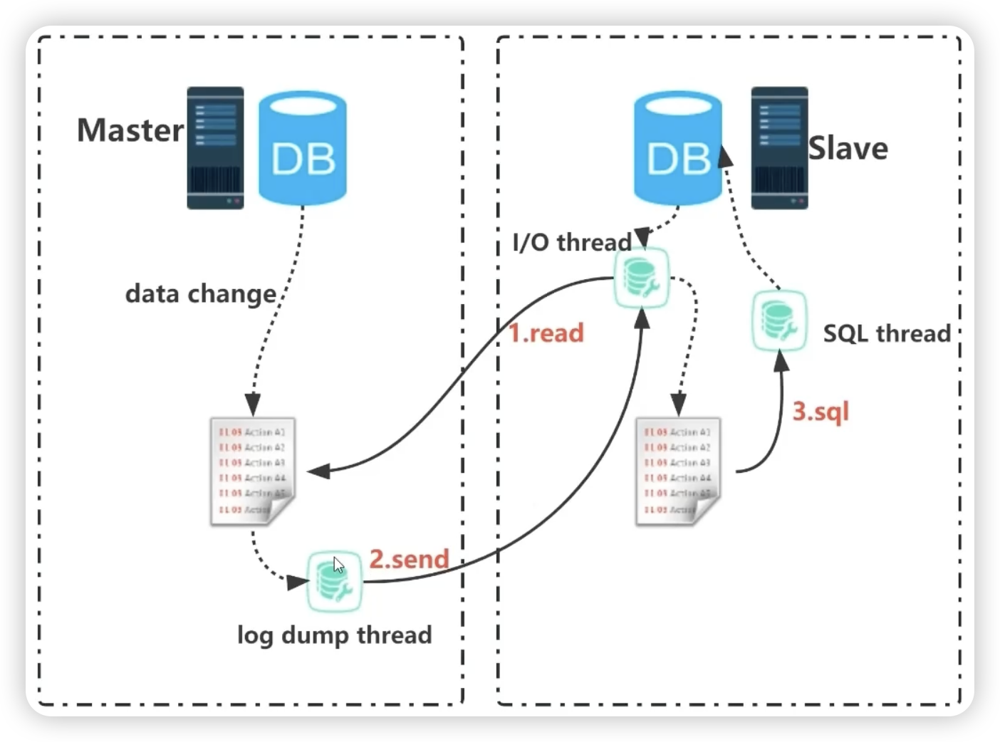

# BinLog

## 主要内容

1. binlog的配置，格式及管理
2. binlog写入流程，刷盘时机，结合redo log的两阶段提交
3. 主从同步的过程及主从延迟问题


## binlog的格式

### Statement
1. 记录的是 SQL的原文
2. 不需要记录每一行的变化，减少了binlog 日志量，节约了IO
3. 受执行计划或函数的影响（某些函数每次执行结果不一样），在从库上执行结果可能不一致


### row（默认值）
1. 记录单元是每一行的改动
2. 保证了复制的准确性，不受SQL语句执行结果的差异影响
3. 保存的信息太多而导致日志量太大


### mixed
1. 优先使用statement，无法重放的sq|使用row格式
2. 结合了两种格式的优势，既减少了存储占用，又保证了复制的准确性


#### 表的存储引擎为NDB
1. 使用了UUID（、NOW（）、USER（、CURRENT_USER（）等函数
2. 使用了INSERT DELAY的语句
3. 使用用户自定义函数


## BinLog配置

开关设备，默认是开



## BinLog写入流程



1. 原则：一个事务的binlog写不能拆开
2. 事务启动时，每个事务都申请一个内存binlogcache，一般大小时32kb
3. 事务提交或者binlog cache写满后，数据就会写入到binlog文件中


## BinLog刷盘机制-什么时候binlog数据写入磁盘中？

### sync_binlog参数

1. sync_binlog=0表示由文件系统自己控制（性能最好，风险高，宕机时内存中的数据就会丢失
2. sync_binlog=1表示每写入一个binlog事件就立即刷新到磁盘（mysql8.0默认值，最安全，但性能最低
3. sync_binlog>1表示每写入sync_binlog次数的binlog事件才触发


## Redo Log和binlog对比

两者都记录了数据库做的变更。为什么不将Binlog和redo log合并？

1. 早期版本的MySQL自带的存储引擎是 MyISAM，没有redo log，Mysql-server层建立一套BinLog。RedoLog在InnoDB引擎层，所属架构层级就不同
2. binlog无法实现 crash-safe的能力。因为binlog不是记录数据页的变更。


## Redo Log 和 binLog的两阶段提交

### 问题引出

1. 如果redolog 写成功，binlog 失败，主有从无
2. 如果先写 binlog 再写 redolog，从有主无
3. Mysql 实现的机制是 二阶段提交（Two-Phase Commit, 2PC）


### 案例解释

```sql
-- 开始事务
START TRANSACTION;

-- 更新主键id=1的数据
UPDATE users SET age = age + 1 WHERE id = 1;

-- 更新主键id=2的数据
UPDATE users SET age = age + 1 WHERE id = 2;
-- 提交事务
COMMIT;
```

1. 收到start transaction后，生成一个全局的事务编号trx_id
2. 找到id=1记录所在的数据页p1，加载到内存BufferPool中并修改。同时修改Redo log buffer，并将p1标记为脏页，同时修改binlog cache。
3. 同上对id=2的操作做如上操作
4. 此时开始执行commit语句。先写redo log字段

```
start trx_id=1;
写入id=1的修改
写入id=2的修改
prepare trx_id=1
```

5. 将binlog cache的数据写入到binlog cache中。同时由sync_binlog决定是不是立即刷磁盘
6. 向redo log中写一条数据：end trx_id=1；表示redo log中这个事务完成

```
start trx_id=1;
写入id=1的修改
写入id=2的修改
prepare trx_id=1
end trx_id=1;
```


### 问题分析

#### 假设执行完第3步，也就是在commit之前mysq|宕机了

此时变更都在内存中，对磁盘数据是没有影响的。简单让该事务执行失败就行。


#### 如果在执行完上面的第4步之后mysql宕机了

等待机器重启后，读取redolog，发现有trx_id=1的prepare状态，回去查找binlog是否存在。此场景不存在，就会通过undolog回滚。


#### 如果在执行完上面的第5步之后mysql宕机了

等待机器重启后，读取redolog，发现有trx_id=1的prepare状态，回去查找binlog是否存在。

此场景存在，所以会继续提交该事务的变更


### 两阶段提交总结

1. 携带trx_id的redo log prepare到磁盘
2. 携带trx_id的binlog写入磁盘
3. 携带trx_id的redo log commit到磁盘


## binlog用于主从复制



### 主从复制日志事件的3种方式

1. 基于语句的复制 （Statement-Based Replication, SBR）对应binlog的Statement记录模式
2. 基于行的复制（Row-Based Replication,RBR）对应binlog的row记录模式
3. 混合类型的复制（Mixed Mode Replication,MMR），对应binlog的mixed记录模式


### 主从复制的一些注意问题

1. 主从服务器操作系统版本和位数一致
2. Master 和 Slave 数据库的版本要一致
3. server id 必须唯一


### 哪些情况可能导致主从延迟？
1. 从库执行的 SQL 中存在执行很慢的语句
2. 从库的SQL线程繁忙
3. 主库的从库太多
4. 主库负载过高
5. 从库负载过高也会导致主从延迟
6. 主从服务器时钟不一致
7. 主库与从库存在网络延迟


### 怎么解决主从集群同步延迟问题？
1. 使用更高效的同步方式
2. 调整从库同步的SQL线程数
3. 减少事务的大小


#### 主从集群同步模式
1. 异步复制（Asynchronous replication），主服务器发送binlog就返回客户端
2. 全同步复制（Fully synchronous replication），必须等到所有从服务器确认，才返回客户端
3. 半同步复制（Semisynchronous replication），等到有1个从确认，就返回客户端（这个从数据库是固定的，启用时配置，不是随机等一个从返回）


### 为什么使用MYSQL主从架构
1. 读写分离
2. 负载均衡
3. 余和备份
4. 数据分析和报表生成