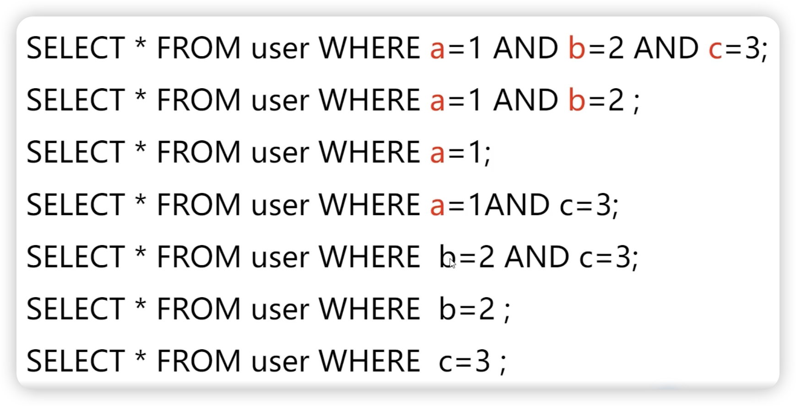

# 索引

索引的本质其实就是数据页的目录


## 索引的优点

提高数据检索的效率，降低数据库的IO成本
唯一索引可以确保数据的唯一性


## 索引的缺点
创建索引和维护索引要耗费时间
索引需要占用额外的磁盘空间


## MySQL8.0之后的InnoDB数据字典

所有的元数据信息都存在Innodb字典表中，mysql.idb


## 双写缓冲区（Double Write Buffer）
部分写失效或者页断裂（partial page write）

redo log记录的是页数据做了什么改动，无法修复损坏的页

底层文件系统页大小和数据库的页大小不一致，一般数据库的页16kb是文件系统页的4倍，会出现部分页写成功，部分页没有写成功


### 双写缓冲区写入流程
脏页刷新时，先拷贝到内存中的double write buffer中

从double write buffer分两次写入磁盘共享表空间中

将double write buffer中的脏页数据写入实际的各个表空间文件


#### redo log 是否需要double write？
redo log buffer是以512字节的block块为单位进行存储的


#### 为什么不能用undolog替代double write
undolog记录的是逻辑数据

需要一个数据页的副本来还原该损坏的数据页


#### double write buffer是否会出现损坏
double write buffer落盘是顺序IO
double write buffer每次写1MB到磁盘
double write buffer写到磁盘的数据有校验值，可以校验完整性


## 更改缓冲区Change Buffer
需要修改的数据不在BufferPool中会产生一次随机读操作
在MySQL5.5之前，叫插入缓冲 （Insert Buffer）
MySQL5.5开始对DELETE和UPDATE也有效，叫做写缓冲


### 更改缓冲区Change Buffer流程

写操作发生时，先将写操作记录下来 不实际读取磁盘数据到Buffer Pool中。定期异步合并这些数据。

注意：但当写操作涉及唯一索引时，为了判断索引是否唯一，必须加入数据到BUfferPool中，导致Change BUffer失效。


### 配置innodb_change _buffering
1. all，默认值：插入、删除和清除操作全部进行缓冲
2. none，不缓冲任何操作
3. inserts，只缓冲插入操作

4. deletes，只缓存删除操作
5. changes，只缓冲插入和删除操作
6. purges，只缓冲清除操作


### delete和purge有什么区别？
delete只是先标记数据被删除。后续由purge线程最终删数据


## 数据存储的相关概念

### 区（extent）
为了解决以页为单位存储带来大量随机IO的问题
每个区的大小为 1MB，连续的64个页会被划为一个区


### 段（Segment）
索引段：存放B +树的非叶子节点的区的集合
数据段：存放B + 树的叶子节点的区的集合
回滚段：存放的是回滚数据的区的集合


索引的本质其实就是数据页的目录

先从页级别的目录中根据二分法快速确定出主键值所在的页
再通过遍历数据页的分组信息找到具体的数据行


### InnoDB的行格式

由参数innodb_default_row_format 定义
MySQL 5.1 开始，默认行格式 Compact（5.1之前为Redundant）
MySQL5.7 开始，默认行格式 Dynamic


### Compact格式


#### 变长字段长度列表

变长字段(varchar等)，具体是使用多大字节，这个信息存储在这里

#### 记录头信息


### Redundant行记录格式

Redundant 是一种冗余的行格式,浪费存储空旧


### COMPRESSED 和 DYNAMIC行记录格式
基于 Compact 行格式进行了一些改进
对溢出页的处理方式上跟Compact 行有区别


## InnoDB数据页格式B+树


每个页都是通过双向链表连起来的，B+树的叶子节点存储的就是数据页


### 在一个页内怎么减少数据遍历？

通过分组减少数据页内数据行的遍历
将所有未删除的记录划分为几个组
每个组的最后一条记录的头信息中的n_owned属性记录组内行数
将每个组的最后一条记录的地址偏移量按序存储到页尾(上图的页目录中)


### 分组(槽)中数据行的数量规定
对于最小记录所在的分组只能有1条记录
最大记录所在的分组拥有的记录条数只能在1~8条之间
剩下的分组中记录的条数范围只能在是4~8条之间


### 划分分组(槽)的步骤:

初始情况下一个数据页里的增加到的两条记录分属两个组
之后每插入一条记录，都会从页目录中找比这个记录大但最近接的槽
当组中的记录数大于8时就会均分成两个组


## InnoDB设计的索引存储方案

### 如果单独存储页级别目录的问题

1. 随着表的数据不断增加，需要很大的连续空间来存储
2. 数据页被删除，目录页中的目录项需要进行移动

### InnoDB的方案

复用了之前存储用户记录的数据页的结构来存储目录项

并通过record_type属性来区分普通用户记录和目录项记录


**目录项和用户记录的区别**

1. record_type值不同
2. 目录项记录只有主键值和页的编号两个列


上图就是InnoDB默认主建ID创建的索引(密集索引)

1. 数据页和数据行是以主键从小到大的顺序进行排序的
2. B+树的叶子节点存储的是完整的用户记录


## 稀疏索引(非主键索引)

独立于存储，和主键存储不同。

叶子节点是主键。


## 为什么InnoDB用 B+树作为索引？

要支持2个能力：

1. 能在尽可能少的磁盘的1/0操作中完成查询（读取索引(非主键)到内存，回表查询）
2. 能高效地查询某一个记录和某个范围的数据（range操作）


对比：

二叉树/红黑树 树深度

B树


原因：

性能表现相对平衡，数据都在叶子上，复杂度Ologn

更合适范围查询，数据都存储在叶子节点，而且是双向链表，方便遍历

磁盘读写优化，（相对于B树，非叶子节点不保存数据信息，一次读取磁盘页可以载入跟多的索引信息，减少IO。16kb

更好的热点数据局部性


## Mysql索引为什么是最左前缀原则？

### 字符串中的最左原则

```
SELECT * FROM user WHERE name LIKE 'nor%；
```

字符串的比较方式是按字符逐渐比较大小的，如上如果name字段有索引，就会走索引查询

下下面的查询不走索引：

```
SELECT * FROM user WHERE name LIKE '%nor%；
```

因为不知道字符串的起始字符，无法比较

### 联合索引最左原则

有索引a,b,c的索引后：




## 索引覆盖和索引下推有什么区别？

### 索引覆盖（Covering Index）
只获取索引字段（不用回表
SELECT name FROM user where name="peter"；


### 索引下推 （Index Condition Pushdown, ICP）

一种优化，目的是减少回表。考虑下面的sql：

```
SELECT * FROM user WHERE name >'c' AND name LIKE '%b'；
```

1. 先通过name>'c'二级索引找到索引叶子节点
2. 遍历后续叶子节点，不满足(like '%b')就不用回表

这个减少回表的优化就是索引下推


### 索引下推和索引覆盖的区别
索引覆盖是指查询中所需的所有列都包含在索引中，不需要回表

索引下推是一种查询优化技术，它将筛选条件下推到索引扫描阶段


## 导致索引失效的情况
查询条件不满足最左前缀原则

使用函数或运算符：WHERE UPRER（name） = 'JOHN"或 WHERE age + 1 = 30

隐式类型转换 WHERE age='18'

索引选择性差的列索引选择性差的列（某个索引重复量很大，比如性别

OR 条件的两个字段中存在非索引字段

索引碎片过多

数据表太小

查询优化器估算错误


## 唯一索引失效的情况

对varchar等大字段设置索引 可能出现失效。索引字段的长度是有限的，对大字段设置唯一索引，可以先给大字段做hash值


## MySql自增主键不连续

主键是自增的，但不保证连续性。主要出于性能考虑，没有必要必须保证连续

事务发生回滚

唯一索引冲突

删除记录


## 唯一索引 VS 普通索引
查询效率几乎相同