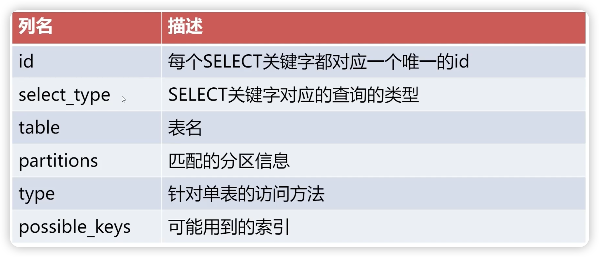
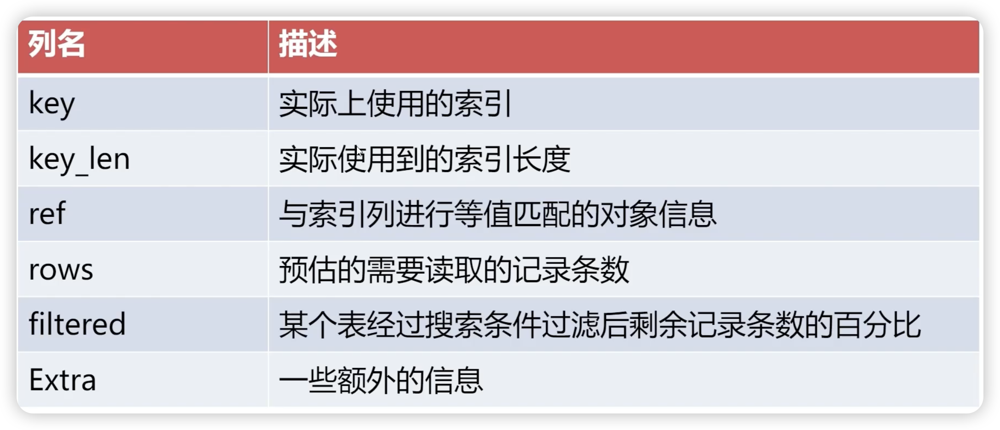

# explain

## explain列名





## 准备测试数据

```sql
CREATE TABLE t1 (
id INT NOT NULL AUTO_INCREMENT,
name VARCHAR(255),
k1 VARCHAR(100),
K2 INT,
k3 VARCHAR(100),
a VARCHAR(30),
b VARCHAR(255),
C VARCHAR(255),
PRIMARY KEY (id),
KEY idx_k1 (k1),
UNIQUE KEY idx_k2 (k2),
KEY idx_k3 (k3),
KEY idx_abc(a,b,c)
)CHARSET = utf8mb4;
```


## select_type

SIMPLE:查询语包中不包含"UNION‘或者子查询的查询

PRIMARY:包含`UNION`、 `UNION ALL` 或者子查询的复杂查询的最左边的查询


**SUBQUERY与DEPENDENT SUBQUERY**

1. SUBQUERY是指优化器不能转成join连接查询的子查询
2. SUBQUERY是物化查询，DEPENDENT SUBQUERY 非物化查询


**物化查询**
MySQL 5.6 版本中加入的另一种优化特性 materialization
把子查询结果物化成临时表，然后代入到外查询中进行查找
如果子查询结果超过 tmp_table_size 大小，会退化成磁盘临时表