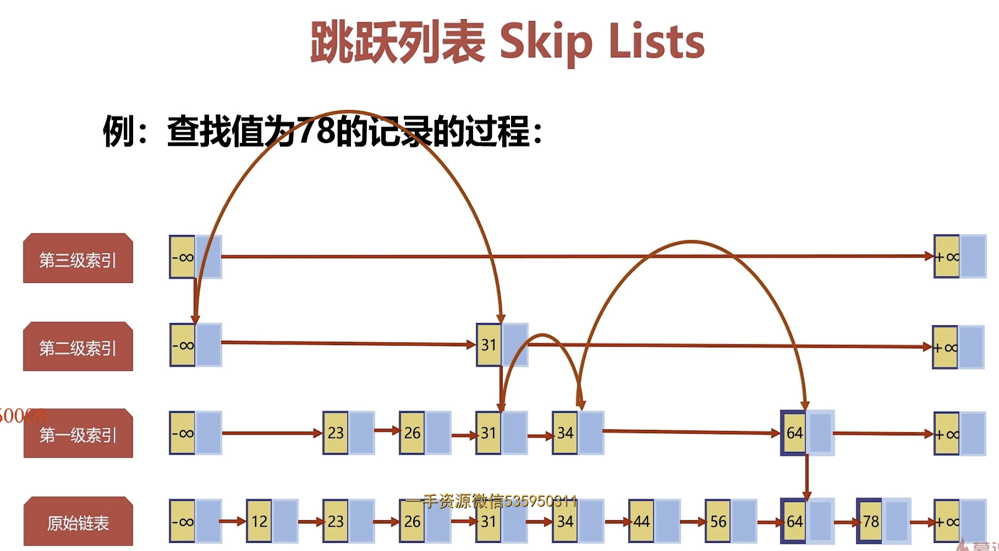

# Redis的命令

## String数据
字符串是Rdis最简单的存储类型，它存储的值可以是字符串，整数或者浮点数，对整个字符串或者字符串的其中一部分执行操作；对整数或者浮点数执行自增或者自减操作。

Redis的字符串是一个有字节组成的序列，根java里面的ArrayList有点类似，采用预分配冗余空间的方式来减少内存的频繁分配，内部为当前字符串实际分配的空间capacity一般要高于实际字符串长度len。当字符串长度小于1M时，扩容都是加倍现有的空间，如果超过1M，扩容时一次只会扩1M的空间。需要注意的是字符串最大长度为512M。

### 1.应用场景
字符串类型在工作中使用广泛，主要用于缓存数据，提高查询性能。比如存储登录用户信息，电商中存储商品信息，可以做计数器(想知道什么时候封锁一个IP地址(访问次数达到上限))等等。

### 2.指令
```
set key value  # 添加一条String类型数据
get key        # 获取一条String类型数据
mset key1 value1 key2 value2    # 添加多条String类型数据
mget key1 key2      # 获取多条String类型数据
incr key        # 自增 +1
incrby key step  # 按步长(step)自增
decr key        # 自减 -1
decrby key step  # 按步长(step)自减
```

## 散列(Hashes)
散列相当于Java中的HashMap，内部是无序字典。实现原理跟HashMap一致。一个哈希表有多个节点，每个节点保存一个键值对。

与java中的HashMap不同的是，rehash的方式不一样，因为java的HashMap在字典很大时，rehash是个耗时操作，需要一次性全部rehash。Redis为了高性能，不能堵塞任务，所以采用了渐进性rehash策略。

渐进式rehash会在rehash的同时，保留新旧两个hash结构，查询时会同时查询两个hash结构，然后在后续的定时任务中以及hash操作指令中，循序渐进的将就hash的内容一点点迁移到新的hash结构中。当搬迁完成了，就会使用新的hash结构取而代之。

当hash移除最后一个元素后，该数据结构会被自动删除，内存回收。

### 1.应用场景
Hash也可以做对象存储，比如存储用户信息，与字符串不一样的是，字符串是需要将对象进行序列化(比如json序列化)之后才能保存，而Hash则可以将用户对象的每个字段单独存储，这样就能节省序列化和反序列化的时间。如下：

此外还可以保存用户的购买记录，比如key为用户id，field为商品id，value为商品数量。同样还可以用于购物车数据的存储，比如key为用户id，field为商品id，value为购买数量等等。

### 2.指令
```shell
# 设置属性
# 在这之前HSET只能设置单个键值对，同时设置多个时必须使用HMSET。而现在HSET也允许接受多个键值对操作参数了
hset keyname field1 value1 field2 value2
# 获取某个属性的值
hget keyname filed
# 获取多个属性的值
hget keyname filed1 filed2
# 获取全部属性的值
hgetall keyname
# 统计hash中有多少个键值对
hlen keyname
# 自增 field字段每次自增步长step
hincrby keyname field step
# 删除一个属性
hdel keyname field
```

## 列表(lists)
Redis中的list相当于Java中的LinkedList，实现原理是一个双向链表(其实底层是一个快速列表)，可以支持反向查询和遍历，更方便操作。插入和删除操作速度快，时间复杂度O(1)，但是索引定位很慢，时间复杂度O(n)。

### 1.应用场景
Lists的应用场景非常多，可以利用它轻松实现热销榜；可以实现工作队列(利用lists的push操作，将任务存在lists中，然后工作线程再用pop操作将任务取出执行)；可以实现最新列表，比如最新评论等。

### 2.操作指令
```shell
# 左进
lpush key value1 value2 value3 ....
# 左出
lpop key
# 右进
rpush key value1 value2 value3 ....
# 右出
rpop key
# 从左往右读取 start和end是下标
lrange key start end
```

## 集合(Sets)
集合类似Java中的HashSet，内部实现是一个value永远为null的HashMap，实际就是通过计算hash的方式来快速排重的，这也是set能提供判断一个成员是否在集合内的原因。

### 1.应用场景
redis的sets类型是使用哈希表构造的，因此查询时间复杂度是O(1),它支持集合内的增删改查，并且支持多个集合间的交集，并集，差集操作。可以利用这些集合操作，解决程序开发过程中很多集合间的问题。比如计算网站独立ip，用户画像中的用户标签，共同好友等功能

### 2.指令
```shell
# 添加内容
sadd key value1 value2
# 查询key里所有值
smembers key
# 移除key里面某个value
srem key value
# 随机移除某个value
spop key
# 返回两个set的并集
sunion key1 key2
# 返回key1踢出交集的那部分(差集)
sdiff key1 key2
# 返回交集
sinter key1 key2
```

## 有序集合(sorted sets)
sorted sets是Redis类似于SortedSet和HashMap的结合体，一方面它是一个set，保证了内部value的唯一性，另一方面它可以给每个value赋予一个score，代表这个value的排序权重。内部使用HashMap和跳跃表(SkipList)来保证数据的存储和有序HashMap里放的是成员到score的映射，而跳跃表里存放的是所有的成员，排序依据是HashMap里存的score，使用跳跃表的结构可以获得比较高的查找效率，并且在实现上比较简单。sorted sets中最后一个value被移除后，数据结构自动删除，内存被回收。

### 1.应用场景
主要应用于根据某个权重进行排序的队列的场景，比如游戏积分排行榜，设置优先级列表，学生成绩表等。

### 2.指令
```shell
# 添加元素
zadd key score value [score value....]
# 获取集合的值并按照score从小到大排列，最小的是最上面
zrange key start end
# 返回有序集key中，所有score值介于min和max之间(包括等于min和max)的成员。有序集成员按score值递增依此排序，最小的是最上面
zrangebyscore key min max
# 删除成员
zrem rank value
# 获取有序集成员的个数
zcard key
# 统计一段分数范围内有多少个值
zcount key score1 score2
# 获取一个成员按分数排序位置
zrank key value
# 获取一个成员反转排序位置
zrevrank key value
```

### 3.跳跃链表

以分数作为key查找value的时间复杂度在大多数情况下是O(nlogn)
如果以value作为key查找自己本身就是O(n)