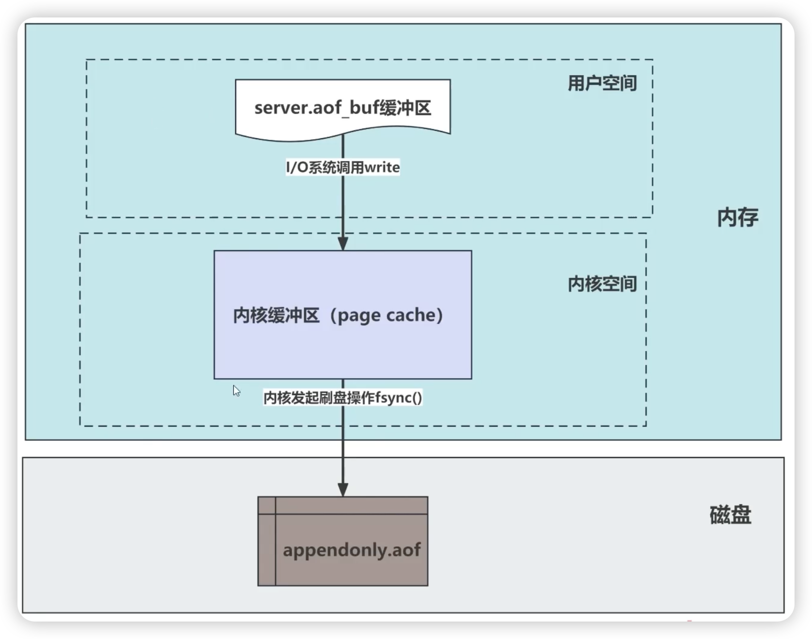

# Redis持久化方式
Redis持久化，解决宕机等服务重启后，所以缓存数据立刻失效的问题。


RDB （Redis DataBase）类似快照
AOF（Append Only File）日志增量同步
混合持久化，兼顾RDB和AOF的特性


## RDB快照

### RDB快照配置

通过如下配置文件的策略来实现RDB快照的启动：

```shell
// redis.conf
save 900 1    #900秒内至少发生了一次修改
save 300 10   #300秒内至少发生10次修改
save 60 10000 #60秒内至少发生1万次修改
```

### RDB快照

1. RDB文件是一个经过压缩的二进制文件
2. RDB持久化的优点是生成的文件紧凑、高效，适合进行备份
3. 缺点是RDB文件生成之间的数据更改可能会丢失

### 写时复制（Copy-On-Write COW）

RDB复制每次全量复制内存所以数据过于占用内存空间。只有当某个进程做了修改动作才执行复制，而且只复制这1页的数据。

1. bgsave命令是调用操作系统的fork（）生成子进程的
2. 父子进程虽然都拥有各自的虚拟内存但指向同一块物理空间，数据不是多份
3. 父进程修改数据后，以物理内存页为单位进行复制


## AOF持久化
1. AOF持久化是通过记录每个写入命令实现的
2. 恢复时RBD只需要将这些数据加载到内存就可以了
3. Redis会根据配置定期将AOF文件同步到磁盘



### AOF的3种落盘策略

1. Always 每执行一条命令就写一次磁盘
2. Everysec（默认值）先写内核缓冲区(page cache)，每秒写磁盘
3. No 完全由操作系统控制写回的时机

### AOF的优缺点

1. 优点是提供了更高的数据安全性，可以保证每个命令都被记录
2. 缺点是AOF文件可能较大，对性能的影响可能大于RDB

### AOF文件过大会带来什么问题呢？

1. 数据恢复会很慢

2. 浪费磁盘空间


### AOF重写（rewrite）
创建新的AOF文件，仅包含恢复当前数据所需的最小命令集

AOF在重新过程中，会合并当前key


### AOF文件重写的过程中，为什么不直现有的 AOF文件？


### 开启AOF持久化

```
// redis.conf
appendonly yes //表示是否开启AOF持久化（默认no，关闭）
appendfilename "appendonly.aof"// AOF持久化写入的文件名
```


## 混合持久化
1. 即能保障数据的恢复速度也能降低数据丟失的风险
2. RDB快照和AOF日志文件都写至文件中


## 持久会对过期的key

### RDB 持久化对过期键的处理

主服务器不会复制过期键值数据
从服务器同步快照数据时不会检查过期数据


### AOF 持久化对过期键的处理

主服务删除过期键值数据时会向从服务器发送DEL 命令

从服务器不对过期数据进行任何处理，完全依赖主服务器