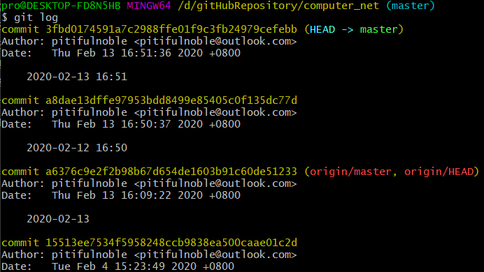

# git基本使用

- 1.安装git后做的基本配置
- 2.add，commit，push使用
- 3.上面三个命令的回退方式以及回滚


## 1.安装git后做配置

### 1.1.里程碑一：添加全局用户名和邮件

```shell
git config --global user.name "你的昵称"
git config --global --replace-all user.name "your user name"
```

```shell
git config --global user.email "你的邮箱"
git config --global --replace-all user.email"your user email"
```

我们可以通过下面的命令来查看是否成功添加了昵称和邮件：

```shell
git config --list
```

### 1.2.里程碑二：添加远程仓库

更具情况考虑是否执行这一步，如果我们是使用``git clone``添加的仓库，就已经有一个``origin``的默认远程仓库了。

检查远程仓库：

```shell
git remote -v
```

添加远程仓库：

```shell
git remote add origin  https://gitee.com/pitifulnoble/computer_net.git
```


## 2.add，commit，push使用

我们可以通过``clone``或者``pull``拉取远程仓库(但速度太慢，最好还是本地复制比较方便)。

```shell
git clone https://gitee.com/pitifulnoble/computer_net.git
```

1.查看当前本地仓库的状态

```shell
git status
```

2.添加所有更改到当前暂存区

```shell
git add .
```

3.提交暂存区的更改(生成一个新版本)

```shell
git commit -m 'msg'
```

4.提交到远程仓库(强制)

```shell
git push origin master
git push origin master --force
```


## 3.上面三个命令的回退方式以及回滚

比较常见的是从``commit``状态退回到``add``状态。也就是从提交状态退回。可以使用如下方法：

- 1.先查看本地提交状态``git log``命令：

  ```shell
  git log
  ```

  

- 2.使用``git reset``命令回到上一个状态。如上图的``a8dae``状态(注意：不会删除``3fbd0``的修改)

  ```shell
  git reset --mixed a8dae
  ```

有的时候我们可能不需要保留``3fbd0``提交的状态，想要完全恢复到``a8dae``状态，这时我们可以使用如下命令：

```shell
git reset --hard a8dae
```

就算使用``--hard``模式也可以找回被删除的``commit``版本，可以使用``git reflog``看看，或者网上找找方法。