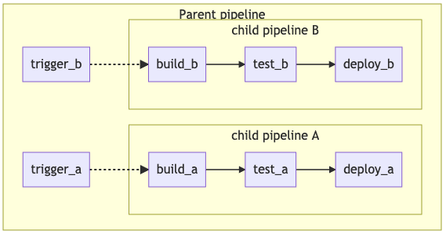

# .gitlab-ci.yml 复杂构建
.gitlab-ci中语法参考下面文档
https://docs.gitlab.com/ee/ci/yaml/README.html#onlychangesexceptchanges

pipeline的结构查看下面文档
https://docs.gitlab.com/ee/ci/pipelines/pipeline_architectures.html#child--parent-pipelines

## 使用changes
Use the changes keyword with only to run a job, or with except to skip a job, when a Git push event modifies a file.

In the following example, when you push commits to an existing branch, the docker build job runs only if any of these files change:
- The Dockerfile file.
- Files in the docker/scripts/ directory.
- Files and subdirectories in the dockerfiles directory.
- Files with rb, py, sh extensions in the more_scripts directory.

```yml
docker build:
  script: docker build -t my-image:$CI_COMMIT_REF_SLUG .
  only:
    refs:
      - branches
    changes:
      - Dockerfile
      - docker/scripts/*
      - dockerfiles/**/*
      - more_scripts/*.{rb,py,sh}
```

## Child / Parent Pipelines
包含在下面文档。还有Directed Acyclic Graph Pipelines
https://docs.gitlab.com/ee/ci/pipelines/pipeline_architectures.html#child--parent-pipelines

In the examples above, it’s clear we’ve got two types of things that could be built independently. This is an ideal case for using Child / Parent Pipelines) via the trigger keyword. It separates out the configuration into multiple files, keeping things very simple. You can also combine this with:
- The rules keyword: For example, have the child pipelines triggered only when there are changes to that area.
- The include keyword: Bring in common behaviors, ensuring you are not repeating yourself.
- DAG pipelines inside of child pipelines, achieving the benefits of both.



Example ``/.gitlab-ci.yml`` configuration for the parent pipeline matching the diagram:

```yml
stages:
  - triggers

trigger_a:
  stage: triggers
  trigger:
    include: a/.gitlab-ci.yml
  rules:
    - changes:
        - a/*

trigger_b:
  stage: triggers
  trigger:
    include: b/.gitlab-ci.yml
  rules:
    - changes:
        - b/*
```

Example child a pipeline configuration, located in ``/a/.gitlab-ci.yml``, making use of the DAG ``needs``: keyword:

```yml
stages:
  - build
  - test
  - deploy

image: alpine

build_a:
  stage: build
  script:
    - echo "This job builds something."

test_a:
  stage: test
  needs: [build_a]
  script:
    - echo "This job tests something."

deploy_a:
  stage: deploy
  needs: [test_a]
  script:
    - echo "This job deploys something."
```

Example child b pipeline configuration, located in /b/.gitlab-ci.yml, making use of the DAG needs: keyword:

```yml
stages:
  - build
  - test
  - deploy

image: alpine

build_b:
  stage: build
  script:
    - echo "This job builds something else."

test_b:
  stage: test
  needs: [build_b]
  script:
    - echo "This job tests something else."

deploy_b:
  stage: deploy
  needs: [test_b]
  script:
    - echo "This job deploys something else."
```
It’s also possible to set jobs to run before or after triggering child pipelines, for example if you have common setup steps or a unified deployment at the end.