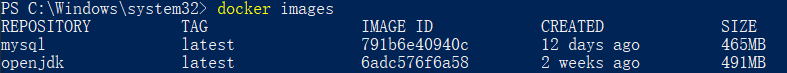
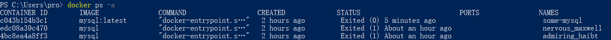

# docker基本使用

- 1.镜像
- 2.容器


## 1.docker安装


## 2.镜像

### 2.1.查看当前镜像

```shell
docker images
```



上面的命令会显示当前已经下载的镜像。

### 2.2.从dockerHub下载镜像

```shell
docker pull [OPTIONS] NAME[:TAG]
```

上面是拉取镜像的命令，没有``[:TAG]``时，会默认使用``latest``版本。

### 2.3.查询自己需要的镜像名字

去[dockerHub网站](https://hub.docker.com/)搜索查询。

### 2.4.制作镜像

<div style="color: red">to be continue.....</div>


## 3.容器

### 3.1.容器启动

#### 3.1.1.通过镜像启动容器：

```shell
docker run [OPTIONS] IMAGE[:TAG] [COMMAND] [ARGS...]
```

#### 3.1.2.启动已有的容器

**里程碑一:** 查看已有的容器：

```shell
docker ps -a
```



**里程碑二:** 启动已有的容器

```shell
docker start CONTAINER_NAME|CONTAINER_ID
```


### 3.2.容器启动的其他参数

```shell
docker run --name some-mysql -e MYSQL_ROOT_PASSWORD=my-secret-pw -d -p 4000:3306 mysql:latest
```

- 1.``--name some-mysql`` 给容器起个名字是``some-mysql``
- 2.``-e MYSQL_ROOT_PASSWORD=my-secret-pw``设置全局变量
- 3.``-d``后台运行
- 4.``-p 4000:3306``端口映射，将容器的3306端口映射到4000上


### 3.3.``docker stop``关闭容器

使用``docker ps``可以看到``container id``。使用如下命令关闭容器。

```shell
docker stop CONTAINER_ID
```


### 3.4.``docker rm``删除容器

```shell
docker rm CONTAINER_NAME|CONTAINER_ID
```


