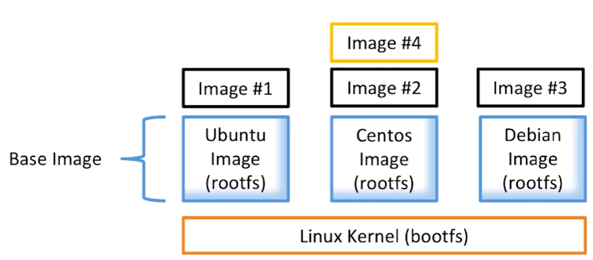
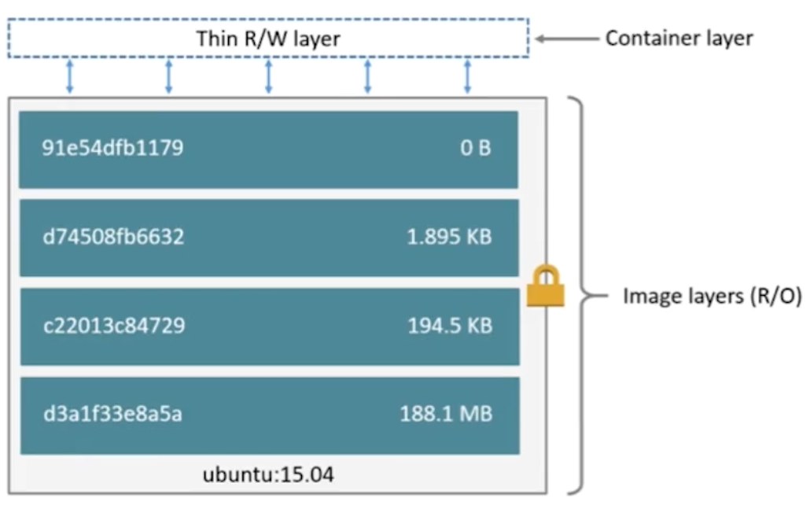

# 基础概念

## 01.image概念

- 1.文件和meta data的集合(root filesystem)
- 2.分层的，并且每一层都可以添加更新或删除文件，成为一个新的image
- 3.不同的image可以共享相同的layer
- 4.image本身是read-only的

## 02.container概念

- 1.通过image创建(copy)
- 2.在image layer之上建立一个container layer(可读写)
- 3.类比面向对象：类和实例
- 4.image负责app的存储和分发，container负责运行app

