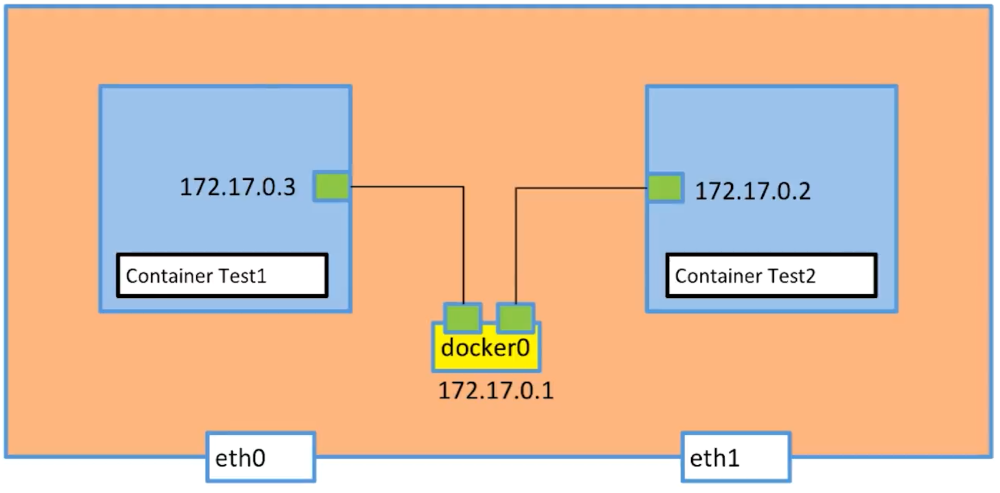

# 网络

## 查看docker的网络
```
docker network ls
```

```
NETWORK ID     NAME                       DRIVER    SCOPE
6e75ed3a1bf0   bridge                     bridge    local
1eb2c023f53d   elasticsearch_docker_elk   bridge    local
7f0a8f5a927a   host                       host      local
4803d879eb67   none                       null      local
```

## 查看具体某个网络
```
docker network inspect 6e75ed3a1bf0
```

```json
[
    {
        "Name": "bridge",
        "Id": "6e75ed3a1bf0ab494c38e09f9ca7c03a0718b578de30733a46030ca1ac973691",
        "Created": "2020-12-30T11:19:40.155849929Z",
        "Scope": "local",
        "Driver": "bridge",
        "EnableIPv6": false,
        "IPAM": {
            "Driver": "default",
            "Options": null,
            "Config": [
                {
                    "Subnet": "172.17.0.0/16",
                    "Gateway": "172.17.0.1"
                }
            ]
        },
        "Internal": false,
        "Attachable": false,
        "Ingress": false,
        "ConfigFrom": {
            "Network": ""
        },
        "ConfigOnly": false,
        "Containers": {
            "22cc2d28357380e0eab8717acaef44aa9433efc726aa5e9f6efac3092b4edf57": {
                "Name": "my-mysql",
                "EndpointID": "f608a05e4561b458a9c8533f4865b96b5ff44cbd82e5efb72ee50dc014f9195e",
                "MacAddress": "02:42:ac:11:00:02",
                "IPv4Address": "172.17.0.2/16",
                "IPv6Address": ""
            },
            "604253fdd6c9d623062180c226c446c599305cbea4784644ec883d019a2924fc": {
                "Name": "redis",
                "EndpointID": "55b5b057cacfd37f94147a4a04504eb3312a7490e3b86cdf959d4e15afc966bc",
                "MacAddress": "02:42:ac:11:00:03",
                "IPv4Address": "172.17.0.3/16",
                "IPv6Address": ""
            }
        },
        "Options": {
            "com.docker.network.bridge.default_bridge": "true",
            "com.docker.network.bridge.enable_icc": "true",
            "com.docker.network.bridge.enable_ip_masquerade": "true",
            "com.docker.network.bridge.host_binding_ipv4": "0.0.0.0",
            "com.docker.network.bridge.name": "docker0",
            "com.docker.network.driver.mtu": "1500"
        },
        "Labels": {}
    }
]
```
containers描述了当前启动容器中有哪些连在这个网络上.通过这种方式我们可以确定容器使用了哪个网络。

## 启动容器时指定网络
```sh
docker run -p9090:80 --net mysql8_mysql-network pikach
```

## bridge network
本机中的容器怎么互相访问


本机容器怎么访问internet


## 网络其他命令
```
➜  ~ docker network

Usage:  docker network COMMAND

Manage networks

Commands:
  connect     Connect a container to a network
  create      Create a network
  disconnect  Disconnect a container from a network
  inspect     Display detailed information on one or more networks
  ls          List networks
  prune       Remove all unused networks
  rm          Remove one or more networks

Run 'docker network COMMAND --help' for more information on a command.
```