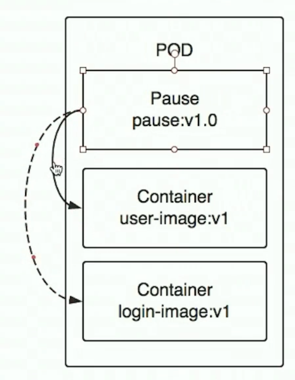

# k8s
## 01.k8s架构

- 1.有master和node两种节点
- 2.master暴露API共外部控制k8s集群

### 1.1.Master

- api Server让外界和k8s集群交互
- scheduler调度容器在哪个node运行等
- controller详细控制，如一个容器实例存在多少份等

### 1.2.node

- pod
    - 具有相同namespace(network/user namespace)的container集合
    - 是最小调度单位
- docker就是docker表示使用什么容器技术
- kubelet 创建容器的管理(类似master的agent)
- kube-proxy
- fluentd

## 02.pod
- pod中的容器都是运行在一台机器上
- pod有一个根容器 Pause把该pod所有容器link到一起
- 如果两个容器的关系特别紧密，就可以放在同一个pod中

## 03.ReplicaSet(RS) 副本机
RS用来管理多pod副本，保证服务的高可用

## 04.Deployment
用来更新，部署服务
- 1.我们管理就是Deplyment
- 2.Deployment会帮助我们自动管理RS(删除，创建)

## 05.Service
- 1.我们给pod打标签
- 2.Service可以找到不同标签的pod
- 3.Service提供这些pod的ClusterIP 供client使用

