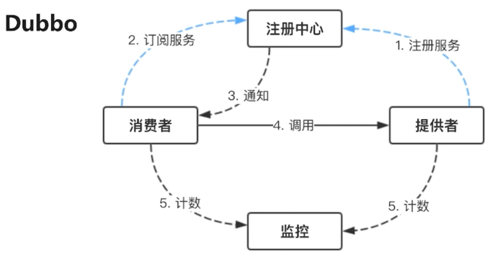
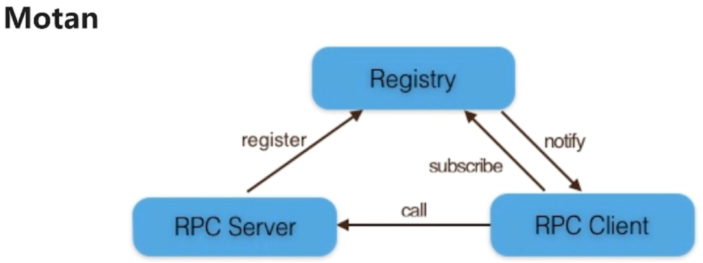
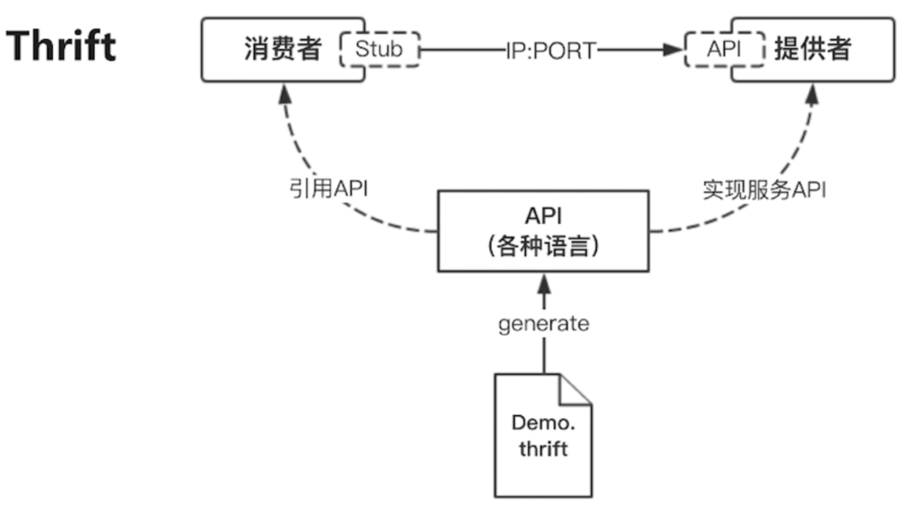
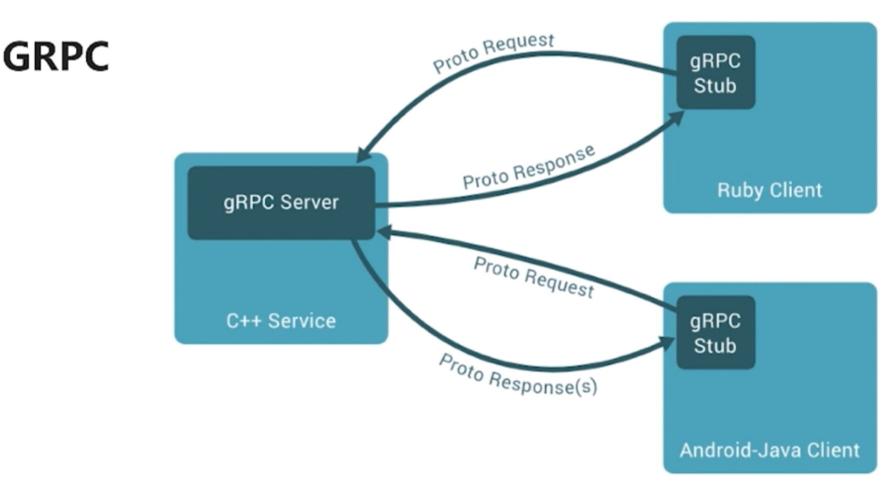
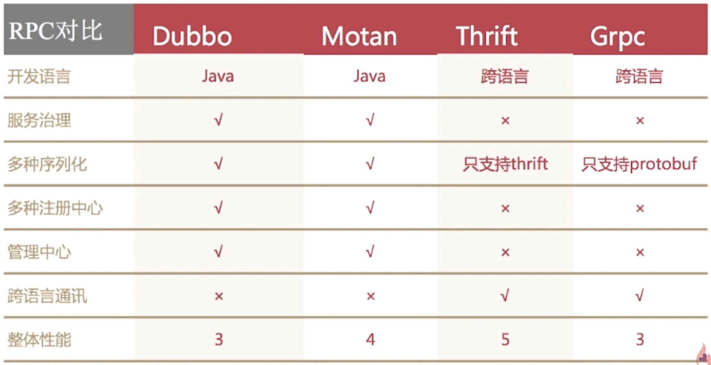

# 微服务

## 01.微服务的通讯

### 1.1.从通讯模式角度考虑

### 1.2.从通讯协议角度考虑

#### 1.2.1.REST API
REST: 表现出 状态转移

#### 1.2.2.RPC
- dubbo/dubbox
- motan
- grpc
- thrift

#### 1.2.3.MQ
消息队列(发布订阅)

### 1.3.如何选择RPC框架
- I/O，线程调度模型
- 序列化方式(可读/二进制)
- 多语言支持
- 服务治理

### 1.4.Dubbo
Dubbo只支持java

蓝色箭头：服务初始化时执行的操作
实现：同步调用
虚线：异步调用

### 1.5.Motan
只支持java

### 1.6.Thrift
跨语言

### 1.7.GRPC

### 1.8.RPC框架的对比

## 2.服务发现VS服务部署更新扩容
