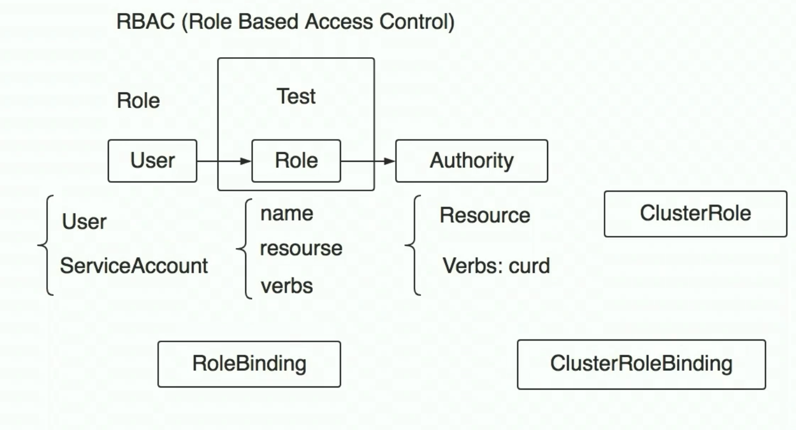

# k8s认证授权

## 01.认证
k8s外部访问ApiServer有两种方式可选：
kubectl和bearerToken

k8s内部不同服务互相访问使用：
ServiceAccount
### 1.1.Kubectl
TLS双向认证
(TLS/SSL + CA)双向认证
保证数据不被监听，CA保证双方都是好人

### 1.2.BearerToken
JWT令牌

### 1.3.ServiceAccount(namespace, token, ca)

## 02.授权
RBAC(ROLE BASED ACCESS CONTROL)
 

**重要概念**
User
Role
Authority