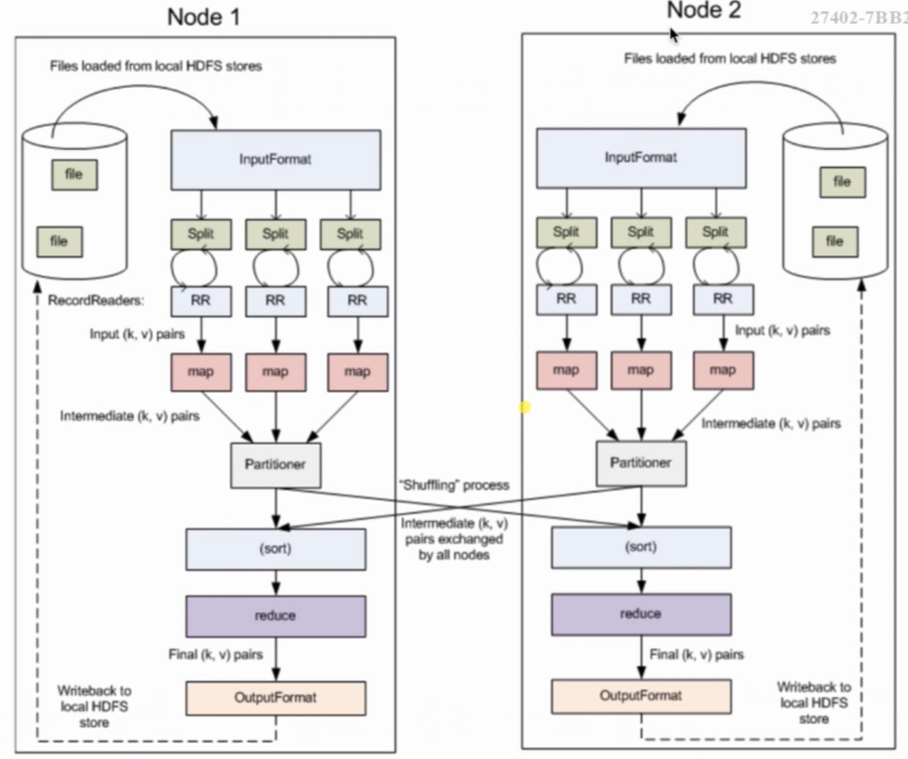

# MapReduce 基础

MapReduce优点：海量数据离线处理&易开发&易运行（但比不了spark和flink）

## 1.MapReduce编程模型
### 1.1.基础概念

将作业拆封成Map阶段和Reduce阶段。
- Map Tasks
- Reduce Tasks
我们需要实现Map和Reduce的逻辑，其他逻辑向开发者隐藏。

### 1.2.MapReduce编程模型之执行步骤
- 1.准备map处理的输入数据
- 2.Mapper处理
- 3.Shuffle
- 4.Reduce处理
- 5.结果输出

#### Map阶段
- 1.框架会把输入文件(夹)划分为很多InputSplit，默认，每个HDFS的Block对应一个InputSplit。通过RecordReader类，把每个InputSplit解析成一个个(k1,v1)。默认，每一行数据，会被解析成一个(k1,v1)
- 2.框架调用Mapper类中的map()函数，map函数的输入是(k1,v1)，输出是(k2,v2)。一个InputSplit对应一个Map Task
- 3.框架对map函数输出的(k2,v2)进行分区。不同分区中的(k2,v2)由不同的Reduce Task处理，默认只有一个分区
- 4.框架对每个分区中的数据，按照k2进行排序，分组。分组，指的是相同k2的v2分成一个组。
- 5.在Map阶段，框架可以执行Combiner操作，【可选】
- 6.框架会把Map Task输出的(k2,v2)写入Linux的磁盘文件
- 至此，整个Map阶段执行结束

#### Reduce阶段
- 1.框架对多个Map Task的输出，按照不同的分区，通过网络Copy到不同的Reduce节点，这个过程称做Shuffle
- 2.框架对Reduce节点接收到的相同分区的(k2,v2)数据进行合并，排序，分组
- 3.框架调用Reducer类中的reduce方法，输入(k2,{v2...}),输出(k3,v3)。一个(k2,{v2...})调用一次reduce函数
- 4.框架把Reduce的输出结果保存到HDFS中
- 至此，整个Reduce阶段执行结束