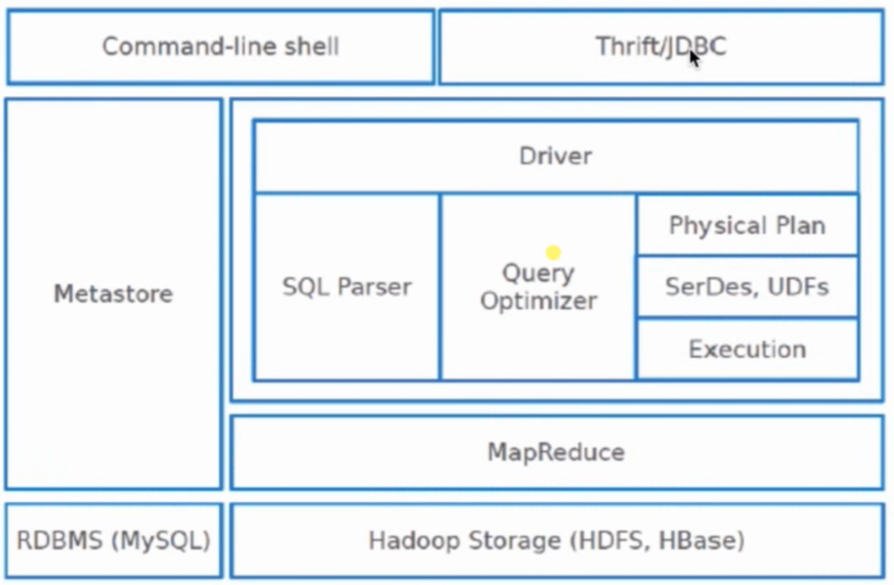

# Hive基础

## 01.hive产生背景
- MapReduce编程不便性
- 传统RDBMS人员的需要

## 02.Hive概述
- 由facebook开源，用于解决海量结构化日志数据统计问题
- 构建在Hadoop之上的数据仓库
- Hive提供的SQL查询语言：HQL
- 底层支持多种不同的执行引擎（2.x默认是spark）
- 统一元数据管理：
    - Hive数据存放在HDFS
    - 元数据信息(记录数据的数据)是存放在MySQL中

## 03.Hive体系架构

- 1.Command-line shell 用来写sql
- 2.Thrift/JDBC 用来提交sql的协议
- 3.Driver (包括编译器，优化器，执行器)把我们的sql解析后提交MapReduce作业，然后在Hadoop运行
- 4.Metastore 元数据信息。Hive是一张张表，而真正的数据放在HDFS，metastore存储数据表的结构信息(数据的数据)。Metastore存放在mysql中

## 04.Hive VS MySQL

| -            | HIVE       | MySQL    |
| ------------ | ---------- | -------- |
| 数据存储位置 | HDFS       | 本地磁盘 |
| 数据格式     | 用户定义   | 系统决定 |
| 数据更新     | 不支持     | 支持     |
| 索引         | 有，但较弱 | 有       |
| 执行         | MapReduce  | Executor |
| 执行延迟     | 高         | 低       |
| 可扩展性     | 高         | 低       |
| 数据规模     | 大         | 小       |

