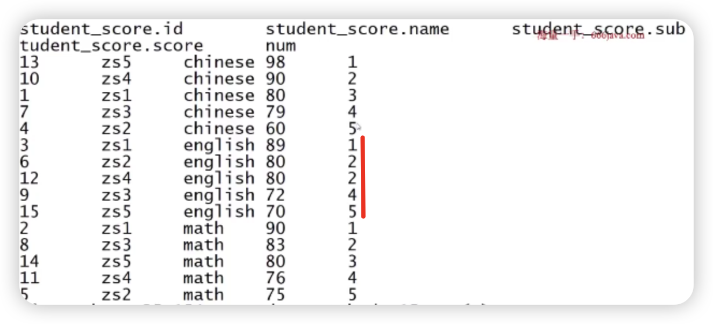
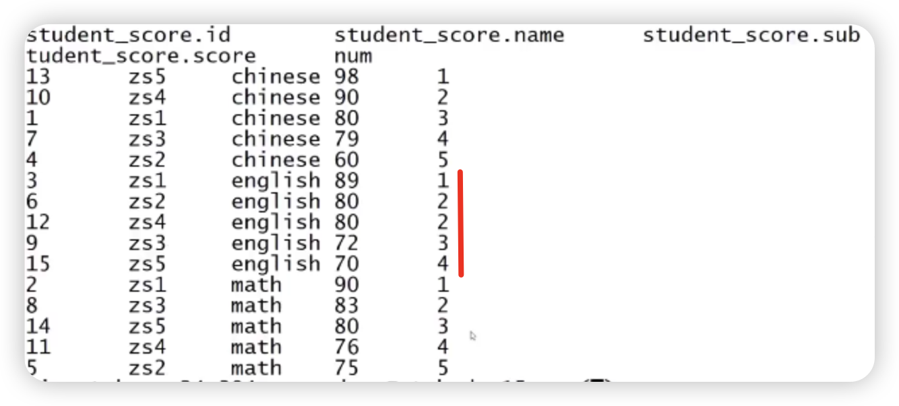

## 分组排序取TopN: ROW_NUMBER(), OVER()

### 原数据

| id   | name | sub     | score |
| ---- | ---- | ------- | ----- |
| 1    | zs1  | chinese | 80    |
| 2    | zs1  | math    | 90    |
| 3    | zs1  | english | 89    |
| 4    | zs2  | chinese | 60    |
| 5    | zs2  | math    | 75    |
| 6    | zs2  | english | 80    |
| 7    | zs3  | chinese | 79    |
| 8    | zs3  | math    | 83    |
| 9    | zs3  | english | 72    |
| 10   | zs4  | chinese | 90    |
| 11   | zs4  | math    | 76    |
| 12   | zs4  | english | 80    |
| 13   | zs5  | chinese | 98    |
| 14   | zs5  | math    | 80    |
| 15   | zs5  | english | 70    |

需求：查询各个科目前3名次的记录行

### 查询语句

```sql
select * from
(
select *,row_number() over(partition by sub order by score desc) as num
trom student score
) s where s.num<=3
```

1. row_number()的作用是给行做编号，不能单独存在，需要和over()配合使用
2. over(partition by sub)修饰row_number()，意思是先分组再添加编号
3. over(partition by sub order by score desc)，每个分组内的排序用score倒序
4. 内层select给每行都添加了一个num字段，最外层select查询每个分组排序前3的记录即可

### 结果

| s.id | s.name | s.sub   | s.core | s.num |
| ---- | ------ | ------- | ------ | ----- |
| 13   | zs5    | chinese | 98     | 1     |
| 10   | zs4    | chinese | 90     | 2     |
| 1    | zs1    | chinese | 80     | 3     |
| 3    | zs1    | english | 89     | 1     |
| 6    | zs2    | english | 80     | 2     |
| 12   | zs4    | english | 80     | 3     |
| 2    | zs1    | math    | 90     | 1     |
| 8    | zs3    | math    | 83     | 2     |
| 14   | zs5    | math    | 80     | 3     |

### rank(), dense_rank()

1. 用法上, rank()，dense_rank()和row_number()用法一致，都需要和over()配合
2. 区别点在于编号规则不同
   1. row_number是自然数递增编号
   2. rank()在遇到数值相等的行，会做相同数据编号，后续行会出现跳跃编号(比如：1，1，2会编号为1，1，3)
   3. dense_rank()在遇到数值相等的行，会做相同数据编号，后续行不会出现跳跃编号(比如：1，1，2会编号为1，1，2)

### rank()视图



### dense_rank()视图



## Hive中 行转列-多行合并(concat_ws(), collect_list(), collect_set())

### 原始数据

| name | favor    |
| ---- | -------- |
| zs   | swing    |
| zs   | football |
| zs   | sing     |
| zs   | coding   |
| zs   | swing    |


### collect_list()

```sql
select name, collect_list(favor) as favor_list from table group by name;
```

collect_list返回一个list类型数据

| name | favor_list                                       |
| ---- | ------------------------------------------------ |
| zs   | ["swing", "football", "sing", "coding", "swing"] |

### concat_ws

```sql
select name, concat_ws(',', collect_list(favor)) as favor_list from table group by name;
```

1. 输入是一个list和分割符
2. 输出是一个string

| name | favor_list                        |
| ---- | --------------------------------- |
| zs   | swing, football,sing,coding,swing |

### collect_set()

能力和collect_list很想，会多做一次去重

```sql
select name, concat_ws(',', collect_set(favor)) as favor_list from table group by name;
```

| name | favor_list                  |
| ---- | --------------------------- |
| zs   | swing, football,sing,coding |

## 列转行-单行拆分：split(), explode(), lateral view

### 原始数据

| name | favor_list         |
| ---- | ------------------ |
| zs   | swing,footbal,sing |
| ls   | coding,swing       |

### split()

将字符串切割为数组类型

```sql
select name, split(favor_list, ',') from table;
```

| name | favor_list                 |
| ---- | -------------------------- |
| zs   | ["swing","footbal","sing"] |
| ls   | ["coding","swing"]         |

### explode()

将数组拆分为多行，这个时候不能加name字段

```sql
select explode(split(favor_list, ',')) from table;
```

| favor_new |
| --------- |
| swing     |
| football  |
| sing      |
| coding    |
| swing     |

### lateral view

如果想加上name列，就需要该能力

```sql
select name, favor_new from table lateral view explode(split(favorlist, ',')) table1 as favor_new
```

| name | favor_new |
| ---- | --------- |
| zs   | swing     |
| zs   | football  |
| zs   | sing      |
| ls   | coding    |
| ls   | swing     |


