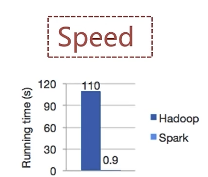
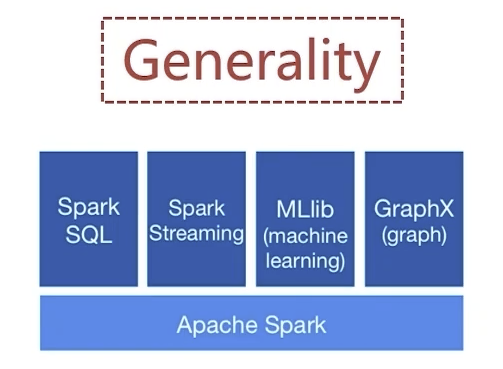

# spark基础

## spark介绍
- spark是一个用于大规模数据处理的**统一计算引擎**
- spark中一个最重要的特性就是**基于内存**进行计算，从而让它的速度可以达到MapReduce的几十倍甚至上百倍

### 1.spark特点

#### 速度快


#### 容易使用


#### 技术生态


#### 多环境运行


## spark集群部署
使用独立集群部署(不依赖hadoop学习用)
http://spark.apache.org
https://archive.apache.org/dist/spark/
https://archive.apache.org/dist/spark/spark-2.4.3/spark-2.4.3-bin-hadoop2.7.tgz

### 1.修改配置
#### spark-env.sh
```
cd /root/tools/spark-2.4.3-bin-hadoop2.7/conf
mv
cp spark-env.sh.template spark-env.sh
```
文件末尾添加
```
- JAVA_HOME=/root/app/open-jdk1.8
- SPARK_MASTER_HOST=Centos-01
```

#### slaves
```
cp slaves.template slaves
```
删除localhost
添加如下内容
```
CentOS-02
CentOS-03
```

#### spark-config.sh
```
cd /root/tools/spark-2.4.3-bin-hadoop2.7/sbin
```
文件末尾添加
```
- JAVA_HOME=/root/app/open-jdk1.8
- SPARK_MASTER_HOST=Centos-01
```

### 2.启动集群
sbin/start-all.sh

### 3.检查集群状态
```
[root@CentOS-01 ~]# jps
9133 Master
9423 Jps
```

## spark集群部署-ON YARN
- 需要一个Hadoop集群
- 需要一个Hadoop客户端

### 1.修改配置
上次spark-2.4.3-bin-hadoop2.7.tgz到hadoop客户端

<hr>
```
mv spark-env.sh.template spark-env.sh
vim spark-env.sh
```
添加配置：
```
export JAVA_HOME=/root/app/openJDK1.8
export HADOOP_CONF_DIR=/root/app/hadoop-3.2.0/etc/hadoop
```

### 2.history-server
```
mv spark-defaults.conf.template spark-defaults.conf
```
添加内容：
```
spark.eventLog.enabled=true
spark.eventLog.compress=true
spark.eventLog.dir=hdfs://CentOS-01:9000/tmp/logs/root/logs
spark.history.fs.logDirectory=hdfs://CentOS-01:9000/tmp/logs/root/logs
spark.yarn.historyServer.address=http://CentOS-04:18080
```

<hr>

spark-env.sh添加
```
export SPARK_HISTORY_OPTS="-Dspark.history.ui.port=18080 -Dspark.history.fs.logDirectory=hdfs://CentOS-01:9000/tmp/logs/root/logs"
```

<hr>
```
# 需要保证HDFS上有 /tmp/logs/root/logs 目录
sh sbin/start-history-server.sh
```