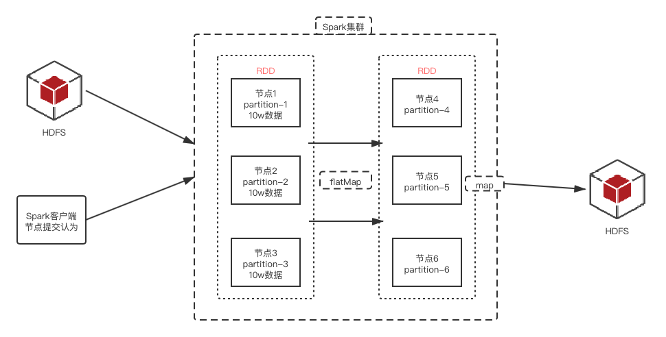
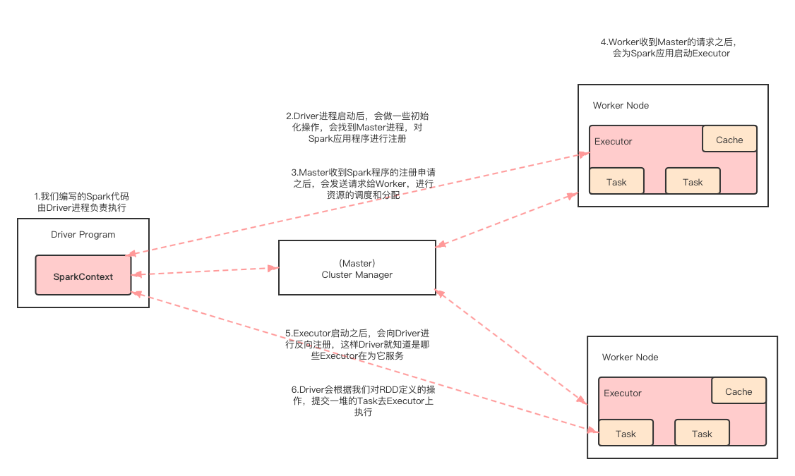

# spark工作原理

## RDD
### 1.什么是RDD
- RDD通常通过Hadoop上的文件，即HDFS文件进行创建，也可以通过程序中的集合来创建
- RDD是Spark提供的核心抽象，全称为Resillient Distributed Dataset，即弹性分布式数据集

### 2.RDD特点
- 弹性：RDD数据默认情况下存放在内存中，但是在内存资源不足时，Spark也会自动将RDD数据写入磁盘
- 分布式：RDD在抽象上来说是一种元素数据的集合，它是被分区的，每个分区分布在集群中的不同节点上，从而让RDD中的数据可以被并行操作
- 容错性：RDD最重要的特性就是提供了容错性，可以自动从节点失败中恢复过来

## Spark架构相关进线程
- Driver：我们编写的spark程序由Driver进程负责执行
- Master：集群的主节点中启动的进程
- Worker：集群的从节点中启动的进程
- Executor：由Worker负责启动的进程
- Task：由Executor负责启动的线程，它是真正干活的

