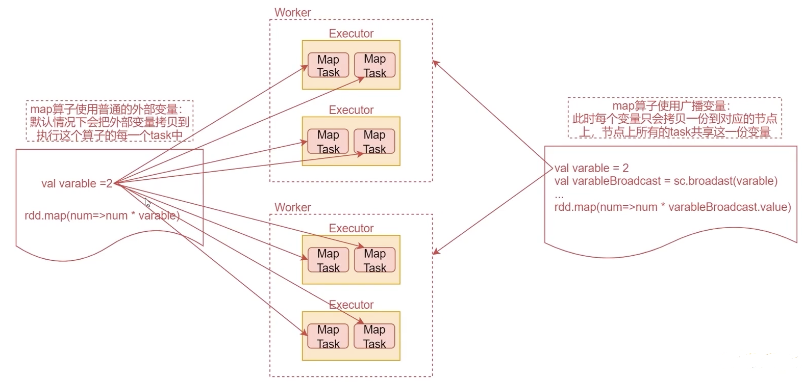

# Spark共享变量
- 默认情况下，一个算子函数中使用到了某个外部的变量，那么这个变量的值会被拷贝到每个task中，此时每个task只能操作自己的那份变量数据
- Spark提供了两种共享变量，一种是Broadcast Variable(广播变量)，另一种是Accumulator(累加变量)

## BroadCast 广播变量
- Broadcast Variable会将使用到的变量，仅仅为每个节点拷贝一份，更大的用处是优化性能，减少网络传输以及内存消耗
- 通过调用SparkContext的broadcast()方法，针对某个变量创建广播变量【**_广播变量是只读的_**】，可以通过广播变量的value()方法获取值

### 2.图例广播变量和常规变量


### 1.实践
```scala
package com.imooc.scala

import org.apache.spark.{SparkConf, SparkContext}

/**
 * 需求：使用广播变量
 * Created by xuwei
 */
object BoradcastOpScala {

  def main(args: Array[String]): Unit = {
    val conf = new SparkConf()
    conf.setAppName("BoradcastOpScala")
      .setMaster("local")
    val sc = new SparkContext(conf)

    val dataRDD = sc.parallelize(Array(1,2,3,4,5))
    val varable = 2
    //dataRDD.map(_ * varable)
    //1：定义广播变量
    val varableBroadcast = sc.broadcast(varable)

    //2：使用广播变量，调用其value方法
    dataRDD.map(_ * varableBroadcast.value).foreach(println(_))

    sc.stop()
  }

}
```

## 累加变量

```scala
package com.imooc.scala

import org.apache.spark.{SparkConf, SparkContext}

/**
 * 需求：使用累加变量
 * Created by xuwei
 */
object AccumulatorOpScala {
  def main(args: Array[String]): Unit = {
    val conf = new SparkConf()
    conf.setAppName("AccumulatorOpScala")
      .setMaster("local")
    val sc = new SparkContext(conf)
    val dataRDD = sc.parallelize(Array(1,2,3,4,5))
    //这种写法是错误的，因为foreach代码是在worker节点上执行的
    //var total = 0 和 println(total) 是在Driver进程中执行的
    //所以无法实现累加操作
    //并且foreach算子可能会在多个task中执行，这样foreach内部实现的累加也不是最终全局累加的结果
    /*var total = 0
    dataRDD.foreach(num=>total += num)
    println(total)*/

    //所以此时想要实现累加操作就需要使用累加变量了
    //1：定义累加变量
    val sumAccumulator = sc.longAccumulator

    //2：使用累加变量
    dataRDD.foreach(num=>sumAccumulator.add(num))

    //注意：只能在Driver进程中获取累加变量的结果
    println(sumAccumulator.value)


    sc.stop()
  }

}
```