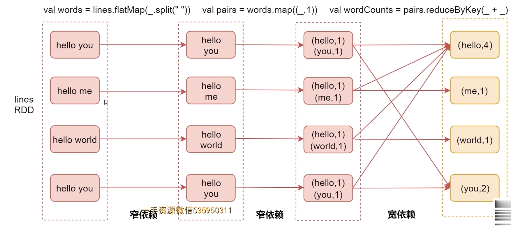
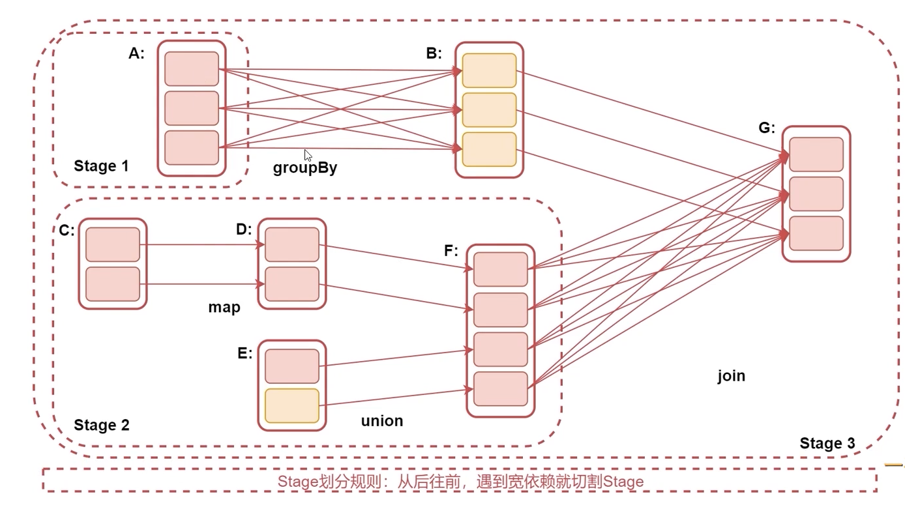

# Spark高级特性
## 宽依赖和窄依赖
- 窄依赖(Narrow Dependency): 指父RDD的每个分区只被一个字RDD的分区所使用，如map、filter等。
- 宽依赖(Shuffle Dependency): 父RDD的每个分区都可能被子RDD的多个分区所使用。如groupByKey、reduceByKey等



## stage
- Spark遇到Action算子会启动Spark job
- Spark job被分割为多个stage，每个stage是由一组并行的Task组成的
- stage的划分依据就是看是否产生了shuffle(即宽依赖)，遇到一个shuffle就会被划分为前后2个stage



## shuffle介绍
```scala
reduceBykey
groupByKey
sortByKey
countByKey
join
.....
```

Spark中的shuffle经历如下过程
- 未优化的 Hash Base shuffle
- 优化过的 Hash Base shuffle
- Sort-Base shuffle

