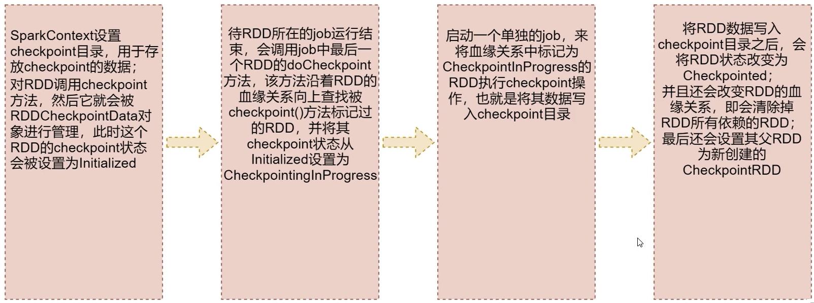

# CheckPoint
针对Spark job，如果我们担心某些关键的，在后面会反复使用的RDD，因为节点故障导致数据丢失，那么可以针对该RDD启动checkpoint机制，实现容错和高可用

## 使用方法
首先调用SparkContext的setCheckpointDir()方法，设置一个容错的文件系统目录(HDFS), 然后对RDD调用checkpoint()方法

## 流程


## checkpoint与持久化的区别
- lineage(血缘关系)是否发生改变
    - 持久化中 lineage不变
    - checkpoint中 RDD的依赖就清空了，lineage也就改变了
- 丢失数据的可能性
    - checkpoint将数据存储在高可用文件系统中(如HDFS)，不容易丢失。持久化可能在内存中，易丢失
- 建议：对需要checkpoint的RDD，先执行persist(StorageLevel.DISK ONLY)


## 代码事例
```scala
package com.imooc.scala

import org.apache.spark.storage.StorageLevel
import org.apache.spark.{SparkConf, SparkContext}

/**
 * 需求：checkpoint的使用
 * Created by xuwei
 */
object CheckpointOpScala {

  def main(args: Array[String]): Unit = {
    val conf = new SparkConf()
    conf.setAppName("CheckpointOpScala")
      //.setMaster("local")
    val sc = new SparkContext(conf)
    if(args.length==0){
      System.exit(100)
    }

    val outputPath = args(0)

    //1：设置checkpoint目录
    sc.setCheckpointDir("hdfs://bigdata01:9000/chk001")

    val dataRDD = sc.textFile("hdfs://bigdata01:9000/hello_10000000.dat")
        .persist(StorageLevel.DISK_ONLY)//执行持久化

    //2：对rdd执行checkpoint操作
    dataRDD.checkpoint()

    dataRDD.flatMap(_.split(" "))
      .map((_,1))
      .reduceByKey(_ + _)
      .saveAsTextFile(outputPath)

    sc.stop()

  }

}
```