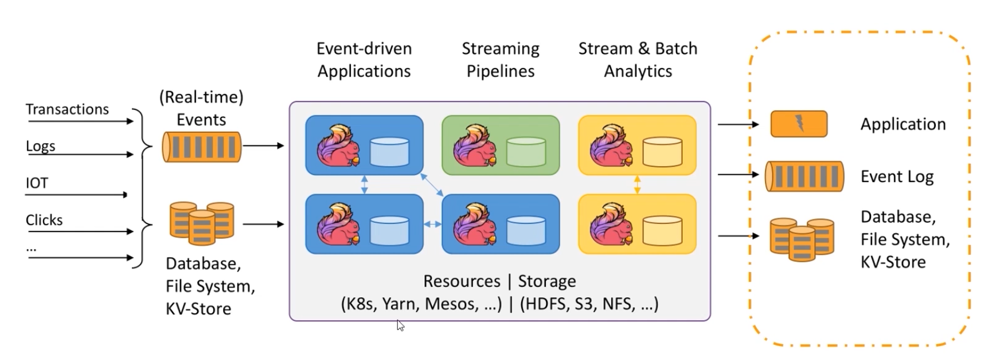
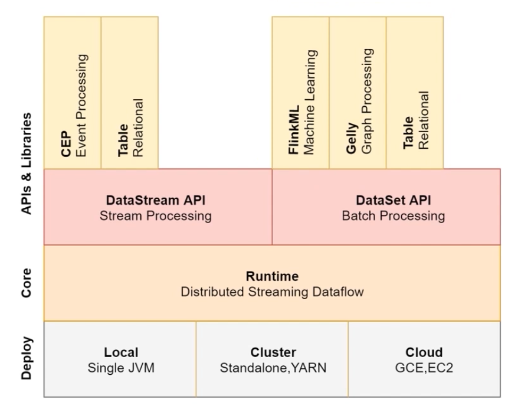

# flink基础

- Flink是一个开源的分布式，高性能，高可用，准确的流处理框架
- Flink支持Stream处理和Batch处理

## Flink 三大核心组件
Data Source
Transformations
Data Sink

## Storm vs SparkStreaming vs Flink

### 实时计算框架如何选择
- 1.需要关注流数据是否需要进行状态管理
- 2.消息语意是否有特殊要求At-least-once或者Exectly-once
- 3.小型独立项目，需要低延迟的场景，建议使用Storm
- 4.如果项目中已经使用了Spark，并且秒级别的实时处理可以满足需求，建议使用SparkStreaming
- 5.要求消息语义为Exectly-once，数据量较大，要求高吞吐低延迟，需要进行状态管理，建议选择Flink