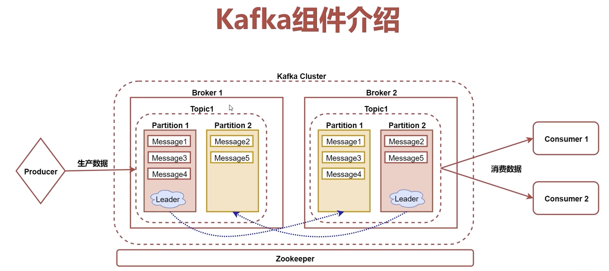

# kafka基础
- 1.kafka是一个高吞吐量的，持久性的，分布式发布订阅消息系统
- 2.kafka的数据是存储在磁盘中的，为什么可以满足每秒百万级别消息的生产和消费
- 3.kafka主要应用在实时计算领域，可以和Flume，spark，flink等框架结合在一块使用

## kafka架构

- 1.Broker:消息的代理，kafka集群中的一个节点称为一个Broker
- 2.Topic:主题，kafka处理的消息的不同分类(逻辑概念)
- 3.Partition:Topic物理上的分组，一个Topic在Broker中被分为1个或多个Partition，分区在创建Topic的时候指定，每个Topic都是有分区的，至少1个
- 4.Message：消息，是通信的基本单位，每个消息都属于一个Partition
- 5.Producer：消息和数据的生产者，向Kafka的Topic生产数据
- 6.Consumer：消息和数据的消费者，从Kafka的Topic消费数据