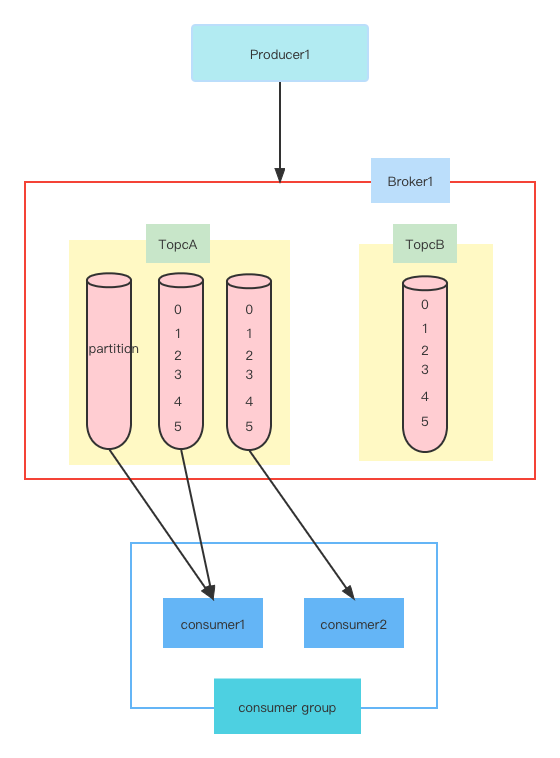
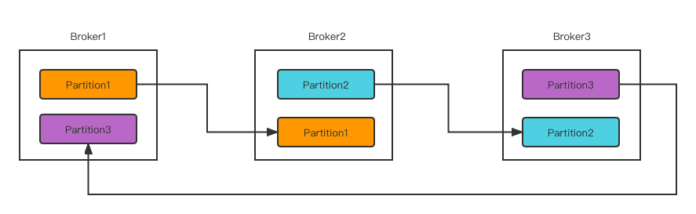

# kafka基础
## 1.1.Kafka核心概念

- Producer
    - 生产着写消息
- Topic
    - 主题
- partition
    - 消息的流通管道，每个消息只能进一个partition，消息有序列offset
- Consumer-Group
    - 消费组，消费组里有多个消费者，每个partition只能被1个消费者消费，保证不会多次消费消息。

## Kafka 位点

## Kafka概念-Replication&Cluster
场景：机器故障，该机器上的消息丢失
解决方案：部署多台broker，消息根据partition在不同的机器之间备份

集群：一组broker组成的集群
Replication：消息的备份

    
## kafka 拓扑模型
    

- Producer：发送消息到broker的生产方
- Broker：处理并存储消息的服务端服务器
- Cluster：共同协作处理消息的一组broker
- Consumer：从broker读取消息的客户端
- ConsumerGroup：共同处理消息的一组Consumer实例，每个consumer属于一个特定的consumer group
- Topic：在逻辑上可以被认为是一个queue，每条消息都必须指定它的topic
- Partition：消息实际存放的地方，每个topic包含一个或多个partition
- Record：在kafka系统中的消息
- Offset：record在partition中的位置
- Replication：副本数