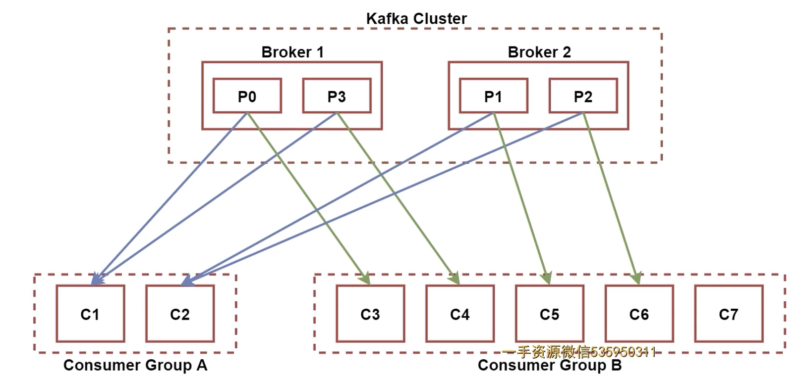
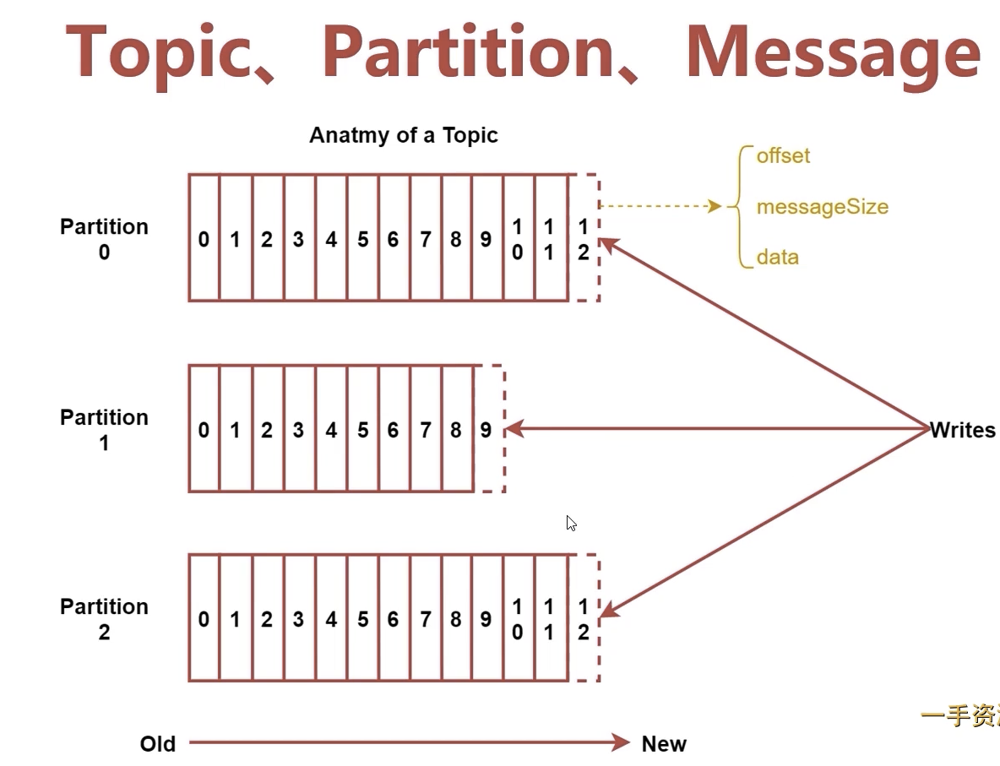

# kafka扩展内容

## Broker扩展
配置文件：server.properties

- Log Flush Policy: 设置数据flush到磁盘的时机

```
log.flush.interval.messages=10000
log.flush.interval.ms=1000
```

- Log Retention Policy: 设置数据保存周期，默认7天

```
log.retention.hours=168
```

## Producer扩展
- partitioner：根据用户设置的算法来计算发送到哪个分区，默认是随机发送到不同分区

## Consumer扩展
- 组内消费和组间消费
- 组间之间没有影响，会完整消费kafka所有数据
- 组内消费中，组内成员多于partition的个数时，会有成员不能接受数据




## Topic,partition扩展
- 每个Partition在存储层面是Append Log文件。新消息都会被直接追加到log文件的尾部，每条消息在log文件中的位置称为Offset(偏移量)
- 越多Partiton可以容纳更多的Consumer，有效提升并发消费的能力
- 业务类型增加需要增加Topic，数据量大需要增加

## Message扩展
- 1.offset，类型是long，表示此消息在一个partition中的起始位置，可以认为Offset是Partition中的Message的id，自增
- 2.MessageSize，类型为int32，表示此消息的字节大小
- 3.data，类型是bytes，表示message的具体内容


