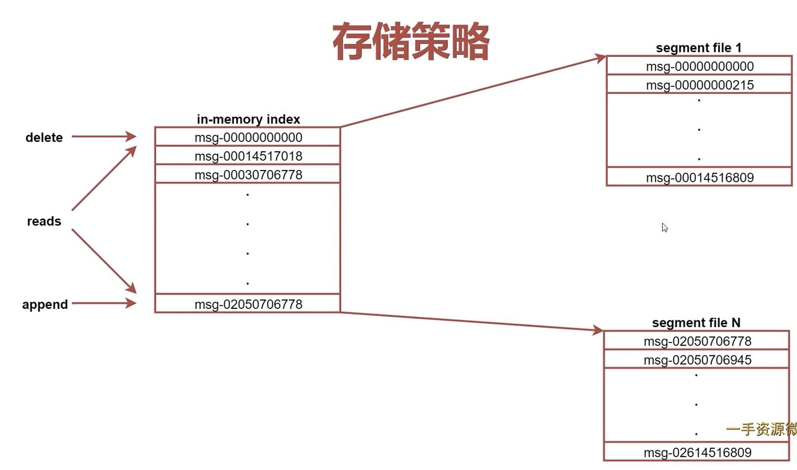

# kafka存储策略&容错机制

## 存储策略
- 在Kafka中每个Topic包含1到多个Partition，每个Partition存储一部分Message。每条Message包含三个属性，其中有一个是Offset
- Offset相当于Partition中这个Message的唯一id，那么如何通过id高效找到Message？
- 两大法宝：分段+索引
    - 每个partition有多个segment
    - 每个segment有一个索引，记录着该segment第一个Message的Offset

## 容错机制
- 当kafka集群中的一个Broker节点宕机，会出现什么现象？
- 当kafka集群中新增一个Broker节点，会出现什么现象？
- 新启动的节点不会是任何分区的Leader，怎么重新均匀分配？