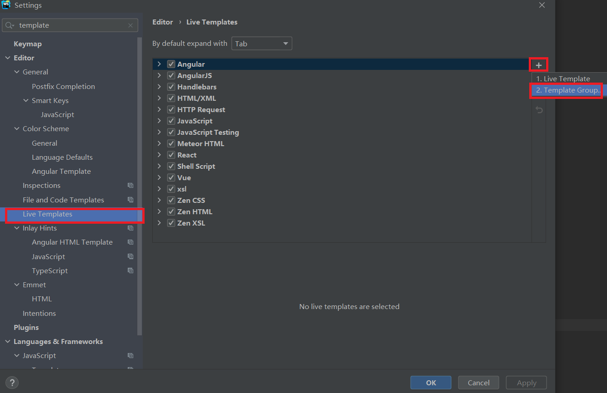
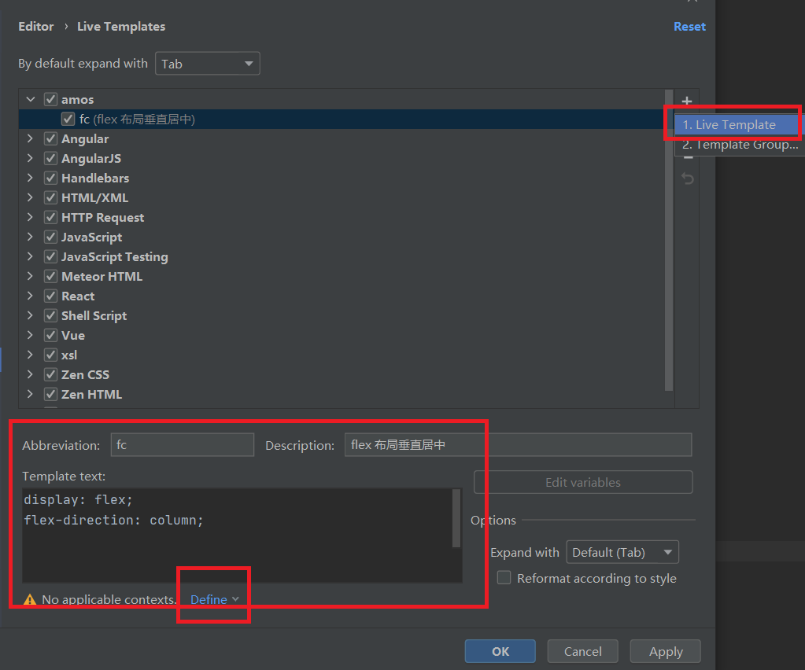
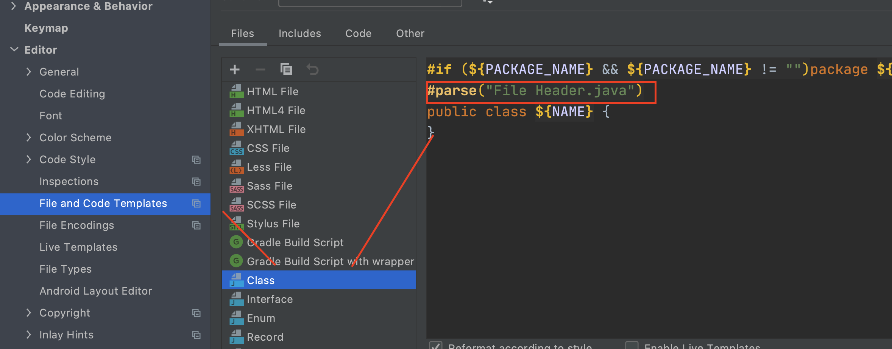
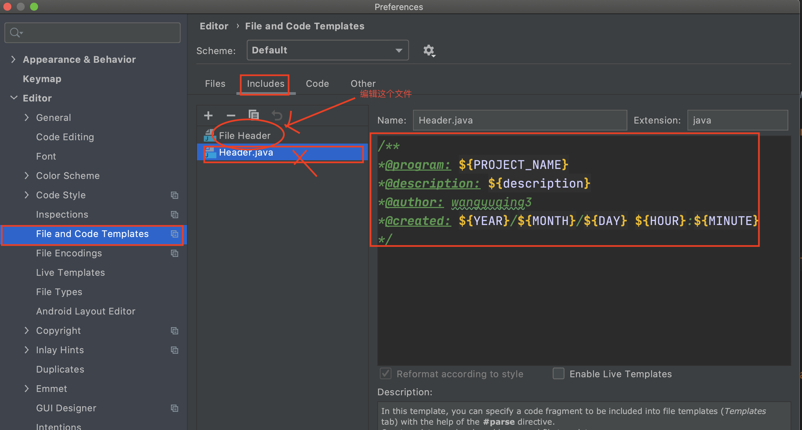
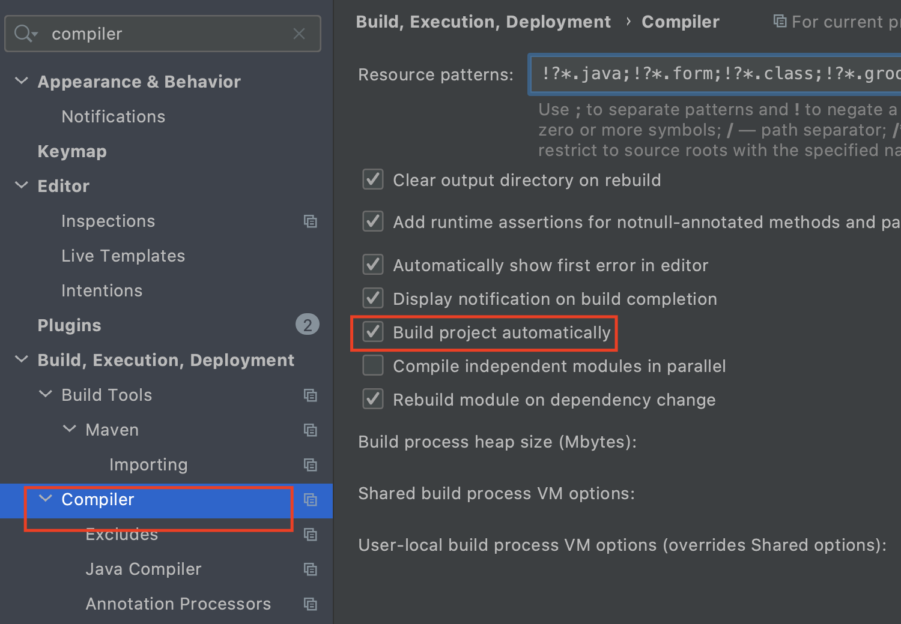
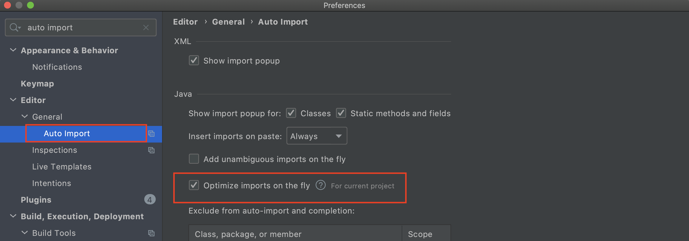

# jetBrains常规设置

## 01.代码模板快捷键

使用特定字符串，打印常见代码模板：





## 02.idea添加默认注释


观察上图，Class、interface等文件有``#parse("File Header.java")`` 我们添加这个文件并设置模板：



在includes中编辑``File Header``文件，增加如下内容：
```java
/**
*@program: ${PROJECT_NAME}
*@description: ${description}
*@author: wangyuqing3
*@created: ${YEAR}/${MONTH}/${DAY} ${HOUR}:${MINUTE}
*/
```

## 3.启动热重启
### 3.1.开启自动编译


### 3.2.自动清除import
