# 性能优化思考
优化的是什么？
响应时间？
1. 空间换时间，预计算 
2. 索引 单车推荐 那全量数据再查询过滤？

# 耗时问题
## 优化方案：
1. 空间换时间，预计算 
2. 索引 单车推荐 那全量数据再查询过滤？

## 排查工具 本地benchemark(PPROF应该可以替代)
benchemark会看一段逻辑的性能状态，需要运行。
benchemark，每次执行默认1s，我们可以指定

### 耗时查看
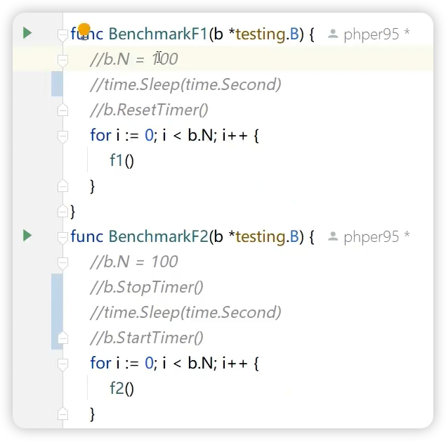
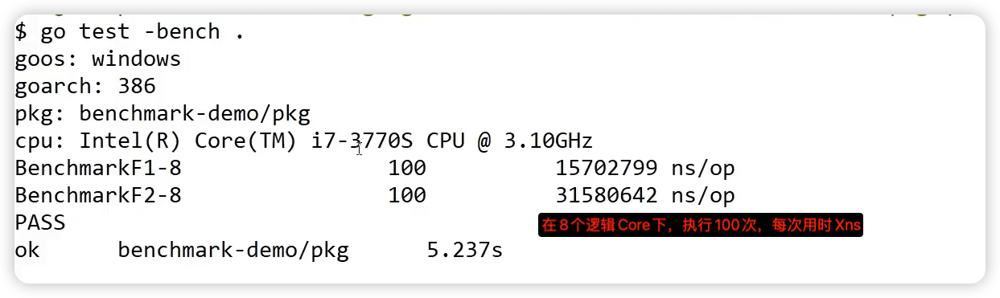
### 看内存，不同core执行结果
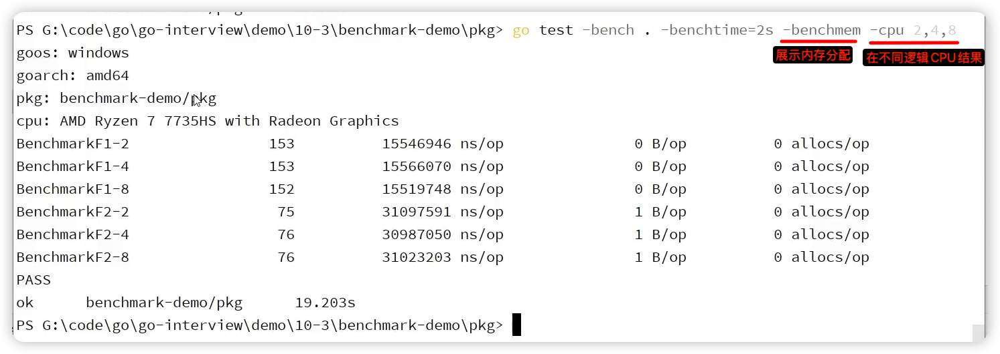

## PPROF工具
### PPROF可采样的数据
1. CPU数据
	1. 启动CPU采样，Go运行时会每隔10ms中断一次，中断信号由SIGPROF信号触发，获取当前所有goroutine的函数栈信息。 
2. 堆内存分配数据
	1. 启用后，每1000次堆内存分配会做一次采样。
3. 锁竞争数据
	1. 启用后，记录当前Go程序中互斥锁争用导致的延迟操作。
	2. 互斥锁竞争频繁可能会导致CPU利用率不高。
4. 阻塞时间的数据
	1. goroutine在某共享资源(一般是由同步原语保护)上的阻塞时间
		1. 从无缓冲channel收发数据的阻塞时间
		2. 满channel发送或空cheannl接收数据
		3. 被其他goroutine锁住的互斥锁的阻塞时间

### PPROF的使用方式
1. 基准测试 后面加PPROF相关的指令导出采集结果到文件
2. 代码中硬编码，调用PPROF导出结果到目标文件或其他存储
3. 通过net/http/pprof包采集（最普遍
### PPROF支持的各类采集文件
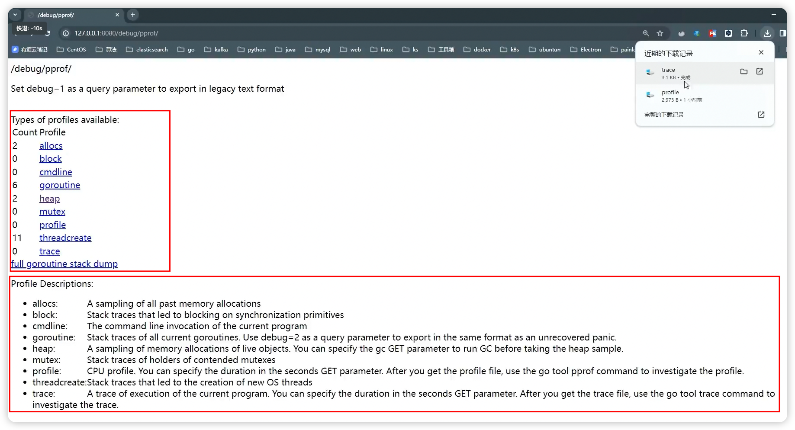
### PPROF文件分析举例
使用TOP找出CPU耗时前几名的函数
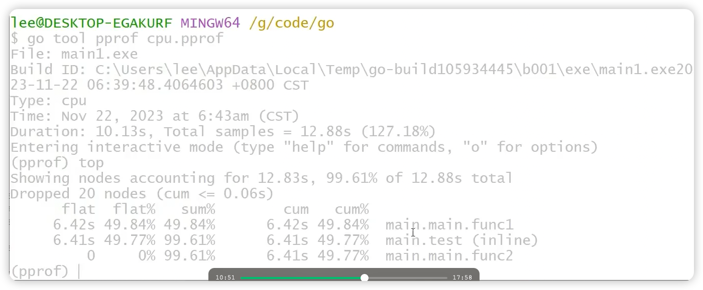
也可以看到函数内具体代码行的执行时间等：
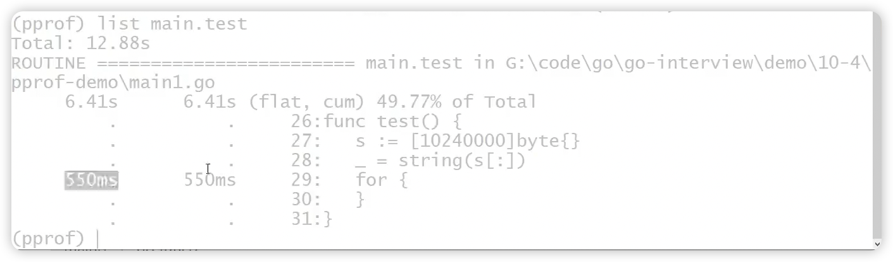
内存同理，看heap文件，可以找到内存使用最大的函数
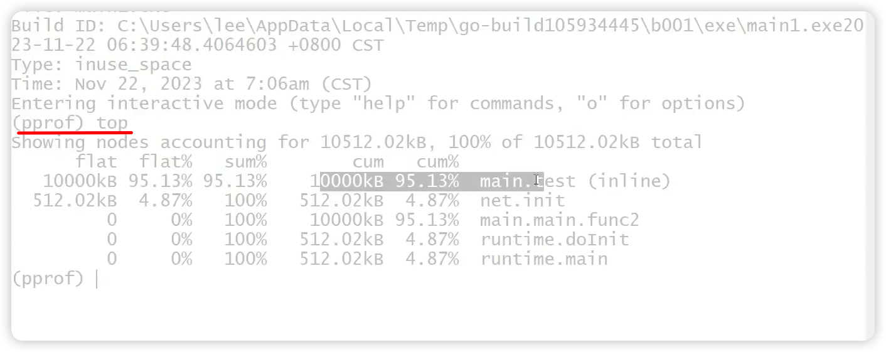

## Trace工具
采集方式可以通过硬编码，选择一段代码。
原生对采集数据分析后阅读界面包含2部分数据，一部分是trace，一部分是goroutine
### trace入口
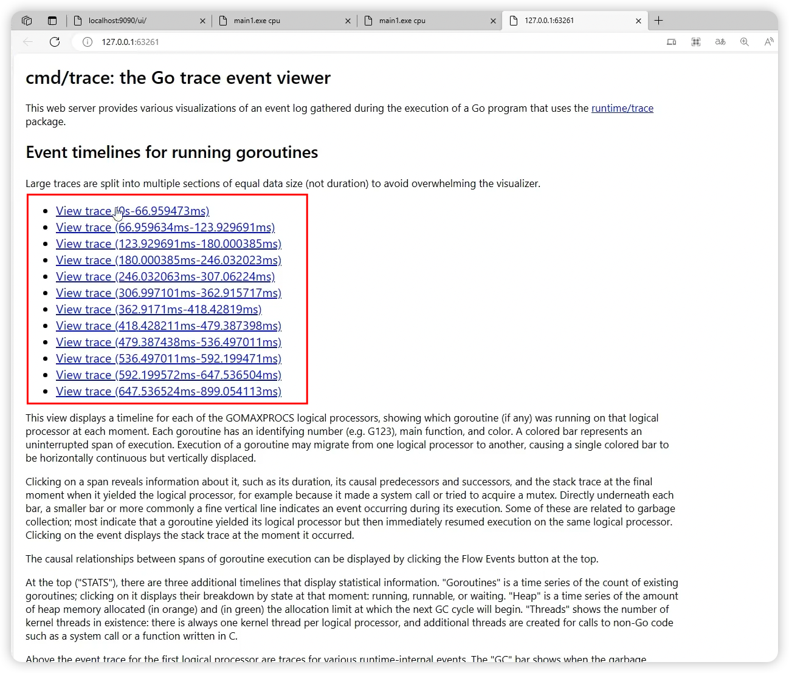
### trace-goroutine
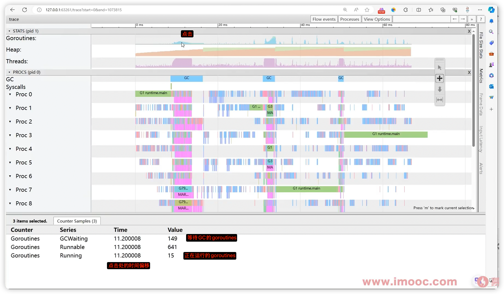
### trace-heap
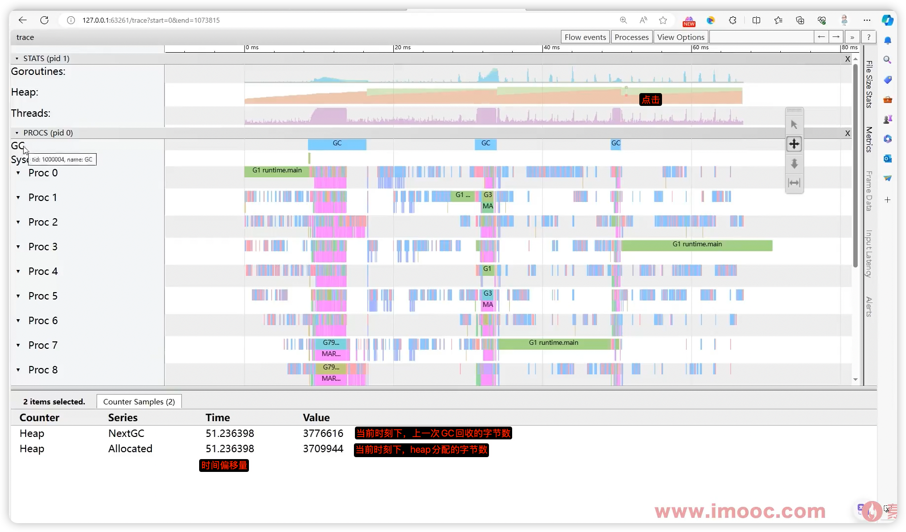
### trace-thread线程
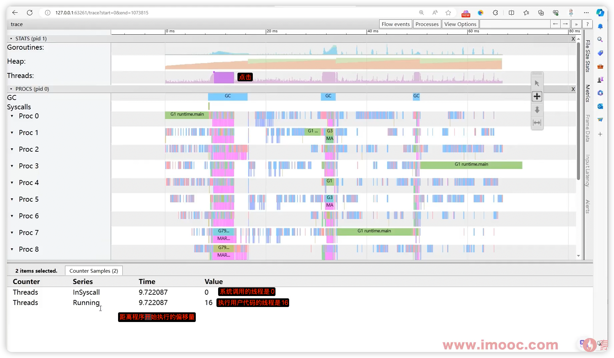
### trace-GC
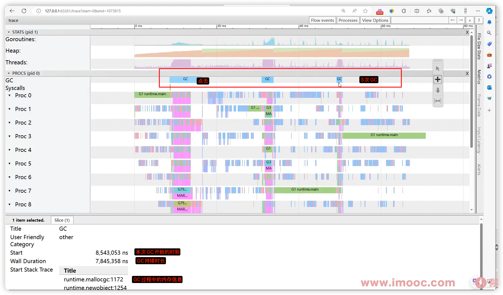

### trace-逻辑CPU，P的执行状态
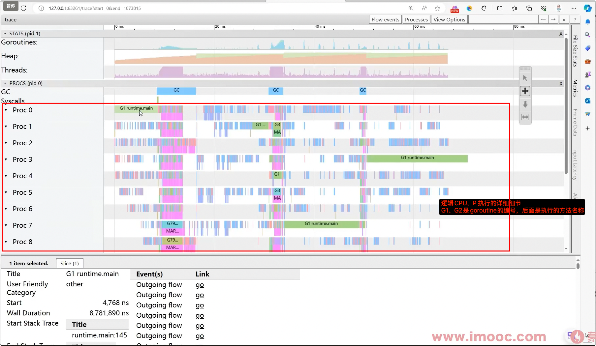
## goroutine状态分析
### 入口
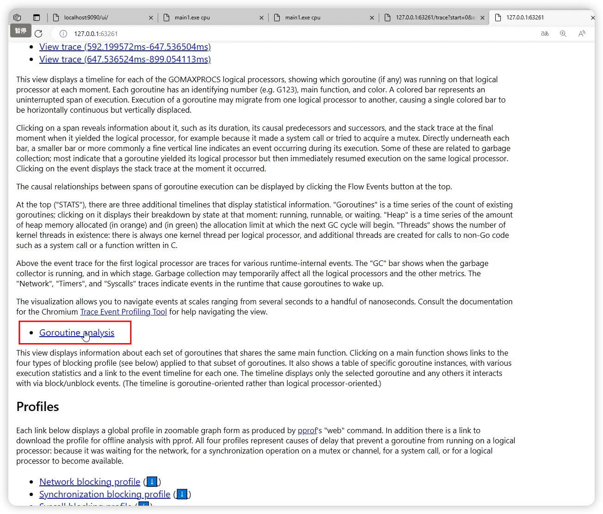
下面这里看到main函数启动了100w个goroutine
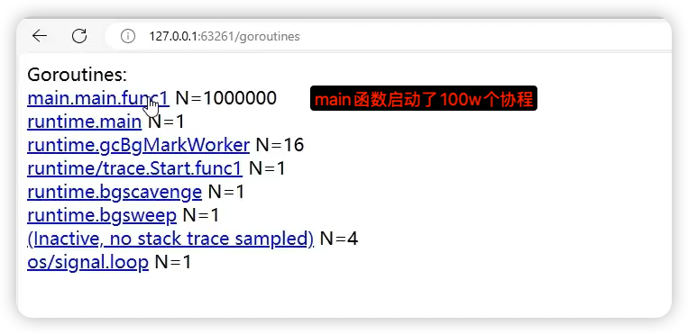
### goroutine的执行细节
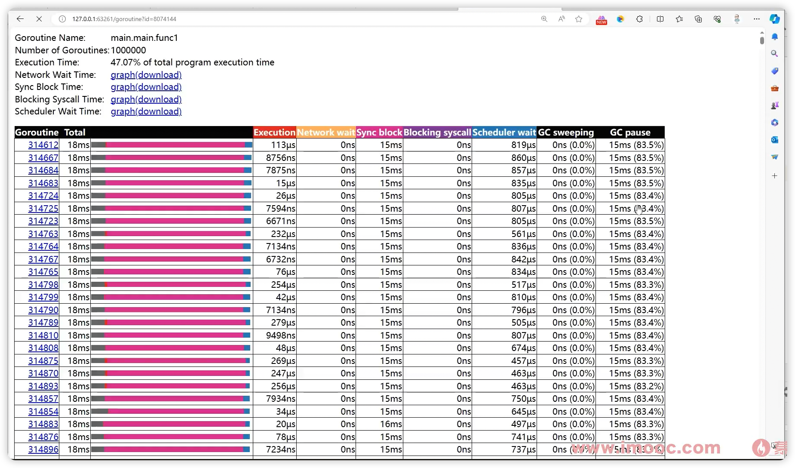