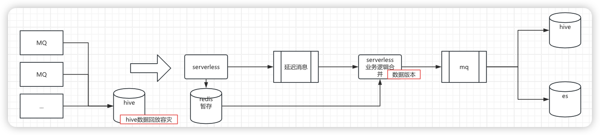

怎么描述项目的技术复杂性？

# 数据需求
需求：支持离线分析+后台数据看板
产品定义到离线表的每个字段；后台看板的UI、交互，数据

技术方案设计：
1. 准在线数据+离线数据的一致性问题。
2. 容灾
在线数据+离线数据 来源同一个数据生产链路：

容灾通过hive表回放 + 数据版本解决。

# 字节6小时视频项目-稳定性
业务复杂性：
6小时视频，最终抽出1万张图片，1千条音频。每个都是一个单独的检测任务，然后汇总为最终的视频审核结果。怎么保证流程中任务不丢失，且可靠的时间内完成所有任务。
关键点：重试。
方案原则：服务无状态。任务可平滑迁移新示例执行。
工具：流程编排，每个节点用消息队列连接RocketMQ，状态机管理，每个节点都会影响任务的状态扭转。
每个节点任务完成后做2件事情，1扭转总任务状态、2发送mq激活下一个节点任务。
单实例问题，任务被打断，会有消息队列将任务提交给其他可工作节点。重复的消息，也会因为状态机而避免重复执行(分情况，轻任务在任务执行后写状态机检查，重任务可以在执行任务前DB检查)。mysql写主读主，任务通过分表降低读写压力。

稳定性三板斧：
1. ()可靠的 技术方案
2. (发现问题)可观测的业务指标，足够笛卡尔积的matrcs，promixuse监控告警。
3. (定位问题)日志告警

# 美团业务需求-单车推荐
业务诉求，更大范围内寻找卸车推荐最优解。
业务定义范围要分级，排班、管辖、经营区县。原来线上走的业务是只到管辖，但是是排班、管辖平行执行，实际上排班、管辖有很多重复的点位，有大量的冗余计算。我在这个需求中将排班、管辖、经营区县的点位合并去重并打标它是哪一路的请求，等计算完成后再做分离。相当于计算量少了排班、和管辖的计算。
上线后业务做了变化，范围更大，即便做了上述优化点位查询会出现性能问题。一个请求查询7w个点位就扛不住了。问题的关键是数据层服务历史设计问题。点位我只需要查询满足我目标的点位，比如卸车，我只看有阈值限定内的点位，这一层过滤就从7w点位剩到4k点位，但现在的数据层服务的逻辑是 现将7w点全部取出，内存中查询每个点位的缺口，然后内存中过滤。
要解决这个问题，首先明确性能问题不在缺口查询上，点位过滤逻辑很多，现在性能是在ES上，7w点位查询ES有问题(ES集群多团队复用，历史问题)，我又做了一项优化，数据服务请求拆成2个节点，第一个节点执行缺口过滤，第二个节点执行其余过滤，大大降低了ES的调用量，降低了3/4。

# 美团业务需求-工单占用-废弃
这不是个好话题

业务/技术的难点在 资源占用。骑行调度，让车辆在合适的时间运往合适的地方。

我们预测一个点位 未来缺多少辆车，或者未来多多少辆车，这些都是资源。我们成为缺口和冗余。
如果一个工单在A点装车，那么这个工单使用的冗余数需要被占用，防止被其他装车工单重复使用冗余资源，导致业务问题。扑空，骑手A装走车，骑手B装不了车。

装车工单类型有很多，比较好的办法是对点位的冗余资源加锁。电单车现在是怎么做的，一次生单会涉及3种类型的生单。一次性拿到点位的冗余，依次生单，并依次提前占用资源。
单车不是这么简单。生完单后，并不是所有的工单都会推到骑手，

为什么单车单会丢失？？？

我们现在通过订阅工单组消息，

