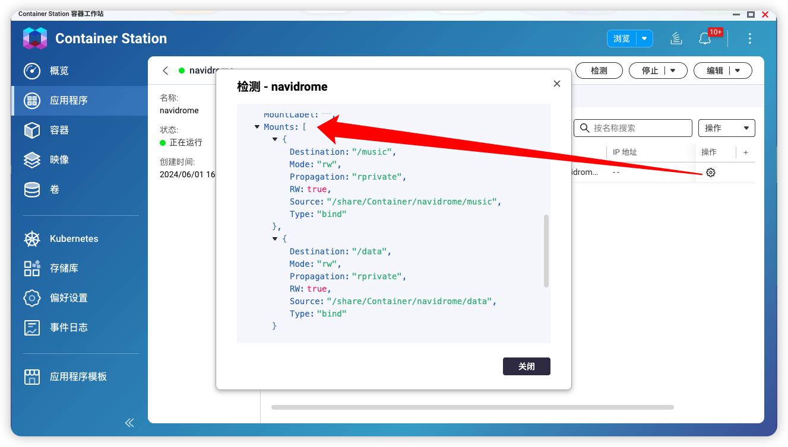
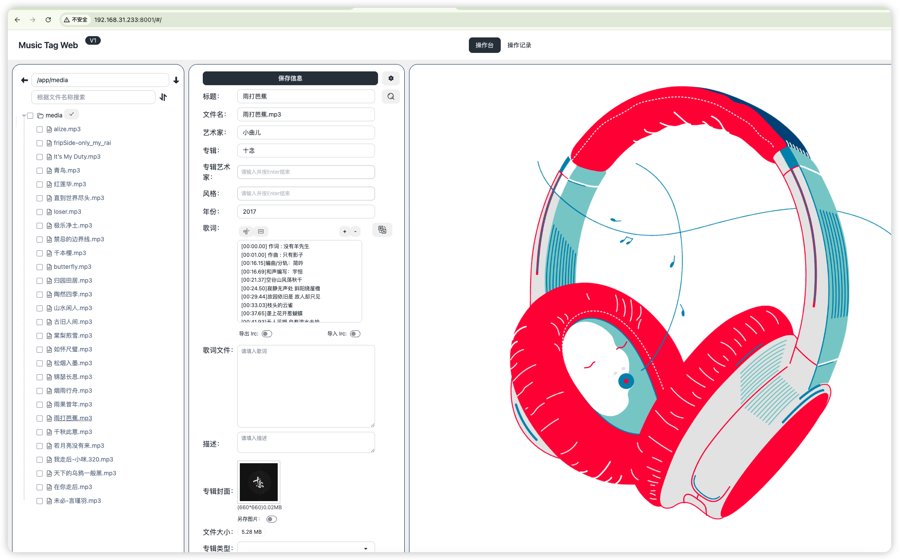

# navidrome等用法

## 工具

查看容器配置方法

Music-tab-web,编辑音乐元数据，添加歌词等

Navidrome，个人音乐服务器，连接客户端来播放音乐

## 地址

地址都可以在nas-container中查看

Music-tab-web : http://nas_ip:8001

navidrome: http://nas_ip:4533

## music-tab-web用法

在 http://tools.liumingye.cn/music/#/ 下载音乐/封面图片/歌词。

填写在music-tab-web上

1. 将音乐mp3文件拷贝到目标路径/music-tab-web和navidrome公用一个
2. 填写下载好的歌词等信息保存