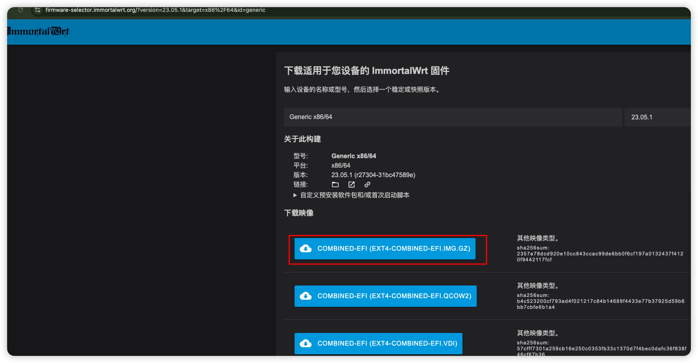

# 软路由

## 1. 下载openwrt系统

https://firmware-selector.immortalwrt.org/?version=23.05.1&target=x86%2F64&id=generic

## 2. 准备刷盘工具

https://etcher.balena.io/#download-etcher

将下载的固件刷入U盘

## 3.插入U盘启动小主机

进入bios，我这台设备是按F10，将U盘启动设置为默认启动
