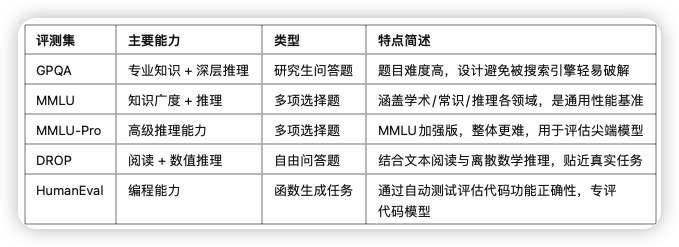
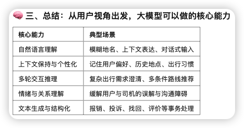

# 请讲一下现在主流的大模型评测集，他们分别的优势和存在的问题。你有使用这些评测集评估的经验吗？

| 测评集 | 覆盖能力           | 测试点       | 自动评估适配性 | 优势             | 问题             |
| ------ | ------------------ | ------------ | -------------- | ---------------- | ---------------- |
| MMLU   | 专业知识广度       | 多科学选择题 | 高             | 权威，通用       | 易泄露、题型单一 |
| C-Eval | 专业知识广度(中文) | 多科学选择题 | 高             | 通用             |                  |
| GSM8K  | 舒心思维链         | 逐步推理     | 高             | 链式推理标准任务 | 范围窄           |

关注这个网站的评测：https://llm-stats.com/

 **1. GPQA（Google-Proof Question Answering）**

​	•	**简介**：GPQA 是一个**研究生水平的问答基准集**，其设计目标是**避免通过简单搜索得到答案**，因此称为 “Google-Proof”。

​	•	**评估重点**：测试大模型在**高阶科学知识**、复杂语义理解与推理方面的真实能力。

​	•	**特点**：

​	•	题目来源于研究生级别的课程考试或文献。

​	•	回答通常需要跨句推理，不能靠关键词搜索得出。

​	•	**用途**：用于验证模型是否具备**深入理解能力**，尤其在专业领域的真实问答任务中。

**2. MMLU（Massive Multitask Language Understanding）**

​	•	**简介**：MMLU 是一个**广泛语言任务的性能评估基准集**，覆盖57个任务，涉及多个学科和领域。

​	•	**评估重点**：测试大模型在**多领域知识理解与判断能力**。

​	•	**特点**：

​	•	题目类型为多项选择题。

​	•	包含STEM（理工）、人文学科、社会科学、法律、医学等。

​	•	**用途**：衡量大模型“**知识广度 + 常识 + 推理能力**”，是当前最主流的通用评估集之一，OpenAI、Anthropic 等厂商广泛使用。

**3. MMLU-Pro**

​	•	**简介**：MMLU-Pro 是对 MMLU 的扩展版，专注于**更高阶、更复杂的推理任务**。

​	•	**评估重点**：测试模型的**高级推理能力、跨任务理解能力和综合判断力**。

​	•	**特点**：

​	•	题目整体比 MMLU 更难，要求更深入的逻辑推理。

​	•	更贴近实际应用场景中的“困难问题”。

​	•	**用途**：适用于评估**先进模型的极限能力**，如 GPT-4、Claude 3、Gemini 等。

**4. DROP（Discrete Reasoning Over Paragraphs）**

​	•	**简介**：DROP 是一个**阅读理解 + 数值推理评估集**，测试模型是否能从自然语言段落中提取并推理出数值答案。

​	•	**评估重点**：考察模型的**离散推理能力**，如加减、排序、计数等操作，往往结合文本理解。

​	•	**特点**：

​	•	答案格式为开放问答（非选择题）。

​	•	任务复杂，需要多步推理才能得出答案。

​	•	**用途**：评估模型在真实文本场景中进行**多步逻辑与数值计算的能力**。

**5. HumanEval**

​	•	**简介**：HumanEval 是一个专门用于评估**代码生成能力**的评测集，由 OpenAI 发布。

​	•	**评估重点**：测试模型在自然语言描述下，**生成正确、可运行的函数代码**。

​	•	**特点**：

​	•	每道题提供一个函数功能的自然语言描述。

​	•	评估方式是“**功能正确性**”（通过自动化测试用例）。

​	•	**用途**：衡量编程类大模型（如 Codex、Code Llama、GPT-Code 系列）在实际编程任务中的能力。

# 出行场景下，从用户的角度，有哪些你觉得是大模型可以提升用户体验的机会

滴滴的打车业务，出行场景下，从用户的角度，有哪些你觉得是大模型可以提升用户体验的机会

## **🚕 一、打车流程分解视角：用户全链路有哪些问题？**

以用户的出行链路为主线，大致可拆成如下几个阶段：

​	1.	**叫车前决策**（选车型、打不打、何时打）

​	2.	**下单过程交互**（地点不明确、特殊需求）

​	3.	**等待与沟通**（定位偏差、司机绕路）

​	4.	**乘车中体验**（路线、用车问题）

​	5.	**结束后的服务**（报销、开票、评价等）

## **🤖 二、每个阶段大模型可能提升的方向**

**✅ 1. 多轮对话式下单助手（智能助手）**

**场景**：用户不清楚去哪，或对路线/车型/费用有疑问。

**大模型可做**：

​	•	理解用户模糊表达（例：我要去人民广场附近某个喜来登）

​	•	多轮澄清目的地或行程安排（例：是早上9点那场会议对吧？）

​	•	个性化推荐车型、顺路拼车、节省成本方案

​	🔍 本质上是对话式交互能力 + 个性化上下文理解

**✅ 2. 自然语言下单与语义地点解析**

**场景**：用户说“去我公司”“去爸妈家”“去我上次去的那个咖啡馆”，传统系统无法理解。

**大模型可做**：

​	•	基于上下文和历史行为，**解析模糊指令为准确地址**

​	•	支持语音输入或对话式输入

​	✨ 增强自然交互 + 提高下单效率，特别适用于老年用户或特殊人群

**✅ 3. 用户-司机之间的“AI沟通官”**

**场景**：司机和用户因路线、定位、语言等产生误解或沟通障碍

**大模型可做**：

​	•	自动翻译/改写用户和司机之间的对话

​	•	自动生成解释：如“他在东门等您，不太清楚怎么走过去”

​	•	自动生成“建议路线”和交通提示

​	🧠 关键在于情境理解、口语表达润色与意图转换

**✅ 4. 乘车中辅助与问题处理 Agent**

**场景**：乘车过程中遇到问题（堵车、绕路、临时变更）

**大模型可做**：

​	•	主动提示路线异常（结合地图/路径 API）

​	•	自动建议是否改路线、是否投诉、是否联系平台

​	•	作为“中立助手”对乘车状态进行总结/判断（可用于后续仲裁）

​	💡 实质是构建一个“用户侧智能 Agent”，参与到 ride 中协同控制

**✅ 5. 打车后服务的智能处理器**

**场景**：报销、开票、评价、遗失物品找回等繁琐操作

**大模型可做**：

​	•	根据公司报销制度自动分类费用/生成开票说明

​	•	根据用户反馈内容自动生成合理评价或投诉模板

​	•	帮用户**追踪找回遗失物**，自动生成与司机沟通内容

​	✍️ 这一块大模型特别强，因为天然适合结构化-非结构化信息的转换

**✅ 6. 智能客服与场景预测推荐**

**场景**：节假日或天气变化时，打车难/贵/排队时间长

**大模型可做**：

​	•	主动告知“可能难打车”并推荐提前叫车或换方式

​	•	模拟多个方案：“现在叫 vs 晚10分钟叫”、“打快车 vs 拼车”

​	🤖 结合 Agent 能力，大模型可以做智能规划与备选方案推荐