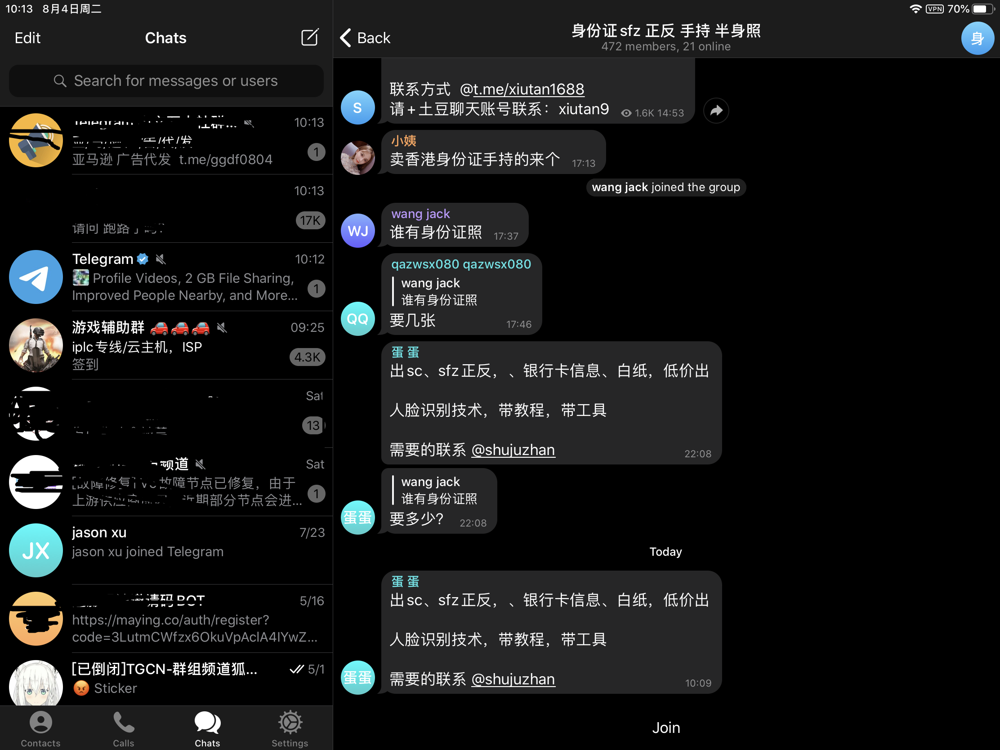

# 黑产

## 01.黑产产生的原因

- 利益

所有行为的驱动原因都是获利，黑产也不例外。

## 02.黑产现状

黑产稳定产业链已经完全形成，

- 1.上游供应链 身份证，手机号，银行卡和U盾等四件套批量提供商
- 2.中游供应链 产业漏洞发现，攻击手段研发
- 3.下游供应链 黄牛等直接执行者

下图是在tg随便搜索得到的四件套购买渠道：

## 03.业内应对黑产的方案

#### 3.1.应对黑产的策略

- 1.业务风控是一场持久战，只有当黑产的投入成本高于收益时，对抗才会逐渐减少。这个时候黑产会向另外的高流量产品进行转移，如此循环……所以业务风控切入点是提升黑产成本；
- 2.根据黑产画像，黑灰产成本由人和资源组成。黑产资源主要由工具、具有唯一性的设备、账号、身份信息等组成，从可控性来讲，打击黑产资源更可控。即提升黑产的攻击成本，对具有唯一性的设备、账号、身份信息进行打击，使它不会为黑产带来利益，所以风控的治理核心打击黑产资源；
- 3.处罚思路上：轻管控、重检测、快迭代。在注册、登录等环节对异常账号进行标记，但不处罚，在每一个业务节点将上一环节的检测结果向下输送，直至在末端场景中或UGC场景中阻断风险行为；
- 4.全链路风控的好处：保护用户体验；提高黑产试错成本，提升风控效果。