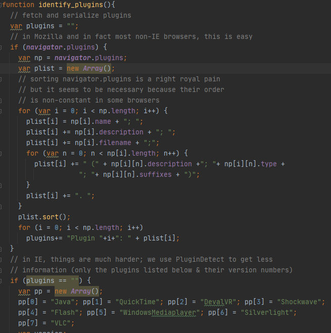

# 浏览器指纹

## 01.浏览器的版本

浏览器发送的HTTP头中包含User-Agent数据，但这些数据不值得信任。浏览器的类型和版本可以通过观察其怪异的行为做推断，比如：

- 1.HTTP表头字段的顺序和数量对每个浏览器家长都是唯一的

- 2.最重要的是每个浏览器系列和版本对HTML5的实现都是不同的(css和js)，我们可以通过运行js脚本检测客户端浏览器的版本

**参考链接：**

维基百科对浏览器指纹的定义：[https://en.wikipedia.org/wiki/Device_fingerprint](https://en.wikipedia.org/wiki/Device_fingerprint)

EFF在浏览器指纹方面的实践：

- 介绍文档：[https://panopticlick.eff.org/about](https://panopticlick.eff.org/about)

- 项目开源地址：[https://github.com/EFForg/panopticlick](https://github.com/EFForg/panopticlick)

- 发表论文：[https://panopticlick.eff.org/static/browser-uniqueness.pdf](https://panopticlick.eff.org/static/browser-uniqueness.pdf)

其他开源项目：

- am I Unique:  [https://github.com/DIVERSIFY-project/amiunique](https://github.com/DIVERSIFY-project/amiunique)

## 02.通过js获取浏览器数据的例子

