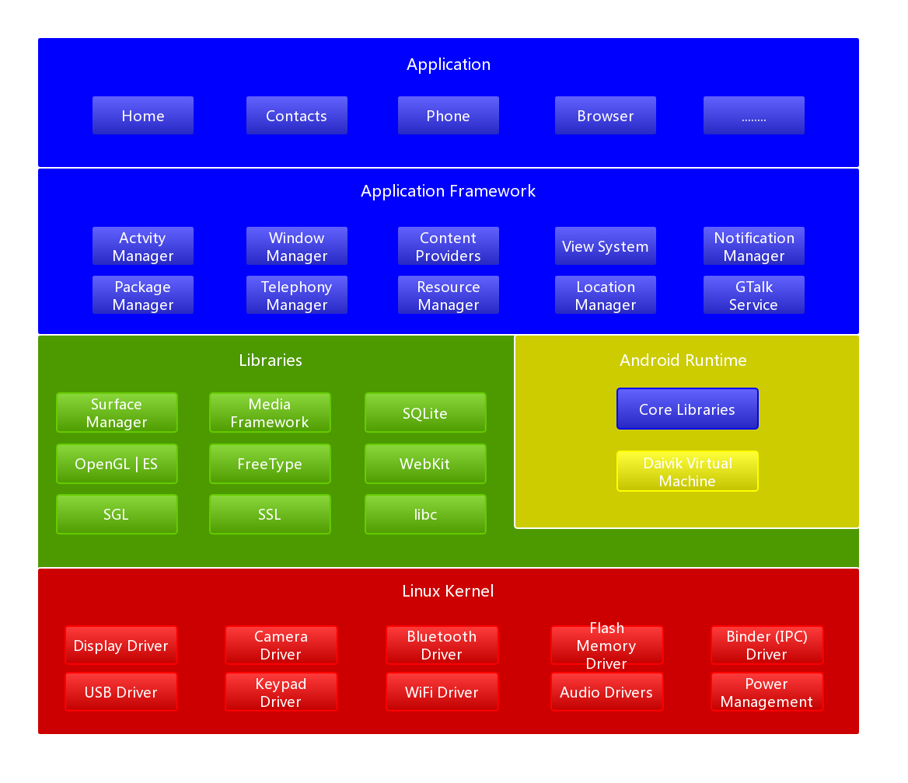
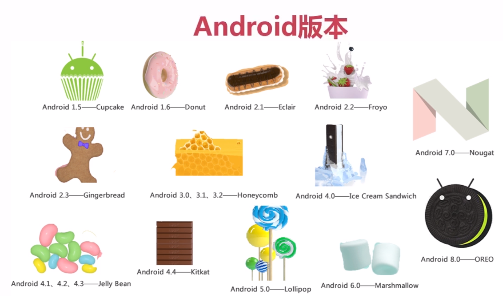
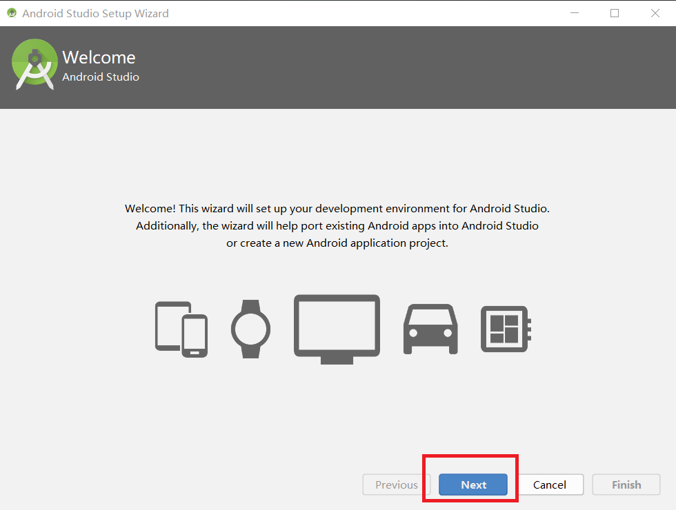
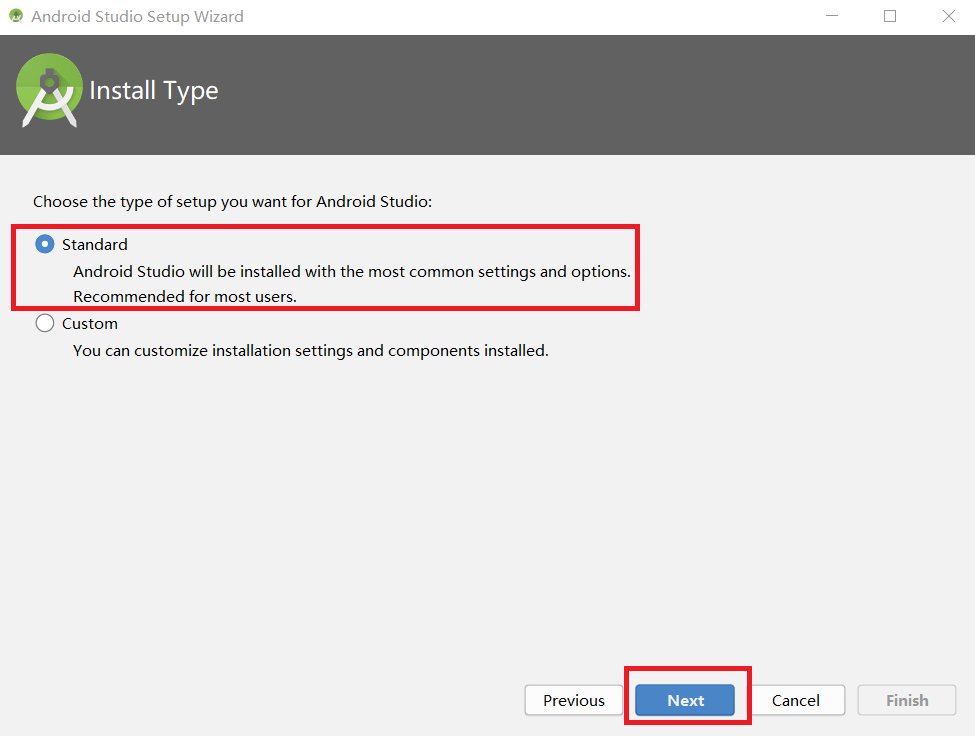
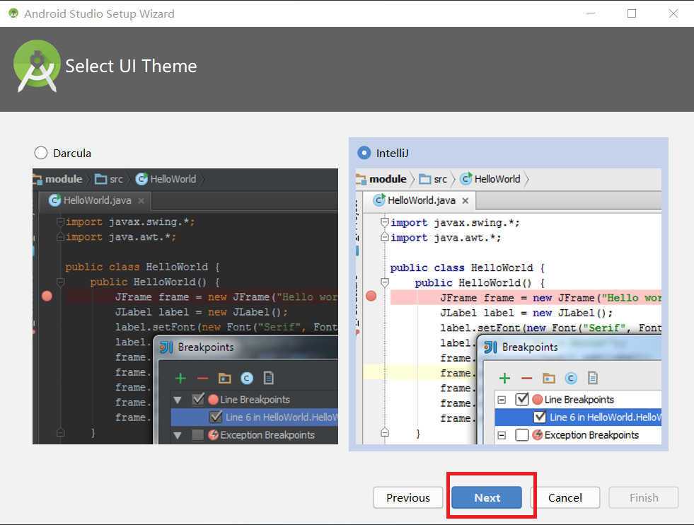
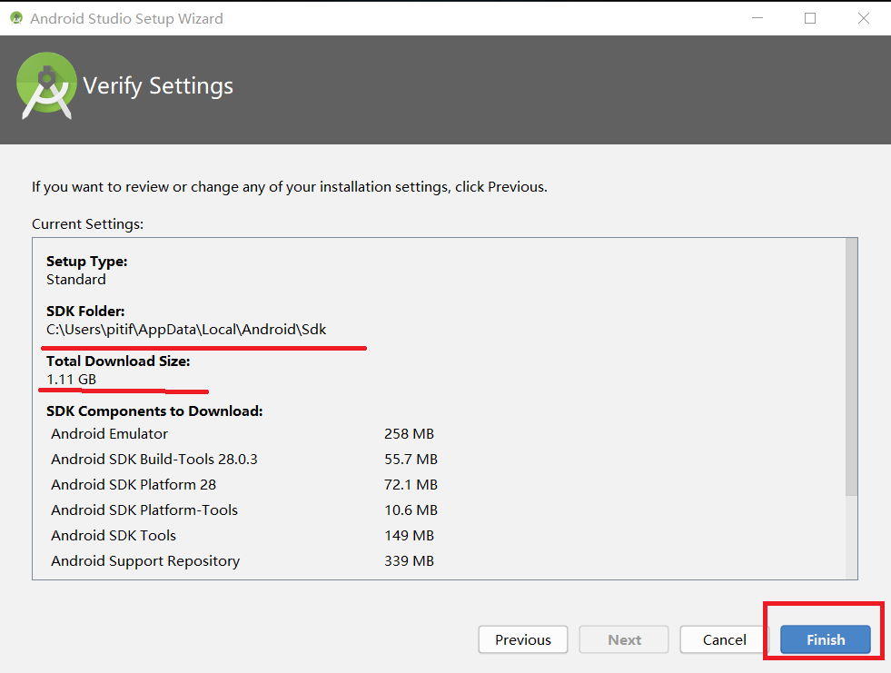

# 安卓入门了解

## 1.Android系统架构
 

## 2.Android版本
 
Android 2.3被誉为移动端的xp系统,是曾经装机量最大的系统 
在选择Android版本的时,要考虑兼容性,现在市场占有率最大的Android版本是4.x 

## 3.AndroidDevTools下载和安装
在国内可以从一个镜像网站下载:
[https://www.androiddevtools.cn/](https://www.androiddevtools.cn/) 

### 3.1.android-studio基础配置
 
 
 
**在下图中点击finash就开始下载sdk** 
 