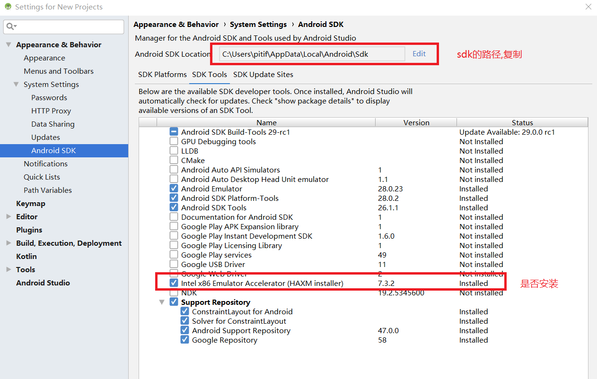

# Android-studio基本使用

## 1.project与module
在其他编辑器工程中,以eclipse为例,project代表一个独立的项目,所有的project放在workspace中. 
在android-studio中,project相当于eclipse中的workspace 

|工具|工作区间|工程|
|----|-------|----|
|eclipse|workspace|project|
|android studio|project|module|

## 2.创建工程
 
 

## 3.修改字体大小
 
 

## 4.创建一个module
 
 
 
 
 
 

## 5.视图模式
在Android Studio中,有多种视图模式供开发者掌握android开发的状态: 
 
其中最常用的是Android和project 

### 5.1.Android模式
在Android模式下,文件会按类型进行划分,(目录结构树和资源管理器上的目录结构不同~),目的是方便开发人员日常开发操作. 
 

### 5.2.Project模式
project模式是文件在硬盘上实际的存储方式 
 

## 6.运行module
在Android Studio中module就相当于一个project 
运行一个module的方法: 
在第一次使用时需要下载一些jar包,通过android studio在创建一个新的module时自动下载 
一段时间过后,界面就变成了如下样式: 
 
接下来运行module: 
 
 

如果在启动安卓虚拟机时发生问题,有如下保存,可以
[点击查看解决方案](#2emulation-currently-requires-hardware-acceleration异常问题解决) 

## 7.Android Studio重要模块的分工协作
在Android Studio中,最重要的模块是: 
- 1.Java类 就在Java目录下
- 2.activity_main.xml 页面布局文件
- 3.AndroidManifest.xml 索引文件

 

### 7.1.项目工程启动过程
#### 7.1.1.AndroidManifest.xml
一个module启动后,首先读取AndroidManifest.xml文件 
 
通过标签元素``<activity>``就可以找到对应的java类,``name=".MainActivity"`` 

#### 7.1.2.java类
通过AndroidManifest.xml文件的``activity``标签,我们找到了对应的java类,如下图 
 
在这个java类中,会使用``onCreate``方法,加载layout(页面布局文件夹)下的布局信息 

#### 7.1.3.页面布局文件xml
页面布局文件是通过xml实现的,通过java类调用后就解析xml布局文件,并显示在移动设备上 

## 8.删除一个module
 
 

## android-studio常见错误处理

### 1.JVM的heap空间不够
 
[stack overflow上的解决方案](https://stackoverflow.com/questions/30045417/android-gradle-could-not-reserve-enough-space-for-object-heap/31760855#31760855) 

### 2.emulation currently requires hardware acceleration!异常问题解决
[参考资料](https://blog.csdn.net/shareye1992/article/details/81777387) 
报错现象: 
 

- 1.检查SDK Tools中的Intel x86 Emulator Accelerator(HAXM installer)是不是安装了
     
- 2.到sdk目录下手动安装
     
- 3.如果上述方法不行,则检查bios是否开启虚拟化``Virtualization Technology``