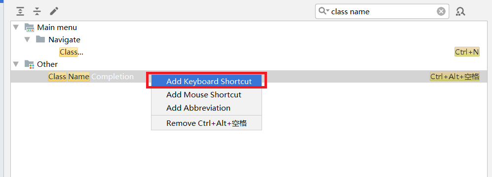

# Android Studio常用配置

## 1.快捷键设置
### 1.代码提示快捷键
Android Studio快捷键和eclipse或visual studio都不同,可以通过以下方式设置<br>
<br>
<br>
<br>
<br>

### 1.2.代码格式化快捷键
同上方法:<br>
<br>

### 1.3.修改撤销与反撤销
撤销:<br>
```
Ctrl+z
```
反撤销:<br>
```
Ctrl+shift+z
```

### 1.4.模糊查找
在当前文件查找:<br>
```
Ctrl+f
```
在全局文件查找:<br>
```
Ctrl+Shift+f
```

### 1.5.显示文档说明
```
Ctrl+q
```

### 1.6.添加get,set方法等
```
Alt+insert
```

### 1.7.补全提示
```
Ctrl+Alt+space
```

### 1.8.引入包或创建新类
```
Alt+Enter
```

### 1.9.代码格式化
```
Ctrl+Alt+L
```

## 2.编码问题
在Android Studio上有四处编码设置:<br>
```
settings->FIle Encodings
 IDE Encoding
 Project Encoding
 File or Director Encoding
 Property FIle Encoding
```
<br>

编译时的编码:<br>
<br>