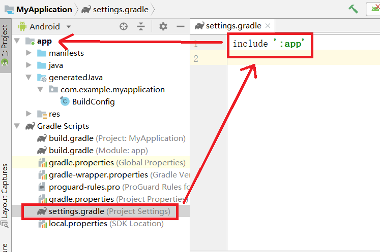

# Grandle
Grandle是Android主流编译工具<br>

## 1.重要文件
### 1.1.项目级别setting.gradle
该文件记录那些module要加入到工程中<br>
<br>

### 1.2.项目级别builid.gradle
配置应用到所有的module中<br>

### 1.3.Module级别builid.gradle
配置应用到当前的module中<br>

## 2.重要参数
```
minSdkVersion: 最小API Level
compileSdkVersion: 编译的SDK版本(用最新的)
targetSdkVersion:目标版本
dependencies: 依赖配置,依赖的库
```