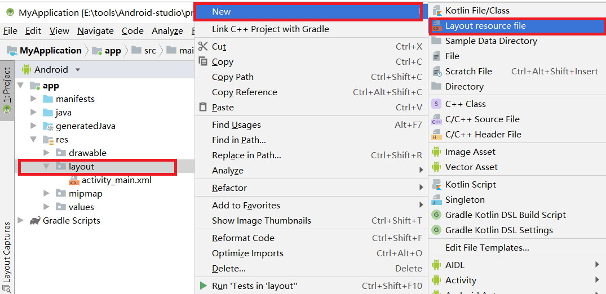
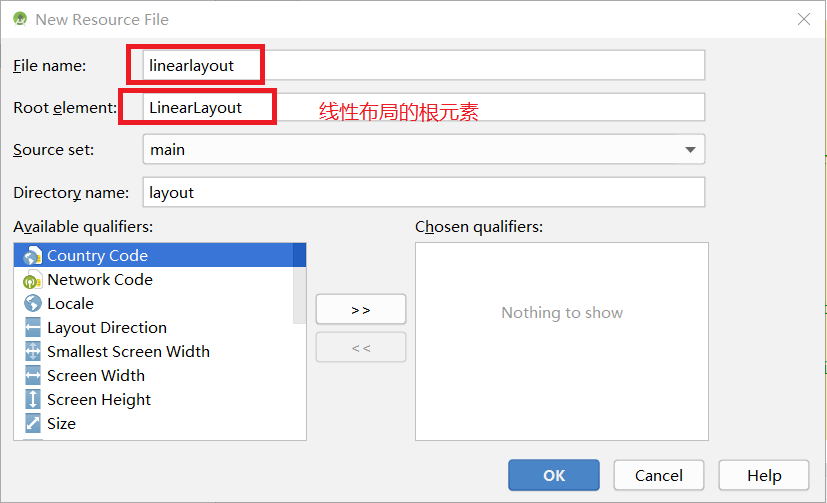
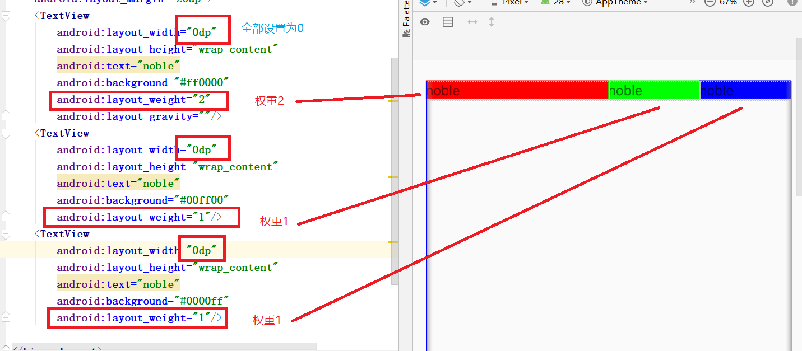
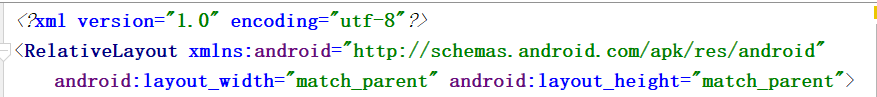
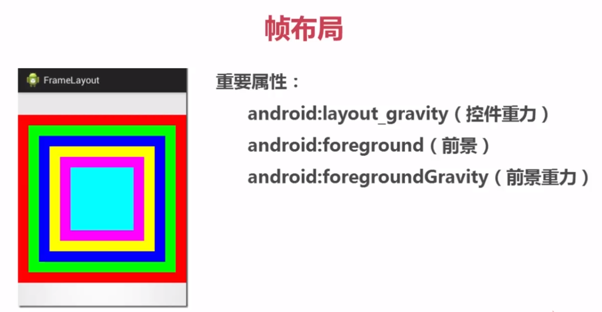
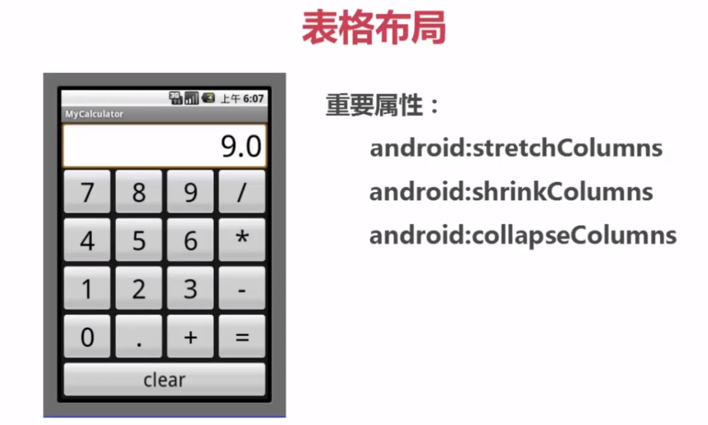
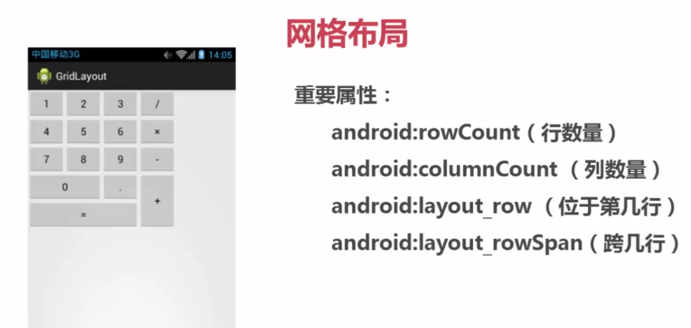
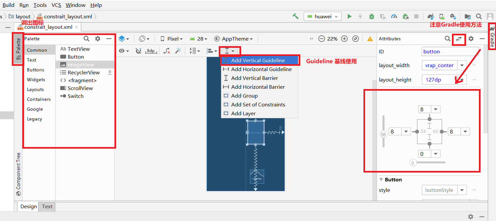

# 页面布局

## 1.常用布局
### 1.1.[线性布局(LinearLayout)](#3.线性布局)
### 1.2.[相对布局(RelativeLayout)](#4.相对布局)
### 1.3.[帧布局(FrameLayout)](#5.帧布局)
### 1.4.[表格布局(TableLayout)](#6.表格布局)
### 1.5.[网络布局(GridLayout)](#7.网格布局)
### 1.6.[约束布局(ConstraintLayout)](#8.约束布局)
### 1.7.[布局引用与嵌套(include)](#9.使用include标签引用和嵌套布局)

## 2.添加布局的方式
### 2.1.利用xml文件设计
页面布局都使用该方法<br>

### 2.2.使用java代码添加
该方法不常用,主要是两个原因<br>
- 1.和xml同样的布局效果,需要的代码量很大
- 2.java代码,不直观 不能很好的和页面效果产生联想

## 3.线性布局
线性布局,上到下,做到右,凡是以这种方式布局的页面都可以使用线性布局来解决<br>
### 3.1.创建线性布局文件layout
<br>
<br>

### 3.2.布局的重要属性
```css
/* match_parent 和父容器一样大, wrap_content 随着内容的增大而增大 */
android:layout_width  [match_parent|wrap_content] 宽度 
android:layout_height [match_parent|wrap_content] 高度
android:layout_padding ndp 内边距 /* n是数字 */
android:layout_margin ndp 外边距
```
上面这四个属性是常用属性,width和height的值有两种类型,分别是match_parent和wrap_content<br>
layout_padding还有layout_margin和css的作用一致<br>

```css
android:orientation    方向 [vertical(垂直)|horizontal(水平)]
android:layout_weight  权重
android:layout_gravity 重力
```

``orientation``,是指线性布局的方向,是线性布局的核心参数<br>
``layout_weight``,是权重,可以让多个控件按权重平分页面像素,如下:<br>
<br>

<br>

``layout_gravity``直译过来是重力,它对应不同的``orientation``有不同的参数<br>
```xml
<!-- 当orientation是horizontal时 -->
android:layout_gravity="top"
android:layout_gravity="bottom"
android:layout_gravity="center"
...
```
```xml
<!-- 当orientation是vertical时 -->
android:layout_gravity="left"
android:layout_gravity="right"
...
```

## 4.相对布局
相对布局是,当前控件的位置相对于其他控件而言的相对位置,参照物有两种:<br>
- 1.父容器
- 2.其他控件

使用相对布局,根元素必须继承RelativeLayout<br>
<br>
### 4.1.相对布局的重要属性
```css
/* 相对于父容器(取值: true/false) */
android:layout_alignParentRight    /* 置于父元素的右方 */
android:layout_alignParentLeft     /* 置于父元素的左方 */
android:layout_alignParentTop      /* 置于父元素的上方 */
android:layout_alignParentBottom   /* 置于父元素的下方 */
android:layout_CenterHorizontal    /* 水平方向居中 */
android:layout_CenterVertical      /* 垂直方向居中 */
android:layout_CenterInParent      /* 水平垂直方向都居中 */
```
```css
/* 相对于其他控件(取值: 其他控件id) */
/*1.在参照物的某边*/
android:layout_toRightOf
android:layout_toLeftOf
android:layout_above
android:layout_below
/*2.和参照物的某边对齐*/
android:layout_alignTop
android:layout_alignBottom
android:layout_alignLeft
android:layout_alignRight
```

## 5.帧布局

<br>
帧布局没有独立的控件<br>

## 6.表格布局
<br>
```css
/*下面属性的参数是下标,从0开始*/
android:stretchColumns   /* 可伸长列 */
android:shrinkColumns    /* 可收缩列 */
android:collapseColumns  /* 塌陷,意思是隐藏列 */
```
表格布局的控件是:<br>
```
<TableLayout></TableLayout>
```

```xml
<?xml version="1.0" encoding="utf-8"?>
<TableLayout xmlns:android="http://schemas.android.com/apk/res/android"
    xmlns:app="http://schemas.android.com/apk/res-auto"
    xmlns:tools="http://schemas.android.com/tools"
    android:layout_width="match_parent"
    android:layout_height="match_parent"
    tools:context=".BottonActivity"
    android:stretchColumns="*">
<!-- TableLayout标签中的控件会自带宽度,match-parent,如果想要让多个控件在同一行排列,则在需要同行排列的控件用TableRow包裹 -->
<!-- 在TableRow包裹的控件,是默认宽度显示,如果希望当前控件填满该行,则添加android:stretchColumns="",值是列的下标,从0开始 -->
    <TableRow>

        <Button android:text="btn1" />

        <Button android:text="btn2" />

        <Button android:text="btn3" />

        <Button android:text="btn4" />
    </TableRow>
</TableLayout>
```

## 7.网格布局
<br>
网格布局的控件是:<br>
```
<GridLayout></GridLayout>
```

### 7.1.跨行跨列实现
```xml
<Button android:text="9"
        android:layout_columnSpan="3"
        android:layout_gravity="fill"/>
```
通过两个属性一起设置才能实现.<br>

## 8.约束布局
约束布局的强大之处在于,我们可以像图片编辑器一样拖动控件到布局中<br>

### 8.1.重要属性
```css
app:layout_constraintStart_toStartOf=""    /* id或parent */
app:layout_constraintHorizontal_bias=""    /* 偏移量0~1 */
```

<br>


## 9.使用include标签引用和嵌套布局
```xml
<?xml version="1.0" encoding="utf-8"?>
<RelativeLayout xmlns:android="http://schemas.android.com/apk/res/android"
    android:layout_width="match_parent"
    android:layout_height="match_parent">
    <!--引用了layout/main_search布局 -->
    <include
        layout="@layout/main_search"
        android:layout_width="match_parent"
        android:layout_height="wrap_content" />
</RelativeLayout>
```