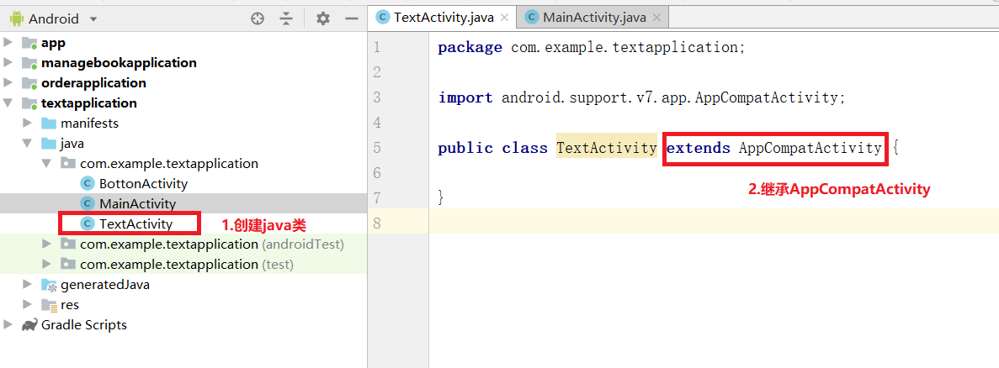
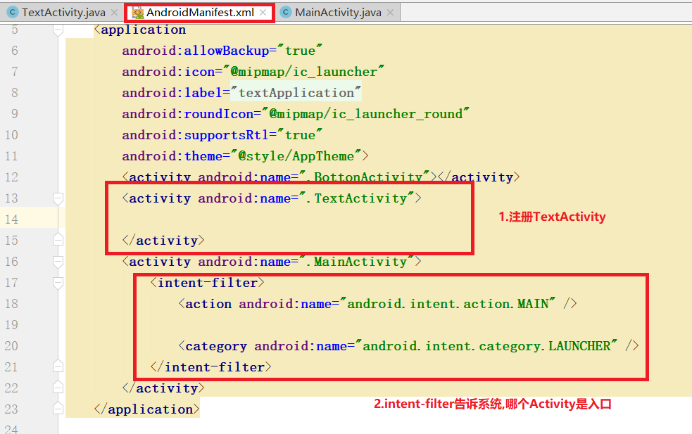
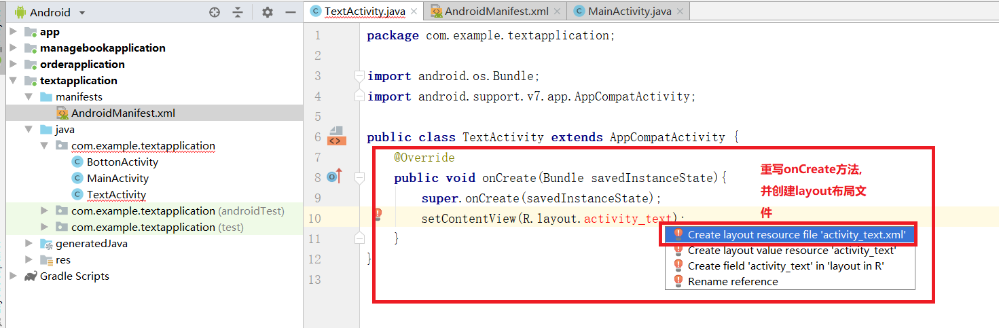
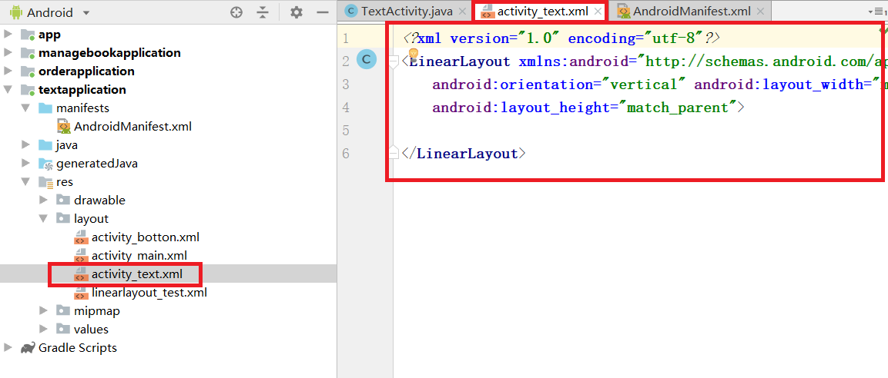
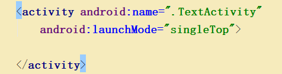
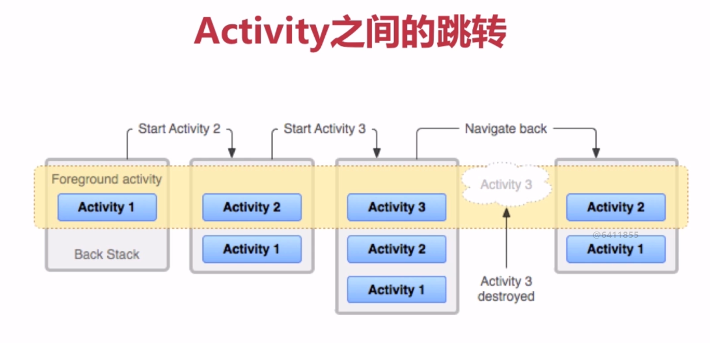
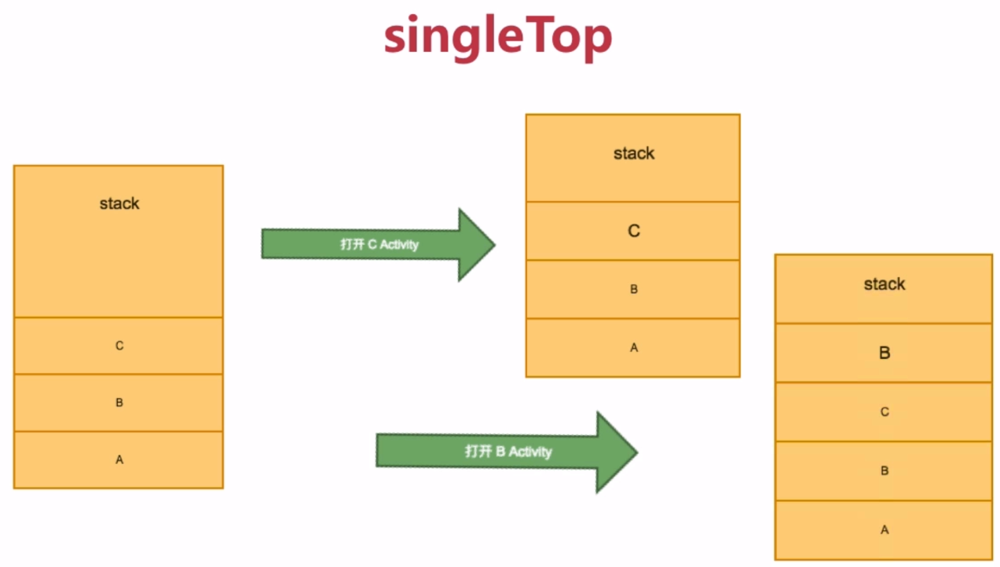
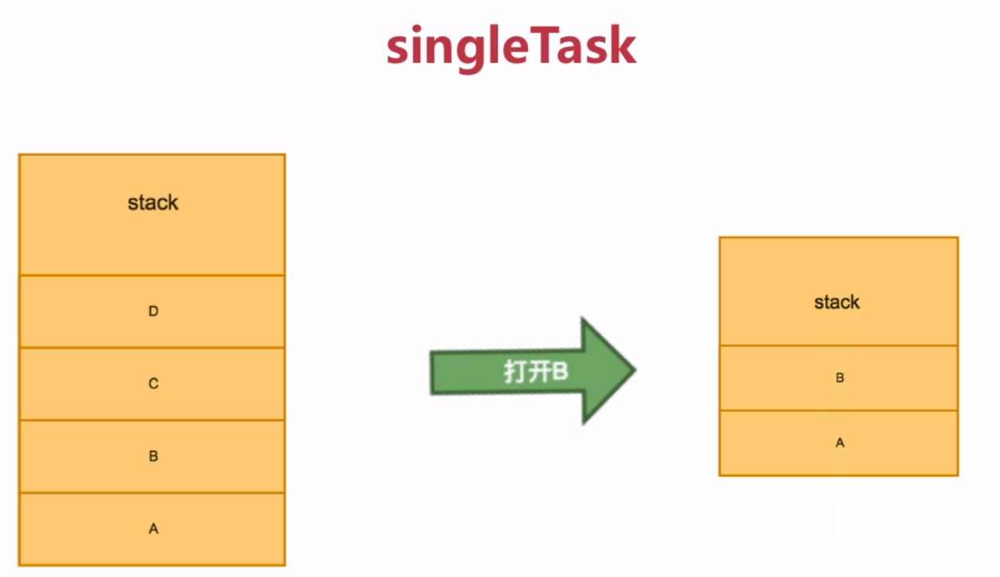
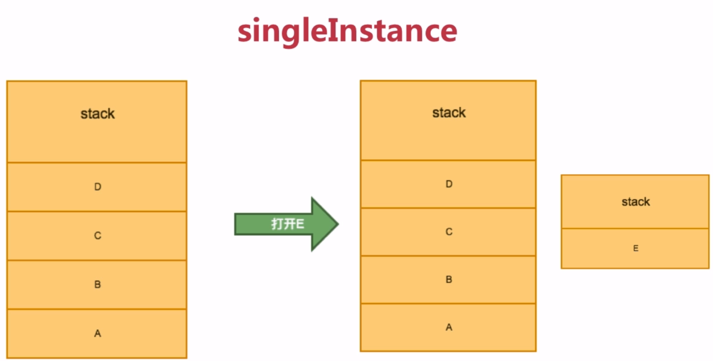
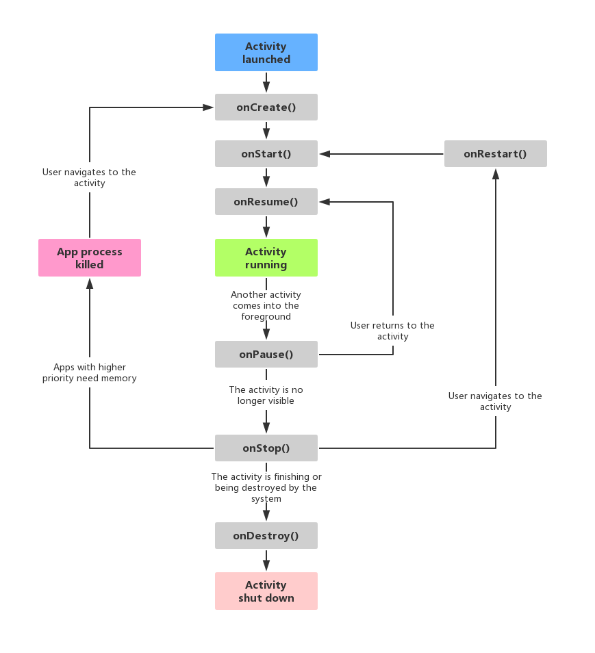

# Activity
Activity就是一个一个的页面<br>
- 1.从用户角度看,每一个不同的页面,就是一个Activity
- 2.从开发者角度,开发app首先就是创建Activity

## 1.创建一个Activity
### 1.1.里程碑一 创建java类
<br>
创建完java类,我们还必须在AndroidManifest.xml中注册.<br>

### 1.2.里程碑二 注册Activity
<br>

### 1.3.里程碑三 添加布局layout文件
<br>
<br>

## 2.给布局页面添加控件
[详细操作方式查看布局管理](https://github.com/pitifulnoble/computer_net/tree/master/%E5%AE%89%E5%8D%93%E5%BC%80%E5%8F%91/02.UI%E6%8E%A7%E4%BB%B6)<br>

## 3.页面跳转
- 1.实例化Intent对象,参数是当前实例和目标Activity.class
- 2.调用Activity.startActivit(intent)方法,跳转


```java
Button button = findViewById(R.id.button);
button.setOnClickListener(new View.OnClickListener() {
    @Override
    public void onClick(View v) {
        Intent intent = new Intent(MainActivity.this,TextActivity.class);
        startActivity(intent);
    }
});
```

## 4.Activity的启动方式
Activity有四种启动方式:<br>
- standard
- singleTop
- singleTask
- singleInstance

### 4.0.Activity启动设置方式
我们在AndroidMainfest.xml文件中设置:<br>
<br>

### 4.1.standard
默认启动方式:<br>
如果我们不给Activity显示设置启动方式,它的默认启动方式便是standard<br>
<br>
如上图,每次开启一个新的Activity,它会覆盖到最上层(即便下层已经开启了一个Activity,也会新建一个Activity),当退回时,回到上一层Activity中.<br>

### 4.2.singleTop
当新打开的Activity和最上层Activity一致时,会复用当前Activity:<br>
<br>
(如上图:当打开的不是C_activity而是B_activity,则会新建)<br>

### 4.3.singleTask
sigleTask模式会寻找已经打开的Activity中是否存在可以复用的相同Activity,但要注意它会是否一部分Activity的资源.<br>
<br>

### 4.4.singleInstance
单实例模式<br>
<br>

## 5.Activity生命周期
```java
onCreate()       //创建Activity
onStart()        //开始Activity
onResume()       //页面已经可以进行交互了
onPause()        //暂停
onStop()         //停止
onDestroy()      //销毁
onRestart()      //重新开始
```
<br>

### 5.1.onSaveInstanceState周期
```java
@Override
protected void onSaveInstanceState(Bundle outState){
    super.onSaveInstanceState(outState);
    outState.putString("key","");
}
```
onSaveInstanceState方法在Activity快销毁的时候执行.<br>
在这个方法中,我们可以使用``outState``类的子方法 向Activity存储一些变量.<br>
这些变量可以在onCreate生命周期中获得(savedInstanceState).<br>

```java
@Override
protected void onCreate(Bundle savedInstanceState) {
    super.onCreate(savedInstanceState);
    setContentView(R.layout.activity_main);
    String str = savedInstanceState.getString("key");
}
```

### 5.2.onBackPressed()时间周期
```java
@Override
public void onBackPressed(){
    super.onBackPressed();
}
```
当按返回键的时候被触发.<br>

## 6.Activity之间传递信息
### 6.1.Intent.putExtra传递基本数据类型

**传递数据的方法:**<br>
```java
Intent intent = new Intent(this,Second_Activity.class);
intent.putExtra("key","noble");
startActivity(intent);
```

**接收数据的方法:**<br>
```java
if(getIntent()!=null){
    String key = getIntent().getStringExtra("key");
    this.setTitle(key);
}
```

### 6.2.通过Buddle传输数据
Buddle类似一个哈希表,key值一般使用String类型:<br>

**传输数据:**<br>
```java
Intent intent = new Intent(this,Second_Activity.class);
Bundle bundle = new Bundle();
bundle.putString("title","noble");
bundle.putString("buttonTitle","noble");
intent.putExtra("bundle",bundle);
startActivity(intent);
```

**接收数据:**<br>
```java
if (getIntent() != null) {
    Bundle bundle = getIntent().getBundleExtra("bundle");
    if (bundle != null) {
        this.setTitle(bundle.getString("title"));
        Button button = findViewById(R.id.backButton);
        button.setText(bundle.getString("buttonTitle"));
    }
}
```

### 6.3.通过序列化对象传递信息

#### 6.3.1.里程碑一 创建对象并实现Serializable
```java
public class User implements Serializable {}
```

#### 6.3.2.里程碑二 发送信息类
```java
Intent intent = new Intent(this,Second_Activity.class);
intent.putSerializable("User",new User("noble"));
startActivity(intent);
```

#### 6.3.3.里程碑三 接收信息
```java
Intent intent = this.getIntent();
User user = (User) intent.getSerializableExtra("user");
```

### 6.4.Activity双向数据传输
#### 6.4.1.里程碑一 启动新Activity的方法需要改变
```java
Intent intent = new Intent(this, Second_Activity.class);
intent.putExtra("User", new User("noble"));
startActivityForResult(intent, 123);                     //使用startActivityForResult传递信息 123是requestCode
```

#### 6.4.2.里程碑二 另一个Activity发送值的方法
```java
Intent intent = new Intent();
intent.putExtra("key","value");  //这是要发送的数据
setResult(RESULT_OK,intent);     //设置resultCode 并发送intent
finish();
```

#### 6.4.3.里程碑三 原Activity接收信息
我们使用生命周期onActivityResult接收信息.<br>
```java
@Override
protected void onActivityResult(int requestCode, int resultCode, Intent data) {
    super.onActivityResult(requestCode, resultCode, data);
    if (data != null && requestCode == 123 && resultCode == RESULT_OK)
        this.setTitle(data.getStringExtra("key"));
}
```