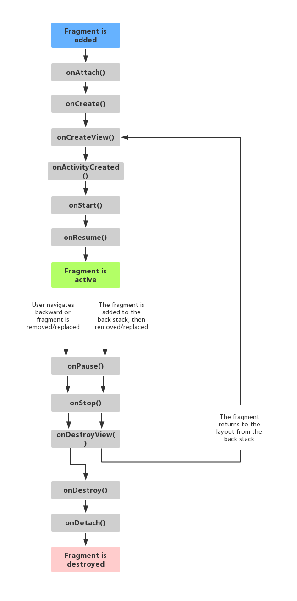

# Fragment
Fragment可以分装在Activity中,有和Activity很多类似的功能,Fragment的引入是为了解决Activity不可分割的性质<br>
我们开发好Fragment模块功能后,再通过布局文件将所有Fragment放在一个Activity布局文件中<br>

## 1.Fragment生命周期
<br>

## 2.Fragment实现方法
从下到上的方式:<br>

### 2.1.里程碑一 实现一个Fragment
#### 2.1.1.新创建一个类
如:ListFragment<br>
```java
public class ListFragment extends Fragment {
    @Nullable
    @Override
    public View onCreateView(@NonNull LayoutInflater inflater, @Nullable ViewGroup container, @Nullable Bundle savedInstanceState) {
        View view = inflater.inflate(R.layout.fragmentlist,container,false);//第一个参数是Fragment布局文件ID 我们要自己实现
        return view;
    }
}
```

#### 2.1.2.实现Fragment布局文件
```xml
<?xml version="1.0" encoding="utf-8"?>
<RelativeLayout xmlns:android="http://schemas.android.com/apk/res/android"
    android:layout_width="match_parent"
    android:layout_height="match_parent"
    android:background="#FF3333"
    android:gravity="center">
<TextView
    android:layout_width="wrap_content"
    android:layout_height="wrap_content"
    android:text="noble"
    android:textColor="#FFFFFF"
    android:textSize="30sp"/>
</RelativeLayout>
```

### 2.2.里程碑二 在Activity布局文件中引用Fragment布局
```xml
<?xml version="1.0" encoding="utf-8"?>
<RelativeLayout xmlns:android="http://schemas.android.com/apk/res/android"
    android:layout_width="match_parent"
    android:layout_height="match_parent"
    android:orientation="vertical">

    <fragment
        android:id="@+id/listFragment"
        <!-- fragment类全名 用来指明我们引用的是那个fragment -->
        android:name="com.example.fragmenttextapplication.ListFragment"
        android:layout_width="match_parent"
        android:layout_height="match_parent"></fragment>
</RelativeLayout>
```

### 2.3.动态方法实现Fragment
使用``getSupportFragmentManager``实现.<br>

#### 2.3.1.里程碑一 实现Fragment布局文件
和静态方法一致,略<br>

#### 2.3.2.里程碑二 实现容器
就是简单的在布局文件中增添修改<br>
```xml
<?xml version="1.0" encoding="utf-8"?>
<android.support.constraint.ConstraintLayout xmlns:android="http://schemas.android.com/apk/res/android"
    xmlns:app="http://schemas.android.com/apk/res-auto"
    xmlns:tools="http://schemas.android.com/tools"
    android:layout_width="match_parent"
    android:layout_height="match_parent"
    tools:context=".MainActivity">
    <LinearLayout
        app:layout_constraintTop_toTopOf="@+id/textView">
        <!-- 容器1 -->
        <LinearLayout
            android:id="@+id/listContainer"
            android:orientation="vertical"
            android:layout_height="match_parent"></LinearLayout>
        <!-- 容器2 -->
        <LinearLayout
            android:id="@+id/detailContainer"
            android:orientation="vertical"
            android:layout_width="match_parent"
            android:layout_height="match_parent">
        </LinearLayout>
    </LinearLayout>

</android.support.constraint.ConstraintLayout>
```

#### 2.3.3.里程碑三 填充容器
使用``getSupportFragmentManager``实现.<br>
```java
ListFragment listFragment = ListFragment.newInstanse("noble");
getSupportFragmentManager()   //帮助类
        .beginTransaction()   //启动事务
        .add(R.id.listContainer,listFragment)  //添加容器
        .commit();            //提交
```

## 3.Activity向Fragment传值
使用动态方法实现Fragment时,我们需要在``容器Activity``实例化Fragment,我们通过封装实例化方法,实现Activity传值到Fragment.<br>

### 3.1.里程碑一 在继承Fragment对象中封装实例化方法

```java
public class ListFragment extends Fragment {
    public static ListFragment newInstanse(String title){
        ListFragment listFragment = new ListFragment();
        Bundle bundle = new Bundle();
        bundle.putString(BUNDLE_TITLE,title);
        listFragment.setArguments(bundle);
        return listFragment;
    }
}
```
我们使用以下方法获得Buddle:<br>
```java
getArguments()
this.title = getArguments().getString(this.BUNDLE_TITLE);
```

### 3.2.里程碑二 在容器Activity中调用上面方法获得实例

```Java
ListFragment listFragment = ListFragment.newInstanse("noble");
getSupportFragmentManager()
        .beginTransaction()
        .add(R.id.listContainer,listFragment)
        .commit();
```