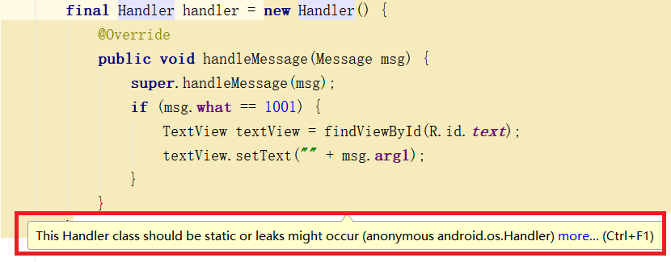

# 安卓多线程
安卓多线程的解决方案如下:<br>
- 1.主线程用来监听页面响应,称为UI线程.较为耗时的操作全部交给子线程来做,依此来提高交互性
- 2.UI控件只能由UI线程(主线程)操作
- 3.Android使用多线程主要想解决的问题是ANR(Application Not Responding)


## 2.Handler
handler有两大功能:<br>
- 1.子线程通知主线程,发送消息
- 2.定时任务

### 2.1.Handler发送消息
#### 2.1.1Handler发送消息简单实现
Handler在UI线程创建,在子线程发送消息,如下:<br>
```java
final Handler handler = new Handler(){          //创建Handler
    @Override
    public void handleMessage(Message msg) {    //重写handleMessage方法,该方法用来接收消息
        super.handleMessage(msg);
        if(msg.what==1001){
            TextView textView = findViewById(R.id.text);
            textView.setText("noble");
        }
    }
};
findViewById(R.id.button).setOnClickListener(new View.OnClickListener() {
    @Override
    public void onClick(View v) {
        new Thread(){
            @Override
            public void run() {
                super.run();
                handler.sendEmptyMessage(1001); //在子线程中发送一个空消息(只有msg.what)
            }
        }.start();
    }
});
```

#### 2.1.2.Message介绍
我们通过Handler方法发送Message:<br>
```java
Handler.sendMessage(Message msg);           //发送msg
Handler.sendMessageAtTime(Message msg, SystemClock.uptimeMillis()+3000); //在(第二个参数)时发送msg
Handler.sendMessageDelayed(Message msg, 2000);    //延迟2000 毫秒发送消息
```

**Message对象的获得:**<br>
```java
Message msg = Message.obtain();
```

**Message对象的分装:**<br>
```java
int Message.what      //类似地址,在主线程中通过该参数区分要接收的message
int Message.arg1      //第一个参数
int Message.arg2      //第二个参数
Object Message.obj    //一个对象参数
```
[根据以上信息并对比实现,理解Handler发送消息的使用方法.](#2.1.1Handler发送消息简单实现)<br>

### 2.2.Handler定时任务
Handler的定时任务实现还是依据消息发送机制(隐藏了消息发送):<br>
- 1.实现一个Runnable接口类,并重写run方法
- 2.使用postDelayed等方法,做定时任务,指向run方法


```java
Runnable runnable = new Runnable() {
    @Override
    public void run() {
        //TODO: 逻辑代码
    }
};
handler.postAtTime(runnable,System.currentTimeMillis()+3000);
```

### 2.3.Handler优化
我们在一般使用Handler时,编译器会发出提示:<br>
<br>
我们可以依据``避免内存泄漏``来对Handler做一些优化.<br>

**先了解一些基本概念:**<br>

#### 强引用(StrongReference)
垃圾回收器绝不会回收它.当内存不足时,java虚拟机会直接抛出OutOfMemoryError错误.强硬有是使用最普遍的引用,大部分引用实际上都是强引用.如:<br>
```java
Student student = new Student();
```
只要此引用存在没有被释放(没有student=null),垃圾回收器就永远不会回收.只有当这个引用被释放之后,垃圾回收器才可能回收,这也是我们经常所用到的编码形式.<br>

#### 弱引用(WeakReference)
如果一个对象只具有弱引用.在垃圾回收器线程扫描它所管辖的内存区域的过程中,一旦发现了只具有弱引用的对象,不管当前内存控件足够与否,都会回收它的内存,(不过,由于垃圾回收器是一个优先级很低的线程,因此不一定会马上发现那些只具有弱引用的对象)如:<br>
```java
Student student = new Student(); //只要student还指向Student就不会被回收
WeakReference<Student> weakStudent = new WeakReference<Student>(student);
```

当要获得weakreference引用的student时,可以使用:<br>
```java
weakStudent.get();
```
如果此方法返回为空,那么说明weakStudent指向的对象student已经被回收了.<br>

列如我们常用的在内部类的Handler中使用Activity弱引用,防止内存泄漏:<br>
```java
public class MainActivity extends Activity {
    private Handler handler = null;
    @Override
    protected void onCreate(@Nullable Bundle savedInstanceState) {
        super.onCreate(savedInstanceState);
        handler = new MyHandler(this);
    }
    private static class MyHandler extends Handler{
        WeakReference<MainActivity> weakReference;
        public MyHandler(MainActivity activity){
            weakReference = new WeakReference<MainActivity>(activity);
        }
        @Override
        public void handleMessage(Message msg){
            super.handleMessage(msg);
            if(weakReference.get()!=null){
                //更新UI
            }
        }
    }
}
```

## 3.AsyncTask多任务
AsyncTask是对Handler的进一步分装,可以简化开发流程<br>

### 3.1.AsyncTask基本使用

```java
/**
* 让一个类继承AsyncTask<Params, Progress, Result>,三个参数都是泛型,并重写doInBackground方法
*/
public class DownLoadAsyncTask extends AsyncTask<String, Integer, Boolean> {
    /**
    * 在主线程执行的方法,可以操作UI(在doInBackground方法之前执行)
    */
    @Override
    protected void onPreExecute() {
        super.onPreExecute();
    }

    /**
    * 在子线程执行操作
    */
    @Override
    protected Boolean doInBackground(String... strings) {
        publishProgress(new Integer(2));//抛出进度,在onProgressUpdate中更新进度
        return null;
    }

    /**
    * 在主线程执行的方法,可以操作UI(在doInBackground方法之后执行),我们可以拿到doInBackGround方法的返回结果
    */
    @Override
    protected void onPostExecute(Boolean aBoolean) {
        super.onPostExecute(aBoolean);
    }

    /**
    * 在UI线程执行,更新进度
    */
    @Override
    protected void onProgressUpdate(Integer... values) {
        super.onProgressUpdate(values);
    }
}
```
```java
new DownLoadAsyncTask().execute("1", "2");//使用execute执行操作
```