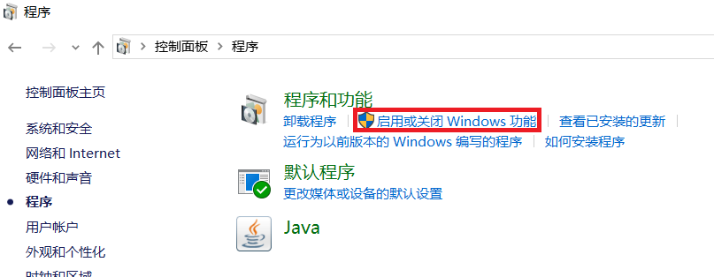
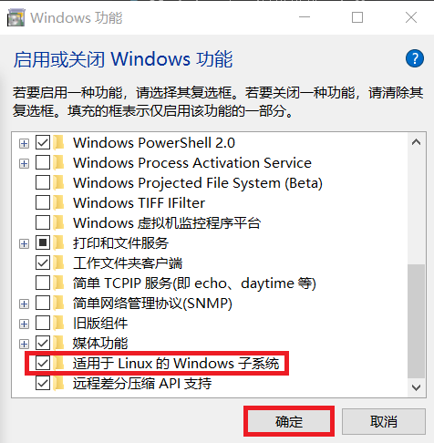
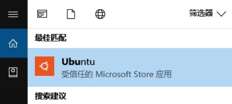
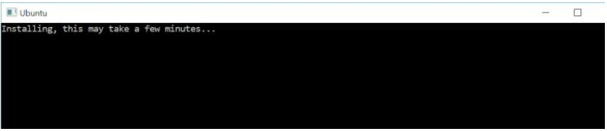
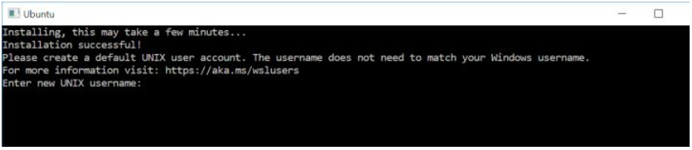
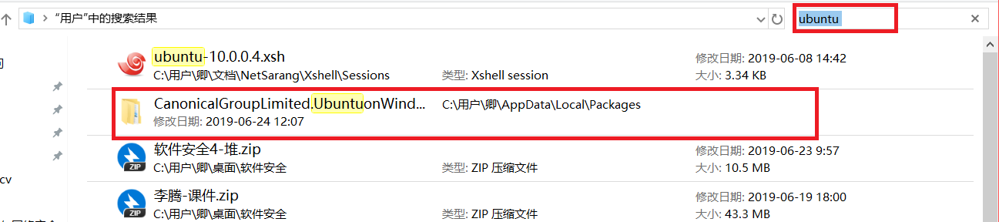

# 在Windows上搭建wsl环境
WSL 就是让开发者在 Windows 上无需虚拟机就可以搭建一套 Linux 开发环境。 
[https://www.cnblogs.com/javanoob/p/wsl.html](https://www.cnblogs.com/javanoob/p/wsl.html) 
## 1.开启Windows中linux子系统功能
 
 

接下来重启操作系统: 
 

## 2.通过Microsoft Shop安装wsl
打开Win10应用商店搜索你喜欢的Linux发行版并安装。目前，WSL支持Ubuntu，Kali Linux，GNU，OpenSUSE等发行版。通过应用商店安装的Linux发行版只支持安装在C盘！ 
 
 
安装完成后按提示输入默认用户名、密码。 
 
全部完成！今后我们可以通过Ubuntu应用打开一个WSL的Ubuntu命令行窗口。Enjoy! 

## 3.要避免的坑

### 3.1.端口
WSL和Win10共享同一套端口，如果出现两者监听同一个端口的情况，Windows主系统的程序拥有更高的优先级。也就是说，如果我们在WSL运行需要监听端口的程序，必须确认该端口没有被Windows主系统内的任何程序占用。如果出现冲突，请参阅软件相关文档修改默认配置。 
例如，在WSL中安装SSH Server时，端口冲突将会导致WSL不能按照预期通过SSH连接登陆，但只需修改默认WSL的SSH监听端口，问题便迎刃而解。 

### 3.2.后台运行Linux程序
当我们在WSL运行后台程序时（如在命令后加&）,后台程序会随着WSL所有Session的关闭而停止运行（每一个Session对应任务管理器中一个Bash进程，如下图）。即，如果我们把WSL的Bash窗口全部关闭的话，WSL的后台程序会被强制停止。这个机制虽然能够避免WSL内程序计划外运行，但是在执行后台任务时WSL命令行图标常驻在任务栏会破坏桌面的简洁…… 

### 3.3.文件系统
WSL和Windows主系统之间的文件系统是可以互相访问的。 

如果在WSL中访问Windows系统的文件，可在根目录下/mnt/看到对应Windows盘符字母的文件夹，通过这些文件夹即可访问Windows的文件系统。 

如果在Windows系统中访问WSL的文件，可在Windows系统中找到已安装Linux发行版的应用数据文件夹，所有Linux系统的数据都在那个文件夹（通过应用商店安装的Linux发行版本质上也是一个应用）。Linux发行版的数据文件夹在``C:\Users\{你的用户名}\AppData\Local\Packages\{Linux发行版包名}\LocalState\rootfs``路径内，在``rootfs``文件夹内我们会看到在WSL中的根目录。  

确定``Linux发行版包名``可在上级文件夹Packages内搜索你安装的Linux发行版名称，如图： 
 
