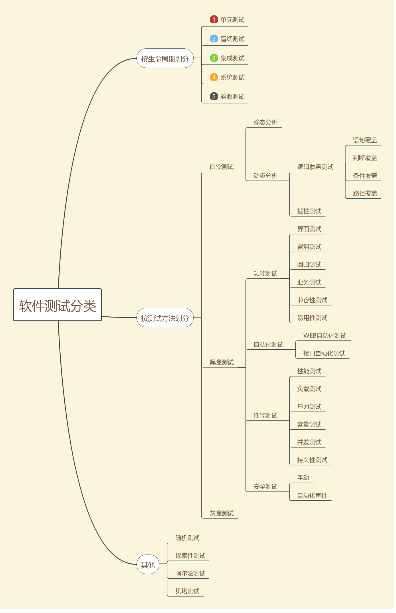
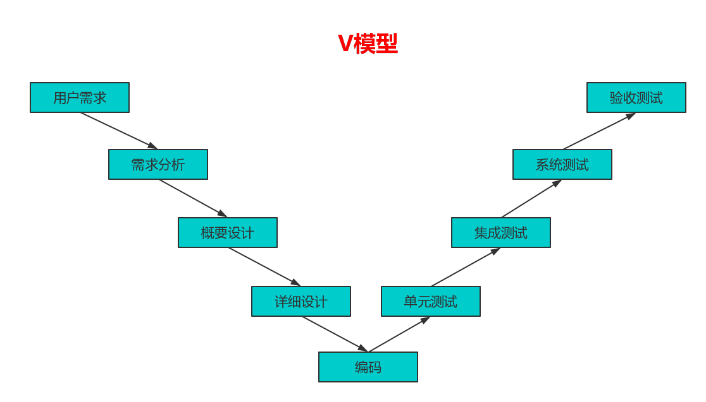
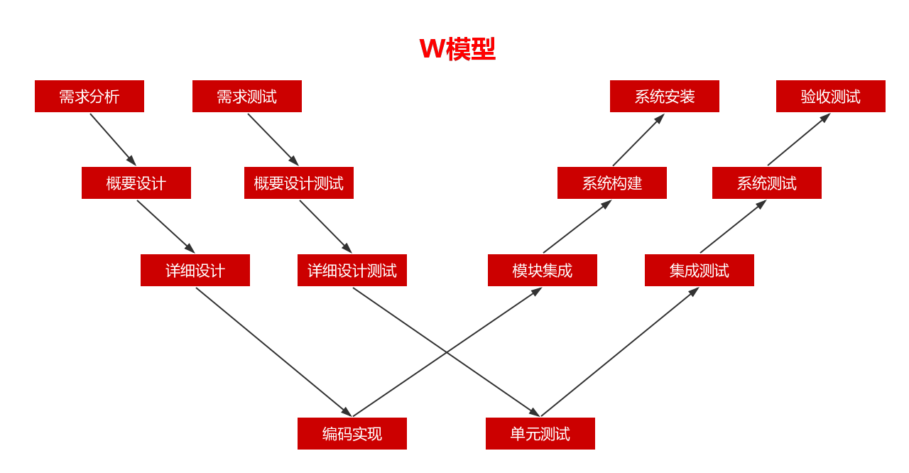
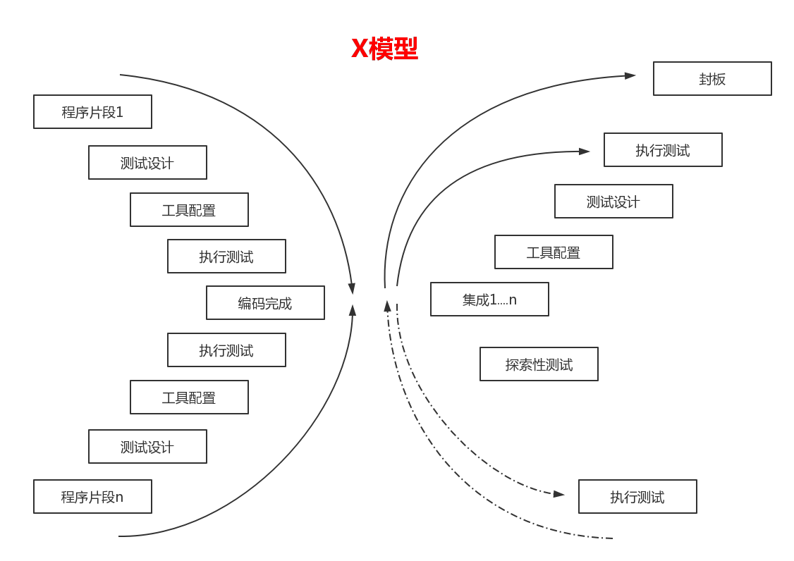

# 软件测试

## 1.软件测试的概念
### 1.经典定义
软件测试(Software Testing),在规定的条件下对程序进行操作，以发现程序错误，衡量软件质量，并对其是否满足设计要求进行评估的过程。 

### 2.标准定义
软件测试是使用人工或自动的手段来运行或猜测某个软件系统的过程，其目的在于检测它是否满足规定的需求或弄清预期结果与实际结果之间的差别。 

### 3.软件测试的目的
软件测试的目的在于发现问题，检测系统是否满足需求。 

## 2.软件测试方法和分类
 

|   | 单元测试 | 集成测试 | 冒烟测试 | 系统测试 | 验收测试 |
|---|---------|----------|---------|----------|---------|
| 测试阶段  | 编码后  | 单元测试完成后  | 提测后  | 冒烟测试通过后  | 发布前  |
| 测试对象  | 最小模块  | 模块间的接口  | 整个系统  | 整个系统  | 整个系统  |
| 测试人员  | 白盒测试或开发  | 白盒测试或开发  | 黑盒测试  | 黑盒测试  | 最终用户或需求方  |
| 测试依据  | 代码、注释、详细设计文档  | 单元测试模块、概要设计文档  | 冒烟测试用例  | 需求说明文档、测试方案、测试用例  | 用户需求、验收标准  |
| 测试方法  | 白盒测试  | 黑盒与白盒结合  | 黑盒测试(手工活与自动化结合)  | 黑盒测试  | 黑盒测试  |

## 3.软件测试的常用术语
### 1.C/S
C指的是客户端(Client),S指的是服务器端(Server),这种软件是基于局域网或互联网的，需要一台服务器来安装服务器软件，每台客户端都需要安装客户端软件。比如我们经常用的QQ和各种网络游戏就属于C/S结构软件。 

### 2.B/S
B指的是浏览器(Browser),S指的是服务器(Server),这种软件同样是基于局域网或互联网的，它与C/S结构软件的区别就是不需要安装客户端(Client),只需要有浏览器，就可以直接使用。比如搜狐、新浪等门户网站及163邮箱都属于B/S结构的软件。B/S结构软件是现在软件的主流，与C/S结构软件相比，便于升级和维护，是测试的重点。 

### 3.测试环境
软件测试环境就是软件运行的平台，包括软件、硬件和网络的集合。 
测试环境=软件+硬件+网络。 

### 4.测试用例(Test Case)
在测试执行之前设计的一套详细的测试方案，包括测试环境、测试步骤、测试数据和预期结果。 
测试用例=输入+输出+测试环境。 
- 1.输入：包括测试数据和操作步骤
- 2.输出：指的是期望结果
- 3.测试环境：系统环境配置

### 5.冒烟测试
在对一个新版本进行系统大规模地测试之前，先验证一下软件的基本功能是否实现，是否具备可测性。 

### 6.阿尔法测试
验收测试的一种，指的是由用户、测试人员、开发人员等共同参与的内部测试。 

### 7.贝塔测试
验收测试的一种，指的是内测后的公测，即完全交给最终用户测试。 

## 4.软件测试模型
我们使用的最多的是以W模型为主。 
X模型是分块化的，探索性的测试，当测试人员的经验非常丰富时可能会采取的测试方法。 
### 1.V模型
V模型是我们熟知的瀑布式模型的一种改进，瀑布模型将软件生命周期分为计划、分析、设计、编码、测试和维护六个阶段，由于早期的错误可能要等到开发后期的测试阶段才能发现，所以可能带来严重的后果。 
V模型就是在这点改进了瀑布模式，在软件开发的生存期，开发活动和测试活动几乎同时开始，这两个并行的动态的过程就会极大的减少bug和error出现的几率。 

 

### 2.W模型
一些高性能高风险的系统、互联网软件，或一个系统难以被具体模块化的时候，就比较难做成V模式所需的各种构建，需要更强调迭代的开发模型或者敏捷开发模型。 
W模型从V模型演化而来，实际上开发是V，测试是并行的V；相对于V模型，W模型增加了软件各个开发阶段中应同步进行的验证和确认活动，W明确表示出了测试与开发的并行关系。测试与开发是同步的，有利于尽早地全面的发现问题。 

 

### 3.H模型
真正的测试级别之间不存在严格的次序关系，个阶段间可以反复触发、迭代、增量。 
为了解决V模型和W模型存在的问题，有专家提出了H模型。它将测试活动完全独立出来，形成独立的流程，将测试准备活动和测试执行活动清晰地体系出来。 

### 4.X模型
 

## 5.测试覆盖率
覆盖率是用来度量测试完整性的一个手段，同时也是测试技术有效性的一个度量。 
覆盖率=(至少被执行一次的item数)/item的总数 

### 1.测试覆盖率特点
- 1.通过覆盖率数据，可以检测我们的测试是否充分
- 2.分析出测试的弱点在哪方面
- 3.指导我们设计能够增加覆盖率的测试用例，有效提高测试质量，但是测试用例设计不能一味追求覆盖率，因为测试成本随覆盖率的增加而增加。

### 2.对于黑盒测试覆盖率
#### 1.需求覆盖
它表示在测试中，有哪些函数被测试到了，其被测试到的频率有多大，这些函数在系统所有函数中占的比例有多大。通过设计一定的测试用例，要求每个需求点都被测试到。 

需求覆盖=(被验证到的需求数量)/(总的需求总数) 

#### 2.用例覆盖
主要体现在我们每次测试验证通过的用例数在总用例中的比重。 

用例覆盖=(验证通过的用例数)/(总的用例数) 

#
