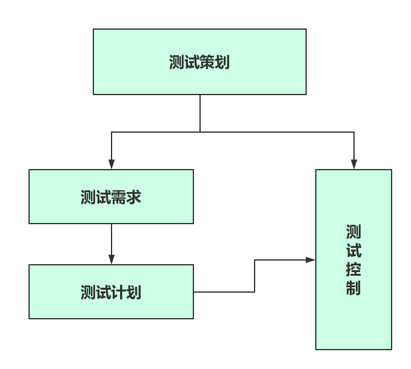

# 软件测试过程总结

## 1.简述
测试总共包含五个步骤，当测试模块提交后，我们要对测试做策划、设计测试用例，执行测试用例，依据测试结果对该模块评估，产出总结报告，最终我们的价值将通过测试报告来体系。 
在实际的项目开发中，模块提测是不固定的，所以上述五个步骤也是循环往复的。 

### 1.测试策划
在任何方案执行阶段，策划最为重要，在软件测试领域，测试策划要解决的问题： 
- 1.进行测试需求分析
- 2.确定需要测试的内容或质量特征
- 3.明确测试的充分性要求
- 4.提出测试的基本方法

 

### 2.测试策划的过程
- 1.确定测试的资源和技术需求
- 2.进行风险分析与评估(测试结果的可靠性等)
- 3.根据上述分析结果制定测试计划
- 4.根据测试计划开展相应的测试控制活动

### 3.测试需求
我们对测试需求做一个剖析。 
首先我们接触过的 需求 有两方面的含义： 
- 1.项目的需求分析：这是根据用户的需求我们做的需求分析
- 2.对于测试模块，我们如何以及怎样测试该模块做需求分析

这是两个完全不同的含义，更有的：测试需求是指：对于开发做出的项目需求分析，由测试人员进行测试该需求是否满足用户的需求，是否满足某一合理的标准(度量)。 

#### 1.为什么要有测试需求

对于测试需求，需要再详细的阐述。并不是提测之后才开始测试的需求分析。之前就说过，测试人员因参与软件开发的需求分析，并提早设计测试需求 

测试人员参与需求分析的好处如下： 
- 1.测试工程师参与需求分析，对需求了解很深刻，减少与开发人员的交互，节约时间
- 2.早期确定测试用例的编写思路，为测试打好基础
- 3.可以获取一些测试数据，为测试用例设计提供帮助
- 4.可以发现需求不合理的地方，降低测试成本
- 5.测试需求的分析用来确定整个测试工作，明确测试对象以及测试工作的范围和作用，并作为测试覆盖的基础

#### 2.怎么做测试需求
##### 1.测试需求前的评估

- 1.我们应拥有对测试需求项的评估度量，必须能产出一个可观察、可评测的结果。
- 2.与客户的交流以澄清某些混淆(循序渐进)
- 3.明确哪些需求更重要
- 4.确保风险承担者尽早的对项目达成共识，并对将来的产品有个清晰的认识

##### 2.需求验证

- 1.省察需求文档
  - 对需求文档以及相关模型进行仔细检查
  - 另外在需求开发期间所做的非正式评审也是很有价值的
- 2.以需求为依据编写测试用例
  - 编写用户手册
- 3.确定合格的标准
  - 让用户描述什么样的产品才算满足他们的要求和适合他们的使用
  - 将确认合格的测试建立在使用情景描述或使用实例的基础之上

##### 3.需求规格说明书检查列表

| 序号 | 检查项 | 检查结果 | 说明 |
|------|-------|----------|-----|
| 1.  | 需求报告覆盖了用户提出的所有需求项  | 是【】否【】NA【】  |   |
| 2.  | 用词是否清晰，语义是否存在有歧义的地方  | 是【】否【】NA【】  |   |
| 3.  | 是否清楚的描述了软件需要做什么以及什么不做  | 是【】否【】NA【】  |   |
| 4.  | 是否描述了软件的目标环境，包括软硬件环境  | 是【】否【】NA【】  |   |
| 5.  | 是否对需求项进行了合理的编号  | 是【】否【】NA【】  |   |
| 6.  | 需求项是否前后一致、彼此不冲突  | 是【】否【】NA【】  |   |
| 7.  | 是否清楚的说明了系统的每个输入、输出格式、以及输入与输出之间的对应关系  | 是【】否【】NA【】  |   |
| 8.  | 是否清晰的描述了软件系统的性能要求  | 是【】否【】NA【】  |   |
| 9.  | 需求的优先级是否合理分配  | 是【】否【】NA【】  |   |
| 10.  | 是否描述了各种约束条件  | 是【】否【】NA【】  |   |

#
